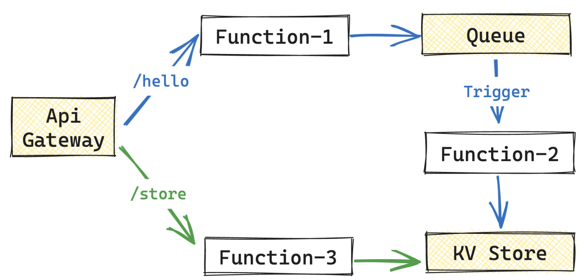

<p align="center"> 
    
    <br/>
    <br/>
   <a href="./README.md"> English </a> 
   ｜ 
   <a href="./README_zh.md"> 简体中文 </a>
</p>

<p align="center">
  <a href="https://join.slack.com/t/plutolang/shared_invite/zt-25gztklfn-xOJ~Xvl4EjKJp1Zn1NNpiw"></a>
  <a href="https://github.com/pluto-lang/pluto/blob/main/LICENSE"></a>
  <a href="https://www.npmjs.com/package/@plutolang/cli"></a>
  <a href="https://www.npmjs.com/package/@plutolang/cli"></a>
</p>

Pluto is a new open-source programming language designed to help developers write cloud applications and **make it easier to use cloud services**.

Developers can directly use the **required resources, such as KV databases and message queues**, in their code based on their business needs. Pluto performs **static analysis** on the code to determine the **infrastructure resources** required by the application and deploys corresponding resource instances and applications on the specified cloud platform.

**⚠️ Note: Pluto is still in the PoC stage and is not yet ready for production use.**

## 🌟 Examples

Let's look at a simple example:

[https://github.com/pluto-lang/pluto/assets/20160766/add7f29c-a8f4-406a-a1b5-75495882c809](https://github.com/pluto-lang/pluto/assets/20160766/add7f29c-a8f4-406a-a1b5-75495882c809)

<p align="center">
  
</p>

The business logic of this example is illustrated in the above diagram, which primarily involves three types of resources and three processes. When deploying this application on AWS, it requires configuring multiple resources such as Lambda, IAM, ApiGateway, Route, Deployment, SNS, and Trigger. Manual configuration can be time-consuming and prone to errors.

In contrast, this example simplifies the process by defining three variables - KVStore, Queue, and Router - in a single code file. Additionally, two route handling functions and one message subscription handling function are defined. This approach can be seen as developing a monolithic application.

With just one command, `pluto deploy`, all the infrastructure resources and business modules will be deployed onto the AWS cloud seamlessly. This includes resources like ApiGateway, DynamoDB, SNS, Lambda, and configurations for triggers, IAM roles, and permissions.

Furthermore, by executing `pluto stack new`, developers can effortlessly publish the service to Kubernetes without making any modifications to the existing code. It will be deployed under a newly created environment configuration.

**Want to see more examples?**

- [Build your own chatbot based on the OpenAI API.](https://github.com/pluto-lang/pluto/tree/main/examples/chat-bot)
- [Send a computer joke to the Slack channel every day.](https://github.com/pluto-lang/pluto/tree/main/examples/daily-joke-slack)

## 🤯 Pain Points

You can learn why we created Pluto from here. In short, we want to solve several pain points that you may frequently encounter.

- **High learning curve**: Developing a cloud application requires mastering both the business and infrastructure technology stacks, and it is also difficult to test and debug, resulting in developers spending a lot of effort outside of writing business logic.
- **Difficult architecture selection**: Cloud service providers currently offer hundreds of capabilities, and Kubernetes has an infinite combination of capabilities. It is difficult for ordinary developers to determine a suitable architecture selection for their own business.
- **Intrusion of infrastructure configuration into business programming**: Developers need to differentiate between infrastructure code and business code when programming, know the specific location of each statement and file, understand clearly which code will be executed locally, and where the code to be deployed to the cloud needs to be written. It is far from being as simple as writing a single machine program.
- **Vendor lock-in**: Programming for specific service providers results in poor flexibility of the final code. When it is necessary to migrate to other cloud platforms due to cost and other factors, a lot of code modification is required to adapt to the new runtime environment.

## 🌟 Features

- **Zero learning curve**: The programming interface is fully compatible with TypeScript and supports the use of most dependency libraries directly.
- **Focus on pure business logic**: Static deduction of source code dependencies on infrastructure at compile time, so developers do not need to distinguish between infrastructure code and business code when programming.
- **One-click deployment**: The CLI provides basic capabilities such as compilation and deployment. Except for coding and basic configuration, everything is automatically completed by Pluto.
- **Support for multiple runtime**: Unified abstraction of multiple runtime based on SDK, allowing developers to migrate between multiple runtime environments without modifying the source code.

## 🔧 How Pluto Works?

<p align="center">
  
</p>

Overall, Pluto first deduces the required cloud resources and the dependencies between resources from the user code, and builds the architecture reference for the cloud. Then, based on the architecture reference, it generates IaC code independent of the user code, and splits the user code into multiple business modules. Finally, the IaC engine adapter calls the corresponding IaC engine to execute the deployment based on the type of IaC code, and publishes the application to the specified cloud platform. Throughout the entire process, the deducer, generator, and adapter can be easily replaced. You have the flexibility to implement them using different deducing and generating techniques, and also support additional IaC engines.

You can learn more about the workflow of Pluto [here](./docs/en/how-pluto-works.md).

## 🤔️ Differences from Other Projects?

The key difference between Pluto and other products is that it uses program analysis technology to directly infer resource dependencies from user code and generate IaC code independent of the user code, so that the code executed at compile time is not directly related to the user code. This provides developers with an experience of not having to worry about infrastructure configuration when writing code.

- Compared to BaaS products like Supabase and Appwrite, Pluto helps developers create their own infrastructure environment on the target cloud platform instead of providing self-managed components.
- Compared to PaaS products like Fly.io, render, and Heroku, Pluto is not responsible for container hosting, but generates more fine-grained compute modules through compilation to leverage the capabilities provided by the cloud platform, such as FaaS.
- Compared to scaffolding tools like Serverless Framework and Serverless Devs, Pluto does not provide an application programming framework for specific cloud vendors or frameworks, but provides a consistent programming interface for users.
- Compared to pure annotation-based Infra from Code (IfC) products like Klotho, Pluto directly infers resource dependencies from user code without additional annotations.
- Compared to SDK-based IfC products like Shuttle and Nitric, Pluto obtains resource dependencies of applications through static program analysis rather than executing user code.
- Both Winglang and Pluto are IfC products based on programming languages, but compared to Winglang, Pluto generates IaC code independent of the user code, so that the code executed at compile time is not directly related to the user code.

You can learn more about the differences with other project [here](./docs/documentation/whats-different.en.md).

## 🚀 Quick Start

Pluto makes it easy to get started with a hands-on experience on CodeSandbox. Just open the [Pluto project template](https://codesandbox.io/p/sandbox/github/pluto-lang/codesandbox?file=%2FREADME.md) and click the Fork button in the top right corner to create your own development environment. The environment already has AWS CLI, Pulumi, and Pluto dependencies installed. Just follow the README to get started.

If you'd rather use it locally, follow these steps for configuration:

### 0. Prerequisites

#### 0.1 Install Pulumi

You can install it according to the [installation guide](https://www.pulumi.com/docs/install/).

#### 0.2 Prepare the access credentials for AWS or Kubernetes.

Choose either AWS or Kubernetes based on your specific requirements.

**Prepare AWS access credentials**

Pluto doesn't require you to set up AWS credentials on your local machine or install the AWS CLI. If you've already set up your AWS credentials using either the AWS CLI or environment variables, Pluto will automatically use those settings. However, if it can't find any credentials locally, Pluto will assist you in creating an administrator role for future use.

⚠️Note: To determine which region to deploy to, Pluto depends on the `AWS_REGION` variable.

```shell
export AWS_REGION="xx-xxxx-x" # replace it with your AWS Region
```

**Prepare Kubernetes access credentials**

No additional configuration is necessary; you just need to know the location where the kubeconfig file is stored, typically at `~/.kube/config`.

> If you opt for Kubernetes as the runtime environment, it is necessary to install Knative in K8s beforehand and disable the scaling down to zero feature. This is because Pluto currently does not support Ingress forwarding to Knative serving. Welcome experts to contribute to the enhancement of this functionality. You can configure the required Kubernetes environment according to [this document](./docs/dev_guide/setup-k8s-dev-env.md).

### 1. Install Pluto

```shell
npm install -g @plutolang/cli
```

### 2. Deploy your application using Pluto

```shell
pluto new        # create a new project interactively
cd <project_dir> # change to the directory of the new project
npm install      # install the depnedencies
pluto deploy     # shoot!
```

For detailed steps, please refer to the [Getting Started Guide](./docs/documentation/getting-started.en.md).

> Currently, Pluto is limited to supporting single-file applications. Within each handler function, it is possible to access literal constants and regular functions that exist outside the scope of the handler function. However, accessing variables (except for resource variables), classes, interfaces is not currently supported.

## 👏 Contributing

Pluto is currently in the PoC stage, and we welcome interested people to contribute. Whether it is suggestions or ideas about the problems Pluto aims to solve, the features it provides, or code implementation, you can participate in the community to build together. Check out the project [contribution guide](./docs/dev_guide/dev_guide.en.md).

## 🐎 Roadmap

- [ ] Complete implementation of resource static deduction process
  - [x] Resource type checking
  - [ ] Conversion of local variables to cloud resources
- [ ] SDK development
  - [ ] API SDK development
  - [ ] IaC SDK development
  - [ ] Support for more resources and platforms
- [ ] More engine support
  - [ ] Terraform
  - [ ] ...

See [Issues](https://github.com/pluto-lang/pluto/issues) for more details.

## 💬 Community

Welcome to join our [Slack](https://join.slack.com/t/plutolang/shared_invite/zt-25gztklfn-xOJ~Xvl4EjKJp1Zn1NNpiw) community, or our DingTalk group at 40015003990 for communication.
