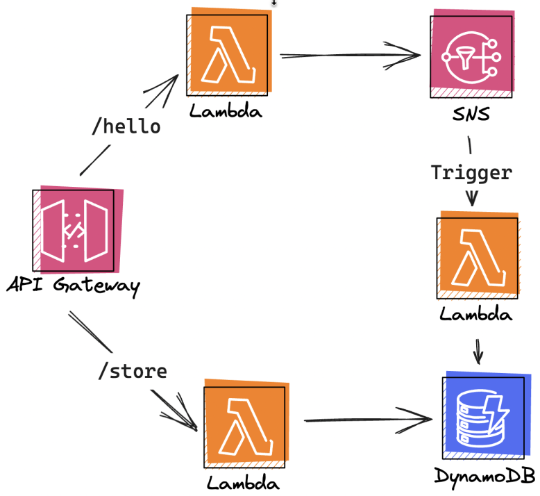

<p align="center"> 
    
    <br/>
    <br/>
   <a href="./README.md"> English </a> 
   ｜ 
   <a href="./README_zh.md"> 简体中文 </a>
</p>

Pluto is a new open-source programming language designed to help developers write cloud applications and **make it easier to use cloud services**.

Developers can directly use the **required resources, such as KV databases and message queues**, in their code based on their business needs. Pluto performs **static analysis** on the code to determine the **infrastructure resources** required by the application and deploys corresponding resource instances and applications on the specified cloud platform.

**⚠️ Note: Pluto is still in the PoC stage and is not yet ready for production use.**

## 🌟 Examples

<p align="center">
  
</p>

Let's look at a simple example where the business logic consists of three processes:

1. Function-1: This function is executed when a user accesses `/hello`. It records the user's access time and publishes it to a message queue.
2. Function-2: This function acts as a subscriber to the message queue and is executed when a new message is published. It stores the message in a KV database.
3. Function-3: This function is executed when a user accesses `/store`. It retrieves the last access time of the specified user.

If you were to deploy this application on AWS, you would need to configure Lambda, IAM, ApiGateway, Route, Deployment, SNS, Trigger, and other resources. Manual configuration can be tedious and prone to errors.

By using Pluto to write this example, you only need one TypeScript code file, which can be considered as writing a monolithic application:

1. Define the required resource variables, including 1 database state, 1 message queue queue, and 1 router router. You can fine-tune the resource capabilities through additional configuration options.
2. Write the corresponding path handling process for the router and the subscription process for the queue. Use the methods provided by the resource types to implement the business logic in the processing code. With these steps, you have completed the entire code writing process.

```typescript
import { Event, Request, Router, Queue, State } from "@pluto";

// Define the resources
const state = new State("statestore", {
  /* additional configuration */
}); // Key-Value Store
const queue = new Queue("access"); // Message Queue
const router = new Router("hello"); // ApiGateway

// Function-1
router.get("/hello", async (req: Request): Promise<string> => {
  const name = req.query["name"] ?? "Anonym";
  const message = `${name} access at ${Date.now()}`;
  await queue.push({ name, message });
  return `Publish a message: ${message}`;
});

// Function-2
queue.subscribe(async (event: Event): Promise<string> => {
  const data = event.data;
  await state.set(data["name"], data["message"]);
  return "receive an event";
});

// Function-3
router.get("/store", async (req: Request): Promise<string> => {
  const name = req.query["name"] ?? "Anonym";
  const message = await state.get(name);
  return `Fetch ${name} access message: ${message}.`;
});
```

<p align="center">
  
</p>

Next, simply execute the command `pluto deploy`, and all the infrastructure resources and business modules will be deployed in an orderly manner to the AWS cloud.

During this process, the router will be published as an ApiGateway component, the message queue will be published as an SNS component, and the database will be published as a DynamoDB component. The functions that handle the HTTP API and the message queue will be published as three Lambda functions. Pluto will also automatically configure triggers, IAM roles, permissions, and other resource configurations. All these steps are completed automatically by Pluto.

Additionally, if developers want to redeploy the service to other public clouds or Kubernetes environments such as Azure without modifying any code, they only need to execute `pluto stack new` to create a new environment configuration and directly deploy it.

Click [here](https://seafile.zhengsj.cn:7443/f/8b837938964d4ebea760/) to watch the complete video demonstration.

**Want to see more examples?**

- Build your own chatbot based on the OpenAI API.
- A morning greeting message for everyone.

## 🤯 Pain Points

You can learn why we created Pluto from here. In short, we want to solve several pain points that you may frequently encounter.

- **High learning curve**: Developing a cloud application requires mastering both the business and infrastructure technology stacks, and it is also difficult to test and debug, resulting in developers spending a lot of effort outside of writing business logic.
- **Difficult architecture selection**: Cloud service providers currently offer hundreds of capabilities, and Kubernetes has an infinite combination of capabilities. It is difficult for ordinary developers to determine a suitable architecture selection for their own business.
- **Intrusion of infrastructure configuration into business programming**: Developers need to differentiate between infrastructure code and business code when programming, know the specific location of each statement and file, understand clearly which code will be executed locally, and where the code to be deployed to the cloud needs to be written. It is far from being as simple as writing a single machine program.
- **Vendor lock-in**: Programming for specific service providers results in poor flexibility of the final code. When it is necessary to migrate to other cloud platforms due to cost and other factors, a lot of code modification is required to adapt to the new runtime environment.

## 🌟 Features

- **Zero learning curve**: The programming interface is fully compatible with TypeScript and supports the use of most dependency libraries directly.
- **Focus on pure business logic**: Static deduction of source code dependencies on infrastructure at compile time, so developers do not need to distinguish between infrastructure code and business code when programming.
- **One-click deployment**: The CLI provides basic capabilities such as compilation and deployment. Except for coding and basic configuration, everything is automatically completed by Pluto.
- **Support for multiple runtime**: Unified abstraction of multiple runtime based on SDK, allowing developers to migrate between multiple runtime environments without modifying the source code.

## 🔧 How Pluto Works?

<p align="center">
  
</p>

Overall, Pluto first deduces the required cloud resources and the dependencies between resources from the user code, and builds the architecture reference for the cloud. Then, based on the architecture reference, it generates IaC code independent of the user code, and splits the user code into multiple business modules. Finally, the IaC engine adapter calls the corresponding IaC engine to execute the deployment based on the type of IaC code, and publishes the application to the specified cloud platform.

You can learn more about the workflow of Pluto [here](./docs/en/how-pluto-works.md).

## 🤔️ Differences from Other Projects?

The key difference between Pluto and other products is that it uses program analysis technology to directly infer resource dependencies from user code and generate IaC code independent of the user code, so that the code executed at compile time is not directly related to the user code. This provides developers with an experience of not having to worry about infrastructure configuration when writing code.

- Compared to BaaS products like Supabase and Appwrite, Pluto helps developers create their own infrastructure environment on the target cloud platform instead of providing self-managed components.
- Compared to PaaS products like Fly.io, render, and Heroku, Pluto is not responsible for container hosting, but generates more fine-grained compute modules through compilation to leverage the capabilities provided by the cloud platform, such as FaaS.
- Compared to scaffolding tools like Serverless Framework and Serverless Devs, Pluto does not provide an application programming framework for specific cloud vendors or frameworks, but provides a consistent programming interface for users.
- Compared to pure annotation-based Infra from Code (IfC) products like Klotho, Pluto directly infers resource dependencies from user code without additional annotations.
- Compared to SDK-based IfC products like Shuttle and Nitric, Pluto obtains resource dependencies of applications through static program analysis rather than executing user code.
- Both Winglang and Pluto are IfC products based on programming languages, but compared to Winglang, Pluto generates IaC code independent of the user code, so that the code executed at compile time is not directly related to the user code.

You can learn more about the differences with other project [here](./docs/en/whats-different.md).

## 🚀 Quick Start (WIP)

1. Install Pluto

```shell
npm install pluto
```

2. Prepare AWS access credentials

If you have multiple profiles, you can specify which profile to use with Pluto through one of the following methods:

```shell
export AWS_PROFILE="dev" # replace it with your specified profile
```

```shell
export AWS_ACCESS_KEY_ID="AKIAQZDxxxx" # replace it with your AccessKey
export AWS_SECRET_ACCESS_KEY="oE/xxxx" # replace it with your SecretKey
export AWS_PROVIDER_REGION="xx-xxxx-x" # replace it with your AWS Region
```

3. Deploy your application using Pluto

```shell
cd apps/cli/examples && pluto deploy
```

## 👏 Contributing

Pluto is currently in the PoC stage, and we welcome interested people to contribute. Whether it is suggestions or ideas about the problems Pluto aims to solve, the features it provides, or code implementation, you can participate in the community to build together. Check out the project [contribution guide](./docs/dev_guide/dev_guide.md).

## 🐎 Roadmap

- [ ] Complete implementation of resource static deduction process
  - [ ] Resource type checking
  - [ ] Conversion of local variables to cloud resources
- [ ] SDK development
  - [ ] API SDK development
  - [ ] IaC SDK development
  - [ ] Support for more resources and platforms
- [ ] More engine support
  - [ ] Terraform
  - [ ] ...

See [Issues](https://github.com/pluto-lang/pluto/issues) for more details.

## 💬 Community

Join our community!

<!--+ [Slack](https://pluto-lang.slack.com)-->

- Dingtalk: 40015003990
