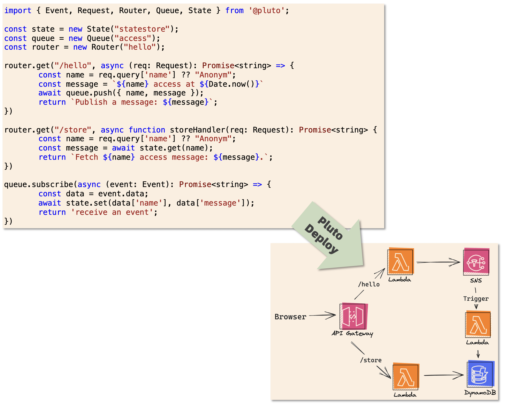

> 图片与 Demo 会在代码重构后替换

<h1 align="center"> Pluto：专注业务，轻松上云 </h1>

 
   <a href="./README.md"> English </a> 
   ｜ 
   <a href="./README_zh.md"> 简体中文 </a>

Pluto 是一种帮助用户轻松上云的开源编程语言，能够让开发者在没有任何云背景的情况下，按照最佳实践架构将应用程序直接发布到云上。开发者像往常一样面向运行时编写业务代码，不需要感知业务代码与基础设施代码之间的差异，同时不需要了解各种云的技术栈与背景知识。除编码外的一切事情，全部交给 Pluto！

来看一个酷炫的例子。

==Demo 展示==

这个例子中，开发者写了一份纯 TypeScript 代码，包含 1 个路由、1 个消息队列、1 个数据库、2 个 HTTP API 和 1 个消息队列订阅者，所有代码都在这一个文件中，这甚至比一个`express.js`后端服务更简单。

然后，执行了一条魔法命令`pluto deploy`，所有的基础设施资源与业务模块就有序地部署到了 AWS 云上。路由将发布为`ApiGateway`组件，消息队列将发布为`SNS`组件，数据库将发布为`DynamoDB`组件，HTTP API 和消息队列的处理函数将发布为 3 个`Lambda`函数。同时，还会自动构建触发器、IAM角色、权限等资源配置。这一切都由 Pluto 自动完成。

此外，如果开发者想要将服务重新发布到 Kubernetes 环境上，不需要修改任何代码，只需新建一份环境配置，就能直接部署到 K8s 上。

**想要了解更多案例？**

- 基于 OpenAI API 快速构建属于你自己的聊天机器人
- 每个清晨的一封问候信息

## 🤯 痛点
从[这里](./docs/zh-CN/what-problems-pluto-aims-to-address.md)可以了解我们为什么要做 Pluto，简单讲，我们想解决几个你或许经常遇到的痛点。

- **上手门槛高：** 开发一个云应用程序需要掌握多种技术栈、知识、工具，同时又很难测试和调试，导致开发者在编写业务之外耗费了大量精力。
- **架构选型难：** 目前云服务提供商提供了数百种能力选项，Kubernetes 更是有无穷尽的能力组合，普通开发者难以针对自身的业务规模、成本预算等选择一个合适的架构选型。
- **编程体验差：** 开发者在编程时需要区分基础设施代码与业务代码的区别，知道每一条语句、每一个文件应该放置的具体位置，清晰地了解哪些代码会在本地执行，要部署到云上的代码需要写在哪里，远远达不到像写一个单机程序一样简单。
- **服务商锁定：** 针对特定服务提供商编程会导致最终代码的灵活性很差，当因为成本等因素需要迁移到其他云平台时，需要进行大量的代码改造才能适配新的运行环境。

## 🌟 特性

- **零上手负担：** 编程界面完全兼容 TypeScript，直接支持使用绝大多数依赖库。
- **专注纯业务逻辑：** 编译时静态推导源代码对基础设施的依赖，使开发者在编程时不需要关系基础设施代码与业务代码的区别。
- **一键上云：** CLI 提供编译、部署等基本能力，除了编码和基本配置外，一切由 Pluto 自动完成。
- **支持多种运行时环境：** 基于 SDK 提供多运行时的统一抽象，让开发者不需要修改源代码，就能够在多种运行时环境之间进行迁移。
- **真实环境测试\*：** 支持在独立隔离的真实云环境执行每一个单元测试，与线上环境保持一致，保障上线后应用程序的正常运行。
- **仿真快速测试\*：** 支持本地仿真测试，加快测试流程，尽早发现问题，提高开发效率。
- **简易的资源扩展方式：** 提供简单的云资源扩展机制，只需要了解基础的 IaC 知识就能够实现支持多运行时的资源类型。
- **架构随业务需要而变化\*：** 随着业务规模、预算成本等因素的变化，开发者可以根据需要在多种架构选型中选择最适合的架构。
- **状态偏移自动纠正\*：** 通过检测 SDK 的更新，获知基础设施的目标状态发生变化，自动将云上应用程序状态修正到与目标状态一致。
- **AI 辅助开发\*：** AI 辅助开发 SDK，进一步降低云资源扩展难度。

标 * 特性正在加紧开发中

## 🚀 快速开始

## 👏 Contributing
Pluto 目前还处于早期阶段，欢迎感兴趣的人参与贡献，无论是对 Pluto 要解决的问题、提供的特性，还是代码实现有任何建议或者想法，都请随时[与我们联系](#)。想要参与代码开发可以参考[DEVELOPMENT](#)指南。

## 💬 Community
