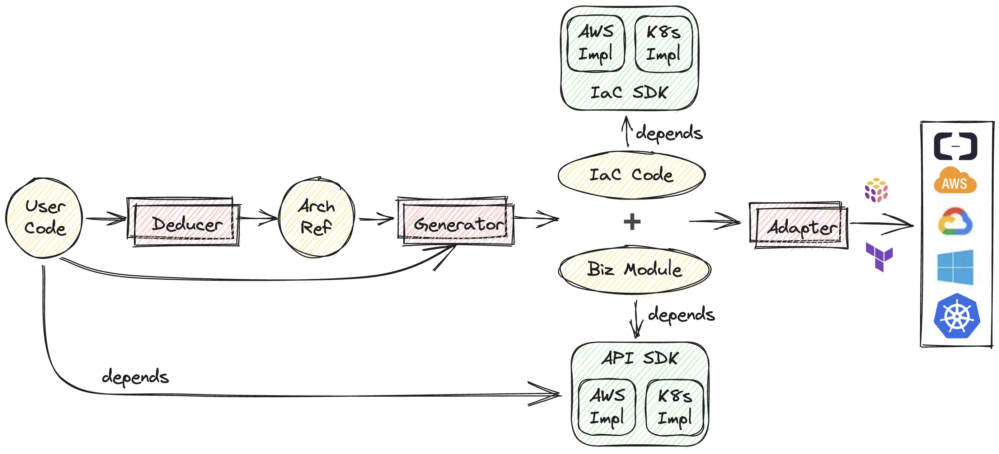

<p align="center"> 
    
    <br/>
    <br/>
   <a href="./README.md"> English </a> 
   | 
   <a href="./README_zh.md"> 简体中文 </a>
</p>

<p align="center">
  <a href="https://join.slack.com/t/plutolang/shared_invite/zt-25gztklfn-xOJ~Xvl4EjKJp1Zn1NNpiw"></a>
  <a href="https://github.com/pluto-lang/pluto/blob/main/LICENSE"></a>
  <a href="https://www.npmjs.com/package/@plutolang/cli"></a>
  <a href="https://www.npmjs.com/package/@plutolang/cli"></a>
</p>

Pluto 是一款研发工具，致力于帮助开发者**更便捷地构建云和 AI 应用**，解决 AI 应用与开源模型难部署等问题。开发者可以使用 **Python、TypeScript** 等熟悉的编程语言编写应用，**在应用代码中直接定义与使用应用所需的云资源**，如 AWS SageMaker、DynamoDB 等。Pluto 会通过**静态分析**的方式从代码中自动获取应用程序的基础设施资源需求，并在指定云平台上创建相应的资源实例，**简化资源创建和应用部署流程**。

**⚠️ 注意：Pluto 仍处于早期阶段，请谨慎用于生产环境。**

## 🌟 示例

让我们来开发一个基于 GPT2 的本文生成应用，这个应用会把用户输入的文本传递给 GPT2 模型，然后返回生成的文本。使用 Pluto 的开发流程如下：

<p align="center">
  
</p>

我们使用 AWS SageMaker 作为模型部署的平台，并使用 AWS Api Gateway 和 Lambda 来承载应用的 HTTP 服务。部署后的应用架构如右上子图 ↗️ 所示，包含两个路由处理函数，一个用于接收用户输入，调用 SageMaker 模型，返回生成的文本，另一个用于返回 SageMaker 模型的端点 URL。

左上子图 ↖️ 截取了应用代码的部分片段，完整代码可以从[这里](https://github.com/pluto-lang/pluto/tree/main/examples/gpt2-hf-sagemaker)获取。在使用 Pluto 开发时，我们只需要在 TypeScript 代码中，通过 `new SageMaker()` 创建一个对象，就可以定义一个 SageMaker 实例，然后就可以直接通过 `sagemaker.invoke()` 调用 SageMaker 模型，也可以通过 `sagemaker.endpointUrl()` 获取 SageMaker 模型的端点 URL。定义 Api Gateway 也只需要 `new Router()` 即可，而在调用 `router.get()`、`router.post()` 等函数时，传入的函数参数会被自动转换为 Lambda 函数。该应用也可以使用 Python 来实现。

编写完应用代码后，只需要执行 `pluto deploy`，Pluto 就会从应用代码中推导出应用的基础设施资源需求，并**自动创建并配置近 30 项云资源**，包括 SageMaker、Lambda、Api Gateway 等资源实例，以及触发器、IAM 角色、权限策略等资源配置。

最终，Pluto 会返回 Api Gateway 的 URL，我们可以直接访问这个 URL 来使用该应用。

**想要了解更多案例？**

- TypeScript 应用：
  - [基于 LangChain、Llama2、DynamoDB、SageMaker 的会话聊天机器人](https://github.com/pluto-lang/pluto/tree/main/examples/langchain-llama2-chatbot-sagemaker)
  - [基于 OpenAI API 的聊天机器人](https://github.com/pluto-lang/pluto/tree/main/examples/chat-bot)
  - [每日笑话 Slack 机器人](https://github.com/pluto-lang/pluto/tree/main/examples/daily-joke-slack)
- Python 应用：
  - [部署 FastAPI 应用到 AWS](https://github.com/pluto-lang/pluto/tree/main/examples/fastapi)
  - [部署 LangServe 示例应用到 AWS](https://github.com/pluto-lang/pluto/tree/main/examples/deploy-langserve-to-aws)
  - [基于 LangChain、Llama2、DynamoDB、SageMaker 的会话聊天机器人](https://github.com/pluto-lang/pluto/tree/main/examples/langchain-llama2-chatbot-sagemaker-python)

## 🚀 快速开始

<b style="color: green;">在线体验</b>：[CodeSandbox](https://codesandbox.io) 提供了线上开发环境，我们在该平台上构建了 [Python](https://codesandbox.io/p/devbox/github/pluto-lang/codesandbox/tree/main/python?file=/README_zh.md) 和 [TypeScript](https://codesandbox.io/p/devbox/github/pluto-lang/codesandbox/tree/main/typescript?file=/README_zh.md) 两种语言的 Pluto 模板应用，**可以直接在浏览器上体验**。打开项目模板后，点击右上角的 Fork 按钮就能创建你自己的工程环境，环境中已经安装 AWS CLI、Pulumi 和 Pluto 基础依赖，按照 README 即可操作使用。

<b style="color: green;">容器体验</b>：我们提供了用于应用开发的容器镜像 `plutolang/pluto:latest`，镜像中包含了 AWS CLI、Pulumi、Pluto 等基础依赖，并配置了 Node.js 20.x 和 Python 3.10 环境。如果你只希望开发 TypeScript 应用，也可以使用 `plutolang/pluto:latest-typescript` 镜像。通过以下命令就可以在容器中体验 Pluto 开发：

```shell
docker run -it --name pluto-app plutolang/pluto:latest bash
```

<b style="color: green;">本地体验</b>：如果你想在本地使用的话，请按照以下步骤配置：

### 0. 安装 Pulumi

Pluto 运行在 Node.js 环境，并使用 Pulumi 与云平台（AWS 或 K8s）进行交互，可以参考 [Pulumi 安装指南进行安装](https://www.pulumi.com/docs/install/)。

### 1. 安装 Pluto

```shell
npm install -g @plutolang/cli
```

### 2. 使用 Pluto 部署您的应用

```shell
pluto new        # 交互式地创建一个新项目，可以选择 TypeScript 或 Python
cd <project_dir> # 进入项目目录
npm install      # 下载依赖

# 如果是 Python 项目，除了 npm install，还需要安装 Python 依赖
pip install -r requirements.txt

pluto deploy     # 一键部署！
```

⚠️ **注意：**

- 如果目标平台为 AWS，Pluto 会尝试读取你的 AWS 配置文件以获取默认的 AWS Region，如果没有配置，会尝试从环境变量 `AWS_REGION` 获取。**如果两者都没有配置，Pluto 在部署时将会报错。**
- 如果目标平台为 Kubernetes，需要事先在 K8s 中安装 Knative，并关闭缩容到零的功能（因为 Pluto 尚不支持 Ingress 转发到 Knative servering，欢迎大佬来改进）。你可以根据[这篇文档](./docs/dev_guide/setup-k8s-dev-env.en.md)配置所需的 Kubernetes 环境。

详细步骤可以参考[上手指南](./docs/documentation/getting-started.zh-CN.md)。

> 目前，Pluto 只支持单文件。在每个处理程序函数中，支持访问处理程序函数作用域之外的字面量常量与普通函数，Python 支持直接访问作用域外的类、接口等，TypeScript 需要将类、接口封装到函数中才能访问。

## 🤯 痛点

[从这里可以了解我们为什么要做 Pluto](./docs/documentation/what-problems-pluto-aims-to-address.zh-CN.md)，简单讲，我们想解决几个你或许经常遇到的痛点。

- **上手门槛高**：开发一个云应用程序需要同时掌握业务与基础设施两种技术栈，同时又很难测试和调试，导致开发者在编写业务之外耗费了大量精力。
- **认知成本高**：目前云服务提供商提供了数百种能力选项，Kubernetes 更是有无穷尽的能力组合，普通开发者通常对云没有足够的理解与认知，难以针对自身的业务确定一个合适的架构选型。
- **编程体验差**：开发者需要维护基础设施与业务逻辑两套代码，或将基础设施配置混杂在业务代码中，导致编程体验不佳，远达不到像写一个单机程序一样简单。
- **服务商锁定**：针对特定服务提供商编程会导致最终代码的灵活性很差，当因为成本等因素需要迁移到其他云平台时，需要进行大量的代码改造才能适配新的运行环境。

## 💡 特性

- **零上手负担**：编程界面完全兼容 TypeScript、Python，支持 LangChain、LangServe、FastAPI 等绝大多数依赖库。
- **专注纯业务逻辑**：开发者只需编写业务逻辑代码，Pluto 通过静态分析自动推导出应用的基础设施需求。
- **一键上云**：CLI 提供编译、部署等基本能力，除了编码和基本配置外，一切由 Pluto 自动完成。
- **支持多种运行时环境**：基于 SDK 提供多运行时的统一抽象，让开发者不需要修改源代码，就能够在多种运行时环境之间进行迁移。

## 🔧 Pluto 是如何工作的?

<p align="center">
  
</p>

整体上，Pluto 的部署过程分为**推导、生成、部署**三个阶段：

1. 推导阶段：推导器（Deducer）会从应用代码中推导出应用所需云资源及资源间依赖关系，表示为云参考架构（architecture reference, arch ref），同时还会将用户的业务代码拆分成多个业务模块，业务模块与依赖的 SDK 共同构成业务模块包（biz bundle）。
2. 生成阶段：生成器（Generator）会依据 arch ref 生成一份独立于用户代码的 IaC 代码。
3. 部署阶段：根据不同的 IaC 代码类型，Pluto 会调用相应的适配器（Adapter），进而与相应 IaC 引擎配合执行 IaC 代码，完成基础设施资源配置与应用程序部署。

其中，推导器、生成器、适配器都是可扩展的，以此来支持更多不同的编程语言、平台接入方式等，目前，Pluto 提供 [Python](https://github.com/pluto-lang/pluto/tree/main/components/deducers/python-pyright) 和 [TypeScript](https://github.com/pluto-lang/pluto/tree/main/components/deducers/static) 两种语言的推导器，以及面向 Pulumi 的[生成器](https://github.com/pluto-lang/pluto/tree/main/components/generators/static)和[适配器](https://github.com/pluto-lang/pluto/tree/main/components/adapters/pulumi)。可以在[这篇文章](./docs/documentation/how-pluto-works.zh-CN.md)中详细了解 Pluto 的工作流程。

## 🤔️ 与其他项目的不同?

Pluto 与其他产品的关键区别在于：它利用静态程序分析技术直接从应用代码中推导资源依赖，并生成独立于用户代码的基础设施代码，使得基础设施配置不侵入用户的业务逻辑，给开发者提供了无需关注基础设施配置即可部署上云的研发体验。

- 与 BaaS 产品（如 Supabase、Appwrite）相比，Pluto 帮助开发者在目标云平台上创建属于自己账户的基础设施环境，而不是提供自管组件。
- 与 PaaS 产品（如 Fly.io、render、Heroku、LeptonAI）相比，Pluto 不负责应用托管，而是通过编译生成细粒度的计算模块，并整合使用云平台提供的、丰富的原子能力，如 FaaS、GPU 实例、消息队列等，在开发者不需要编写额外配置的情况下，将应用直接部署到云平台上。
- 与脚手架工具（如 Serverless Framework、Serverless Devs）相比，Pluto 没有针对特定云厂商或框架提供应用编程框架，而是为用户提供了一致的编程界面。
- 与基于纯注释的 IfC（Infrastructure from Code）产品（如 Klotho）相比，Pluto 直接从用户代码中推导资源依赖，无需额外的注释。
- 与基于动态分析的 IfC 产品（如 Shuttle、Nitric、Winglang）相比，Pluto 通过静态程序分析获取应用的资源依赖，并生成独立于用户代码的基础设施代码，无需执行用户代码。

可以在[这篇文档](./docs/documentation/whats-different.zh-CN.md)中详细了解与其他产品的不同之处。

## 👏 参与贡献

Pluto 目前还处于早期阶段，欢迎感兴趣的人参与贡献，无论是对 Pluto 要解决的问题、提供的特性，还是代码实现有任何建议或者想法，都可以参与到社区进行共建。[项目贡献指南](./docs/dev_guide/dev_guide.en.md)。

## 🐎 路线规划

- 资源静态推导过程完整实现
  - 🚧 资源类型检查
  - ❌ local 变量转换 cloud 资源
- SDK 研发
  - 🚧 Client SDK 研发
  - 🚧 Infra SDK 研发
  - ❌ 更多资源及更多平台支持
- 引擎扩展支持
  - 🚧 Pulumi
  - ❌ Terraform
- 🚧 本地模拟测试功能

详见 [Issue 列表](https://github.com/pluto-lang/pluto/issues)

## 📊 能力矩阵

✅：表示用户可见接口均可使用  
🚧：表示用户可见接口部分可用  
❌：表示暂不支持

### TypeScript

| 资源类型  | AWS | Kubernetes | 阿里云 | 模拟环境 |
| :-------: | :-: | :--------: | :----: | :------: |
|  Router   | ✅  |     🚧     |   🚧   |    🚧    |
|   Queue   | ✅  |     ✅     |   ❌   |    ✅    |
|  KVStore  | ✅  |     ✅     |   ❌   |    ✅    |
| Function  | ✅  |     ✅     |   ✅   |    ✅    |
| Schedule  | ✅  |     ✅     |   ❌   |    ❌    |
|  Tester   | ✅  |     ❌     |   ❌   |    ✅    |
| SageMaker | ✅  |     ❌     |   ❌   |    ❌    |

### Python

| 资源类型  | AWS | Kubernetes | 阿里云 | 模拟环境 |
| :-------: | :-: | :--------: | :----: | :------: |
|  Router   | ✅  |     ❌     |   ❌   |    ❌    |
|   Queue   | ✅  |     ❌     |   ❌   |    ❌    |
|  KVStore  | ✅  |     ❌     |   ❌   |    ❌    |
| Function  | ✅  |     ❌     |   ❌   |    ❌    |
| Schedule  | ✅  |     ❌     |   ❌   |    ❌    |
|  Tester   | ❌  |     ❌     |   ❌   |    ❌    |
| SageMaker | ✅  |     ❌     |   ❌   |    ❌    |

## 💬 社区

欢迎加入我们的 [Slack](https://join.slack.com/t/plutolang/shared_invite/zt-25gztklfn-xOJ~Xvl4EjKJp1Zn1NNpiw) 社区，或者 钉钉交流群: 40015003990。
