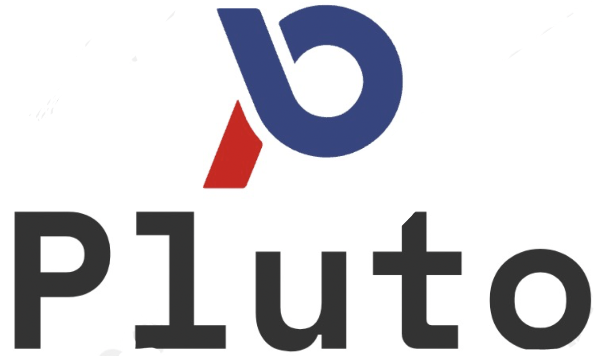
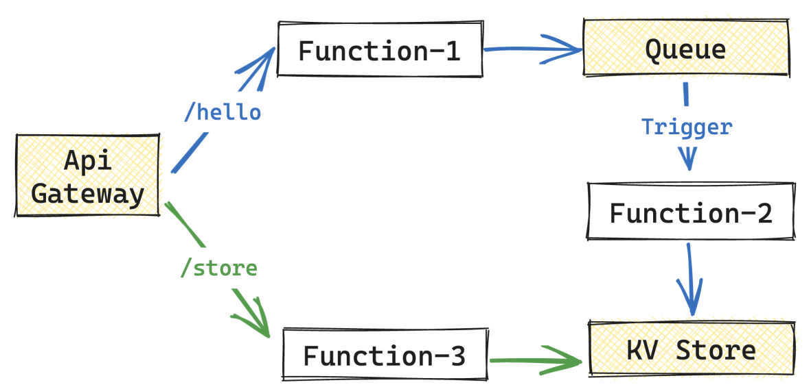

<p align="center"> 
    
    <br/>
    <br/>
   <a href="./README.md"> English </a> 
   ｜ 
   <a href="./README_zh.md"> 简体中文 </a>
</p>

Pluto 是一种新型开源编程语言，旨在帮助开发者编写云应用程序，降低云服务的使用难度。开发者可以根据业务需求，在代码中**直接使用所需资源，例如 KV 数据库、消息队列**等。Pluto 通过**静态分析**代码获取应用依赖的**基础设施资源拓扑**，并在指定的云平台上部署相应的资源实例和应用程序。

**⚠️ 注意：Pluto 仍处于 PoC 阶段，尚未准备好用于生产环境。**

## 🌟 示例

<p align="center">
  
</p>

看一个简单的例子，在这个例子中业务逻辑由 3 个过程构成：

1. Function-1：当用户访问 /hello 时执行该函数，记录该用户的访问时间，并发布到一个消息队列中。
2. Function-2：作为消息队列的订阅者，当有新消息发布时被执行，并将消息存储到 KV 数据库中。
3. Function-3：当用户访问 /store 时执行该函数，获取指定用户上次访问的时间。

如果在 AWS 上部署这个应用，需要配置 Lambda、IAM、ApiGateway、Route、Deployment、SNS、Trigger 等多种资源，手动配置非常繁琐，并且很容易出错。

如果采用 Pluto 编写这个例子，只需一份 TypeScript 代码文件即可，可以视作在编写一个单体应用程序：

1. 首先，定义所需的资源变量，包括 1 个数据库 state、1 个消息队列 queue、1 个路由 router。你可以通过额外的配置项来进行细粒度的资源能力配置。
2. 然后，编写 router 的相应路径处理过程以及 queue 的订阅处理过程，并在处理过程中使用资源类型提供的方法来实现业务逻辑。

通过以上步骤，就完成了全部的代码编写过程。

```typescript
import { Event, Request, Router, Queue, State } from "@plutolang/pluto";

// Define the resources
const state = new State("statestore", {
  /* additional configuration */
}); // Key-Value Store
const queue = new Queue("access"); // Message Queue
const router = new Router("hello"); // ApiGateway

// Function-1
router.get("/hello", async (req: Request): Promise<string> => {
  const name = req.query["name"] ?? "Anonym";
  const message = `${name} access at ${Date.now()}`;
  await queue.push({ name, message });
  return `Publish a message: ${message}`;
});

// Function-2
queue.subscribe(async (event: Event): Promise<string> => {
  const data = event.data;
  await state.set(data["name"], data["message"]);
  return "receive an event";
});

// Function-3
router.get("/store", async (req: Request): Promise<string> => {
  const name = req.query["name"] ?? "Anonym";
  const message = await state.get(name);
  return `Fetch ${name} access message: ${message}.`;
});
```

<p align="center">
  
</p>

接下来，只需执行一条命令 `pluto deploy`，所有的基础设施资源和业务模块就会有序地部署到 AWS 云上。

这个过程中，路由将被发布为 ApiGateway 组件，消息队列将被发布为 SNS 组件，数据库将被发布为 DynamoDB 组件。而处理 HTTP API 和消息队列的函数将被发布为三个 Lambda 函数。同时，Pluto 还会自动构建触发器、IAM 角色、权限等资源配置。这些步骤都由 Pluto 自动完成。

此外，如果开发者想要将服务重新发布到 Azure 等其他公有云或 Kubernetes 环境上，不需要修改任何代码，只需执行 `pluto stack new` 新建一份环境配置，就能直接部署。

[点击](https://seafile.zhengsj.cn:7443/f/8b837938964d4ebea760/)观看完整的视频演示。

**想要了解更多案例？**

- 基于 OpenAI API 快速构建属于你自己的聊天机器人
- 每个清晨的一封问候信息

## 🤯 痛点

[从这里可以了解我们为什么要做 Pluto](./docs/zh-CN/what-problems-pluto-aims-to-address.md)，简单讲，我们想解决几个你或许经常遇到的痛点。

- **上手门槛高**：开发一个云应用程序需要同时掌握业务与基础设施两种技术栈，同时又很难测试和调试，导致开发者在编写业务之外耗费了大量精力。
- **架构选型难**：目前云服务提供商提供了数百种能力选项，Kubernetes 更是有无穷尽的能力组合，普通开发者难以针对自身的业务确定一个合适的架构选型。
- **基础设施配置侵入业务编程**：开发者在编程时需要区分基础设施代码与业务代码的区别，知道每一条语句、每一个文件应该放置的具体位置，清晰地了解哪些代码会在本地执行，要部署到云上的代码需要写在哪里，远远达不到像写一个单机程序一样简单。
- **服务商锁定**：针对特定服务提供商编程会导致最终代码的灵活性很差，当因为成本等因素需要迁移到其他云平台时，需要进行大量的代码改造才能适配新的运行环境。

## 🌟 特性

- **零上手负担**：编程界面完全兼容 TypeScript，直接支持使用绝大多数依赖库。
- **专注纯业务逻辑**：编译时静态推导源代码对基础设施的依赖，使开发者在编程时不需要关系基础设施代码与业务代码的区别。
- **一键上云**：CLI 提供编译、部署等基本能力，除了编码和基本配置外，一切由 Pluto 自动完成。
- **支持多种运行时环境**：基于 SDK 提供多运行时的统一抽象，让开发者不需要修改源代码，就能够在多种运行时环境之间进行迁移。

## 🔧 Pluto 是如何工作的?

<p align="center">
  
</p>

整体上，Pluto 首先从用户代码中推导出所需云资源及资源间依赖关系，构建云参考架构（architecture reference）。然后，依据 arch ref 生成一份独立于用户代码的 IaC 代码，并将用户代码拆分成多个业务模块。最终，由 IaC 引擎适配器根据 IaC 代码的类型调用相应 IaC 引擎执行部署，将应用程序发布到指定的云平台上。

可以在[这篇文章](./docs/zh-CN/how-pluto-works.md)中详细了解 Pluto 的工作流程。

## 🤔️ 与其他项目的不同?

Pluto 与其他产品的关键区别在于：它利用程序分析技术直接从用户代码中推导资源依赖，并生成独立于用户代码的 IaC 代码，使得编译时执行的代码与用户代码没有直接关联。这给开发者提供了在编写代码时无需关注基础设施配置的体验。

- 与 BaaS 产品（如 Supabase、Appwrite）相比，Pluto 帮助开发者在目标云平台上创建属于自己账户的基础设施环境，而不是提供自管组件。
- 与 PaaS 产品（如 Fly.io、render、Heroku）相比，Pluto 不负责容器托管，而是通过编译生成更细粒度的计算模块，以利用云平台提供的 FaaS 等能力。
- 与脚手架工具（如 Serverless Framework、Serverless Devs）相比，Pluto 没有针对特定云厂商或框架提供应用编程框架，而是为用户提供了一致的编程界面。
- 与基于纯注释的 IfC（Infra from Code）产品（如 Klotho）相比，Pluto 直接从用户代码中推导资源依赖，无需额外的注释。
- 与基于 SDK 的 IfC 产品（如 Shuttle、Nitric）相比，Pluto 通过静态程序分析获取应用的资源依赖，而不是通过执行用户代码来获取。
- Winglang 和 Pluto 都属于基于编程语言的 IfC 产品，但与 Winglang 相比，Pluto 会生成独立于用户代码的 IaC 代码，使得编译时执行的代码与用户代码没有直接关联。

可以在[这篇文档](./docs/zh-CN/whats-different.md)中详细了解与其他产品的不同之处。

## 🚀 快速开始

### 0. 前提条件

Pluto 使用 Pulumi 与云平台（AWS 或 K8s）进行交互，部署云资源。

#### 0.1 安装 Pulumi

可以参考 [Pulumi 安装指南](https://www.pulumi.com/docs/install/)，安装完后需要在命令行中进行登录。

```shell
pulumi login
```

#### 0.2 准备目标环境（AWS 或 K8s）访问凭证

根据你的需要选择 AWS 或 Kubernetes 即可。

**准备 AWS 访问凭证**

如果你之前已经安装并配置了 AWS CLI， Pluto 将使用你已经配置的凭证信息。如果你有多份配置信息，你可以使用环境变量选用要启用的配置。

```shell
export AWS_PROFILE="dev" # 替换成你指定的配置
```

如果你没有使用 AWS CLI，你需要使用以下环境变量配置你的凭证信息。

```shell
export AWS_ACCESS_KEY_ID="AKIAQZDxxxx" # 替换成你的 AccessKey
export AWS_SECRET_ACCESS_KEY="oE/xxxx" # 替换成你的 SecretKey
export AWS_REGION="xx-xxxx-x"          # 替换成你期望部署的 Region
```

**准备 Kubernetes 访问凭证**

不需要额外的配置，只需知道 kubeconfig 存放的位置即可，通常在 `~/.kube/config`。

> 如果选择 Kubernetes 作为运行时环境，需要事先在 K8s 中安装 Knative，并关闭缩容到零的功能（因为 Pluto 尚不支持 Ingress 转发到 Knative servering，欢迎大佬来改进）。

### 1. 安装 Pluto

```shell
npm install -g @plutolang/cli
```

### 2. 使用 Pluto 部署您的应用

```shell
pluto new        # 交互式地创建一个新项目
cd <project_dir> # 进入项目目录
npm install      # 下载依赖
pluto deploy     # 一键部署！
```

## 👏 参与贡献

Pluto 目前还处于 PoC 阶段，欢迎感兴趣的人参与贡献，无论是对 Pluto 要解决的问题、提供的特性，还是代码实现有任何建议或者想法，都可以参与到社区进行共建。[项目贡献指南](./docs/dev_guide/dev_guide.md)。

## 🐎 路线规划

- [ ] 资源静态推导过程完整实现
  - [ ] 资源类型检查
  - [ ] local 变量转换 cloud 资源
- [ ] SDK 研发
  - [ ] API SDK 研发
  - [ ] IaC SDK 研发
  - [ ] 更多资源及更多平台支持
- [ ] 引擎扩展支持
  - [ ] Terraform
  - [ ] ...
- [ ] 本地模拟测试功能

详见 [Issue 列表](https://github.com/pluto-lang/pluto/issues)

## 💬 社区

欢迎加入我们的社区

<!--+ [Slack](https://pluto-lang.slack.com)-->

- Dingtalk: 40015003990
