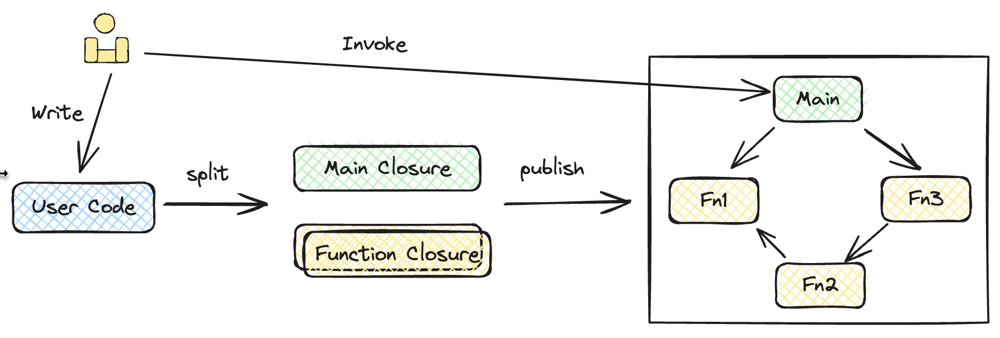
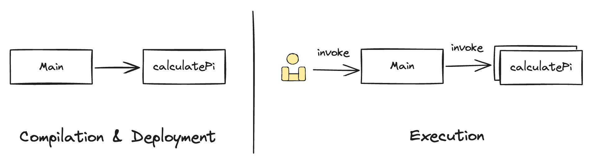

# 云原生应用开发模式的一个构想


## 背景

云原生应用通常形象地解释为应用架构出生或生长在云基础设施上的应用程序。此类基于云基础设施构建的应用程序能够有效利用云提供的自动扩缩、高可靠性等特性，这对于个人开发者和中小型企业来说，不需要关心基础设施的复杂性，又能获得强大的支撑能力，显然是一件很香的事情。

### 现状

那么，现在是怎么开发云应用程序的？提到云原生应用，大家通常会想到容器、微服务，这两项技术也在 CNCF 对云原生的定义中被提到。一个典型的开发流程可能是：开发者开发微服务粒度的应用代码，封装成容器，最终托管到 PaaS 平台上。

但随着云的发展，函数计算（Function as a Service, FaaS）已经成为云的重要组成部分。相较于 PaaS，FaaS 与云的各项能力结合的更紧密，在扩缩容、冷启动等方面，FaaS 的性能也更加强悍，例如，AWS Lambda 的冷启动时延已经达到百毫秒级。

### 问题

那么，微服务、容器的开发模式是否仍适用于基于 FaaS 的云原生应用？分析来看：

1. 函数承载的服务通常被称为 NanoService，比微服务的粒度更小，如果由开发者将一个应用程序的每个函数逐个打包、发布，即使云厂商提供了命令行工具，**整个操作过程也会比较繁琐**。
2. 将一个应用程序拆分成若干个函数进行开发，各个函数在代码关系上互不相干，函数间的调用必须通过 SDK 进行，这使得开发一个应用需要在不同函数间反复切换，在**编程思维上极不连贯**。
3. 对函数进行编排需要了解云基础设施提供的事件机制、编排工具等，有了**更高的学习成本**。

整体来说，直接基于 FaaS 的开发模式体验较差，如何有效管理和协调这些函数成为了一个重要问题。显然，我们不希望开发一个应用程序是这种体验，那么，我们该如何开发云原生应用呢？在这里提出一个构想：**单体式编程，编译时拆分，分布式执行**。



## 联想

看到这个构想，你可能会觉得这与并行编程框架 OpenMP 的思路比较相近，的确如此。OpenMP 利用编译器在代码并行区域添加多线程代码实现并行执行，而在这个构想中同样是利用编译器识别并提取可独立计算的代码区域，但具体的分布式执行则交由云基础设施负责。

大数据计算的 MapReduce、Spark 可能也有些相似，以及近来比较火热的 Ray，同为云计算领域，同样都是面向大规模分布式计算。这里，与以上各类框架显著不同的一个点是，底层运行时实现方式的不同。以上各类框架都是各自构建了一套底层运行时环境来支撑特定种类任务的分布式执行，而这里的构想则是希望基于云基础设施提供的 FaaS 作为统一的底层环境，来实现通用计算，支撑各类云原生应用。两种方式相较而言，前者针对特定负载可能有调度、性能优势，而后者能与云基础设施提供的各项能力结合的更紧密，同时也能让各种场景的负载有结合的可能。

在开发体验上，的确是相近的。

## 构想

### 为什么要“单体式编程”

因为我们在开发一个单体应用程序时体验是非常好的，我们的上下文都在一个工程项目中，变量间的依赖关系、函数间的调用关系能够在执行前由 Lint、Format 工具，IDE 插件等各类工具进行检查。

### 为什么能“编译时拆分”

没有任何编程约束的代码文件的确难以进行拆分，但是可以通过定义关键字、特殊类、特殊函数等方式来指导编译器对代码进行拆分。

例如下面这份代码，可以将 Function 看作使特殊类，而它在构造函数中传递的函数定义就可以被分析提取成一个独立的计算模块。当然，在实际实现时肯定需要考虑更多的情况。

```typescript
class Function  {
	constructor(fn: (...args: any[]) => any) { /* ... */ }
}

const fn = new Function((a: number, b: number ) => { return a + b; });

async main() {
	const c = await fn.invoke(1, 1);
	console.log("1 + 1 = ", c);
}
main();
```

特别的是，在拆分出一个个计算模块后，整个代码文件相应去除各个计算模块的代码，剩下的部分也应该成为一个计算模块。而这个计算模块就是整个应用程序的入口，类似单体应用中的 main 函数，而这个 main 函数就可以完成整个应用程序的逻辑编排。

这样，我们就获得了单体式编程的开发体验，并通过编译时拆分的方式获得了基于云的分布式执行的能力。这种开发模式的产物是直接长在云基础设施上的，属于云原生应用。

## 示例

来看一个基于这种构想的示例程序。这个程序是利用蒙特卡洛计算 Pi，整个代码逻辑很简单：创建 10 个 Worker，每个 Worker 各自执行 100 万次采样，最终汇总采样结果。

```typescript
const calculatePi = new Function((iterations: number): number => {
  let insideCircle = 0;

  for (let i = 0; i < iterations; i++) {
    const x = Math.random();
    const y = Math.random();
    if (x * x + y * y <= 1) {
      insideCircle++;
    }
  }

  const piEstimate = (insideCircle / iterations) * 4;
  return piEstimate;
});

async function main() {
  const workerCount = 10;
  const iterationsPerWorker = 1000000;

  let piPromises: Promise<number>[] = [];
  for (let i = 0; i < workerCount; i++) {
    piPromises.push(calculatePi.invoke(iterationsPerWorker));
  }

  const piResults = await Promise.all(piPromises);

  const piSum = piResults.reduce((sum, current) => sum + current, 0);
  const pi = piSum / numWorkers;
  console.log(`Estimated value of π: ${pi}`);
}

main();
```



这份代码执行起来的预期效果应该像上面这张图展示的：

1. 在编译阶段，拆分出两个计算模块，一个对应 `calculatePi`，另一个对应整体代码去除 `calculatePi` 后的剩余代码（main 代码）。
2. 然后将两个计算模块部署成两个 FaaS 资源实例。
3. 部署完成后，调用执行 main 代码对应的 FaaS 实例，从日志中获取输出结果。

更复杂的示例可以从这里了解：

- [大数据场景: Word Count](https://github.com/pluto-lang/pluto/issues/108)
- [Web 场景](https://github.com/pluto-lang/pluto/issues/109)

2024 年 Pluto 也将基于这个构想继续进行尝试，在具体实现时，会利用静态分析、IaC 等技术来支撑，感兴趣或有适用场景的同学也欢迎交流。

## 参考资料

- [CNCF Cloud Native Definition v1.0](https://github.com/cncf/toc/blob/main/DEFINITION.md)
- [Lambda execution environments - AWS Lambda](https://docs.aws.amazon.com/lambda/latest/operatorguide/execution-environments.html)
