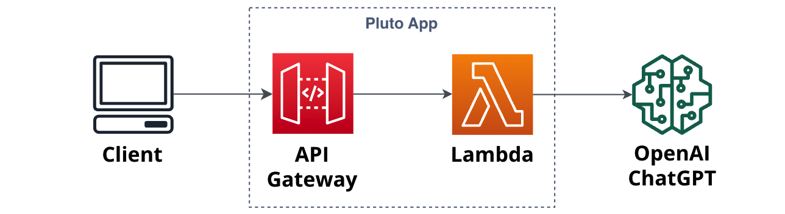

# How to Bridge the Last Mile in LangChain Application Development


Undoubtedly, [LangChain](https://github.com/langchain-ai/langchain) is the most popular framework for AI application development at the moment. The advent of LangChain has greatly simplified the construction of AI applications based on Large Language Models (LLM). If we compare an AI application to a person, the LLM would be the "brain," while LangChain acts as the "limbs" by providing various tools and abstractions. Combined, they enable the creation of AI applications capable of "thinking." However, this article does not delve into the specific usage of LangChain but aims to discuss with readers the last-mile issue in LangChain application development—**how to deploy LangChain applications**, using AWS as an example. _Why deploy on AWS? The free tier is simply too appealing for daily use._

First, let's define the scope of this discussion: we are not talking about only deploying a LangChain application's code to the cloud. If that were the case, we would only need to consider using services like EC2 virtual machines, Fargate container services, or Lambda functions. However, a complete AI application often requires a series of backend services for support, such as using databases to save session histories or vector databases to store knowledge base embeddings. To achieve more comprehensive AI application functionalities, we might also need messaging queues, API Gateways, and so on. Therefore, we will discuss: **How to deploy a LangChain application and its dependent backend services to the cloud together.**

## 🔗 LangServe

Those familiar with the LangChain ecosystem might think of LangChain's sub-project [LangServe](https://github.com/langchain-ai/langserve) upon reading this. LangServe's goal is to simplify the deployment of LangChain applications. It can package LangChain apps into API servers and provides default endpoints such as stream, async, docs, and playground. But LangServe alone does not resolve the deployment issues of LangChain applications. It ultimately provides an API server based on FastAPI, akin to frameworks like Flask and Django. How to deploy LangServe applications to the cloud and how to create and manage the dependent backend services remain unanswered by LangServe.

Nonetheless, LangChain is actively offering hosted LangServe capabilities on the LangSmith platform, indicating that the LangChain community is aware of the deployment issues and is working towards a solution. Even so, what about the backend services that LangChain applications depend on? Should LangSmith also provide these services? Aren't application hosting and backend services core competencies of cloud service providers? Why not directly use services from AWS, Azure, and others?

## 🪄 Three Ways to Deploy LangChain Applications

Let's examine how to deploy LangChain applications on AWS. Here, we introduce three different methods for deployment. If you have better approaches, feel free to join the discussion.

### ⚙️ AWS CDK

In an AWS GenAI Day event, AWS invited Harrison Chase, the CEO of LangChain. The theme was "Building and Deploying Cutting-edge Generative AI Applications with LangChain and Amazon Bedrock." You can watch the recorded event [here](https://aws.amazon.com/startups/learn/build-and-deploy-a-cutting-edge-generative-ai-application-with-langchain-and-amazon-bedrock).

Interestingly, a significant portion of the event was dedicated to introducing how AWS's services like OpenSearch, Bedrock, Kendra, etc., can integrate with LangChain. However, the final demonstration did not show how to create instances of these services or how to deploy LangChain applications on AWS. Instead, it showcased a locally executed LangChain application that utilized pre-deployed instances of AWS Bedrock and Kendra services.

However, I found a [`langchain-aws-template` GitHub repository](https://github.com/langchain-ai/langchain-aws-template) in the Resources list at the end of the video. It contains two example applications integrating AWS with LangChain, complete with deployment guides. The deployment process includes four steps:

1. Create a specific Python environment using Conda;
2. Configure keys and other necessary application data;
3. Execute a Bash script to package the application;
4. Deploy the application using AWS CDK.

It seems quite straightforward, right? But if you need to implement more complex features and rely on more backend services, you will have to modify the packaging process and the CDK deployment scripts. This can be challenging for developers unfamiliar with AWS CDK or AWS cloud services.

Additionally, we previously conducted a [comparison](https://pluto-lang.vercel.app/cookbook/langchain-llama2-chatbot-sagemaker) that found using IaC-based deployment methods (like Terraform) results in **IaC code that is 2-3 times the volume of the business code**. This means using IaC tools requires spending a significant amount of time maintaining IaC code, while developers clearly prefer to focus more on business code development, as the goal is to implement application functionalities.

_A quick note here: AWS CDK is one type of Infrastructure as Code (IaC) tool, alongside others like Terraform and Pulumi. They have similar usage patterns and share the issues mentioned above._

### ⌨️ AWS Console

If we don't use AWS CDK, we can manually create the backend services that applications depend on by logging into the AWS console. However, this method is quite cumbersome, involving repetitive navigation across different console pages to create various service instances and configure permissions between them. Moreover, these processes cannot be automated, making team collaboration, continuous integration, and continuous deployment impractical for complex applications.

As we can see from the above, both the AWS CDK deployment method and manual creation have their difficulties:

1. Prone to errors: Both methods essentially involve manually creating granular service instances, which can lead to configuration omissions and errors that are hard to detect during deployment and only surface when the application runs.
2. Requires AWS background knowledge: Whether defining service instances through CDK code or manually creating them via the console, developers need an in-depth understanding of AWS services, including direct dependencies like DynamoDB, S3, and indirect ones like IAM.
3. Tedious permission configuration: For security reasons, we usually adhere to the principle of least privilege when configuring permissions for resource service instances. If developers manually manage these permissions through CDK or the console, it will undoubtedly be a very cumbersome process. Moreover, it's easy to forget to update permission configurations after modifying business code.
4. Dependency management: When publishing a LangChain application as an AWS Lambda function instance, we need to package the application's SDK dependencies during the packaging process. This requires manual management by developers, which can lead to missed dependencies. If the local device's operating system or CPU architecture doesn't match AWS's platform, the packaging process becomes even more troublesome.

### 🤖️ Pluto

The analysis above shows that despite the powerful services offered by large cloud service providers like AWS, there's still a significant learning curve for developers to effectively utilize these services. This led us to an idea: what if we could deduce the infrastructure resource requirements of an application directly from the LangChain application code, and then automatically create corresponding resource instances on cloud platforms like AWS? This approach could simplify the process of resource creation and application deployment. Based on this idea, we developed a development tool named [Pluto](https://github.com/pluto-lang/pluto).

Pluto is a tool designed for individual developers, aimed at **making the construction of cloud and AI applications more convenient**, addressing the aforementioned usability issues related to cloud services. Developers can **directly define and use the cloud services their application requires within the application code**, including AWS DynamoDB, SageMaker, and more. Pluto employs **static program analysis** to automatically extract the infrastructure requirements from the code and create the necessary service instances on the designated cloud platform.

So, what's it like to deploy a LangChain application using Pluto? Let's look at a simple example:

```python
import os

from pluto_client import Router, HttpRequest, HttpResponse
from langchain_core.pydantic_v1 import SecretStr
from langchain_core.prompts import ChatPromptTemplate
from langchain_core.output_parsers import StrOutputParser
from langchain_openai import ChatOpenAI

prompt = ChatPromptTemplate.from_template("tell me a short joke about {topic}")
model = ChatOpenAI(
    model="gpt-3.5-turbo",
    api_key=SecretStr(os.environ["OPENAI_API_KEY"]),
)
output_parser = StrOutputParser()

def handler(req: HttpRequest) -> HttpResponse:
    chain = prompt | model | output_parser
    topic = req.query.get("topic", "ice cream")
    joke = chain.invoke({"topic": topic})
    return HttpResponse(status_code=200, body=joke)

router = Router("pluto")
router.get("/", handler)
```

The code snippet above is a LangChain application implemented with Pluto, and it looks just like a regular Python application, doesn't it? However, by simply executing `pluto deploy`, Pluto can construct the application architecture shown in the figure below on the AWS platform. During the process, it will automatically create instances for the API Gateway and Lambda, and configure the routing, triggers, permissions, etc., from API Gateway to Lambda.

<p align="center">
  
</p>

Due to space limitations, the example above only demonstrates the integration of a LangChain application with the API Gateway resource. Similarly, using variable definitions, you can **integrate more resources such as DynamoDB, S3, SageMaker**, and more. You can find additional examples [here](https://pluto-lang.vercel.app/cookbook).

Since the infrastructure configuration is defined alongside the application code, developers can freely alter the code according to their needs. In the next `pluto deploy`, Pluto will automatically update the infrastructure configuration of the application without any extra steps from the developer, thus solving the previously mentioned issues of error-proneness, code packaging, and cumbersome permission configurations.

## 💬 Conclusion

The analysis above shows that despite the powerful services offered by large cloud service providers like AWS, there's still a significant learning curve for developers to effectively utilize these services. This might explain the emergence of AI Infra products like [LangSmith](https://smith.langchain.com), [Modal](https://modal.com), and [LaptonAI](https://www.lepton.ai), which aim to be one-stop service providers for AI applications. We, on the other hand, take a different approach by directly deducing the infrastructure requirements from the application code and automatically creating corresponding service instances on cloud platforms, thus assisting developers with deployment issues. Our hope is to enable developers to focus on writing business logic, allowing even those unfamiliar with AWS to deploy applications to the cloud without getting bogged down in the tedious configuration of infrastructure.

Lastly, if you like the Pluto project and want to give it a try, you can visit our [Getting Started guide](https://pluto-lang.vercel.app/documentation/getting-started), which offers various usage options including containers and online. If you have any questions or suggestions, or would like to contribute (very welcome!), feel free to [join our community](https://github.com/pluto-lang/community) to participate in discussions and co-creation.

And finally, if you've come this far, why not **give us a star🌟**? GitHub link 👉 [https://github.com/pluto-lang/pluto](https://github.com/pluto-lang/pluto).

## Reference

- [Recipe Collection](https://pluto-lang.vercel.app/cookbook):
  - [Llama2 Conversational Chatbot](https://pluto-lang.vercel.app/cookbook/langchain-llama2-chatbot-sagemaker-python).
  - [RAG Document Bot](https://pluto-lang.vercel.app/cookbook/rag-qa-bot-with-web).
  - [Deploying LangServe Applications to AWS](https://pluto-lang.vercel.app/cookbook/deploy-langserve-to-aws).
- [LangChain GitHub](https://github.com/langchain-ai/langchain).
- [LangServe GitHub](https://github.com/langchain-ai/langserve).
- [AWS Free Resources](https://aws.amazon.com/cn/free).
- [Build and deploy a cutting-edge generative AI application with LangChain and Amazon Bedrock | AWS GenAI Day](https://aws.amazon.com/startups/learn/build-and-deploy-a-cutting-edge-generative-ai-application-with-langchain-and-amazon-bedrock).
- [LangChain AWS Template](https://github.com/langchain-ai/langchain-aws-template).
- [Pluto GitHub](https://github.com/pluto-lang/pluto).
- [Pluto Community](https://github.com/pluto-lang/community).
- [Pluto Website](https://pluto-lang.vercel.app/zh-CN).
