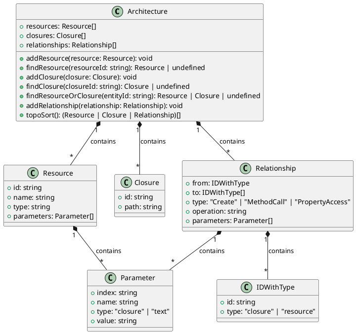

# Architecture Reference

The Architecture Reference (hereafter referred to as Arch Ref) is a product of the [deducer](./deducer.en.md). It represents the architecture of an application mapped to the cloud, including the cloud BaaS resource instances that the application needs to create, the event handling functions of the resource instances, and the relationships between the resource instances.

Users can understand the architecture of the application from the Arch Ref and confirm whether the architecture meets their expectations. Pluto will automatically create cloud BaaS and FaaS resource instances based on the content of the Arch Ref, with minimized permission configuration.

## Components

The Arch Ref consists of three parts: resource instances, compute closures, and resource relationships. The following diagram shows the composition of the Arch Ref:

### Resource Instances

A Resource Instance is a cloud resource instance that the application needs to create. It includes information such as the instance's ID, type, name, and parameters.

_Note: The name and ID here may not match the ID generated at runtime, as the ID is also generated based on the resource name. During the deduction phase, the resource name corresponds to the variable name of the resource object, while the name of the resource object at runtime is determined by the parameters given by the user. For example, `router = new Router("name")`, in the generated Arch Ref, the name is router, but at runtime, the resource name will be name._

### Compute Closures

A Compute Closure is typically an event handling function of a resource instance, such as a Queue subscriber or a Router path handling function. It includes the closure's ID and path information.

The path information is the folder path where the closure is located after export, relative to the root directory of the application. If it's a TypeScript application, the compute closure folder is a Node.js module, containing an `index.ts` file and an `index.js` file generated by esbuild compilation and packaging. The `default` function exported in this module is the event handling function defined by the user.

### Resource Relationships

A Resource Relationship represents the relationship between resource instances, including the actor of the relationship, the type, operation, and parameters.

The actor could be a resource instance or a compute closure. If it's a resource instance, the corresponding relationship type should be `Create`, and the corresponding operation should belong to the [Infra API](./sdk.zh-CN.md) of that resource type, indicating that the resource instance has called an Infra API to create another resource instance or compute closure. If it's a compute closure, the corresponding relationship type should be `MethodCall` or `PropertyAccess`, indicating that a Client API method or property of a resource instance has been called in the compute closure.

The `Create` relationship guides Pluto to create and associate resource instances at compile time, the `MethodCall` relationship guides Pluto to configure appropriate permissions for the FaaS instance to which the compute closure belongs at compile time, and the `PropertyAccess` relationship guides Pluto to configure appropriate environment variables for the FaaS instance to which the compute closure belongs at compile time, enabling it to access the properties of the resource instance at runtime.

<!--

-->
