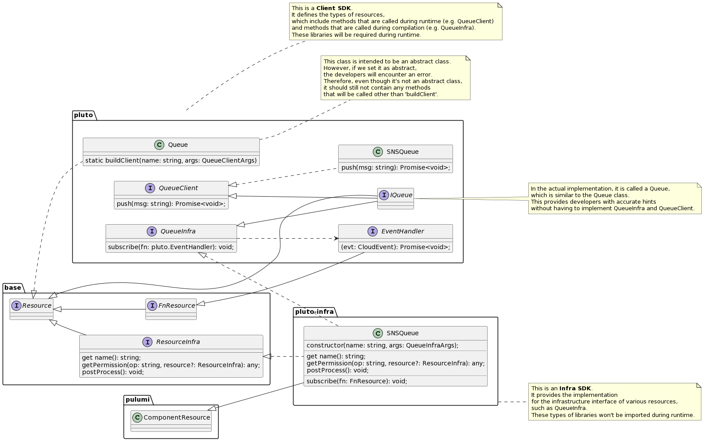

# How the SDK Works

The above class diagram illustrates the inheritance relationship between types in the SDK using a message queue as an example. In this diagram, the message queue is ultimately implemented using AWS SNS.

In Pluto, there are two types of SDKs related to the cloud platform. These two SDKs each include multiple runtime implementations. They are:

1. Client SDK:
   - Defines two types of methods:
     1. Functions supported by resource components at runtime.
     2. Methods for associating resource components.
   - SDKs based on resource components implement the first type of methods. These methods typically encapsulate the functionality supported by BaaS components at runtime. For example, the `push` method in `pluto.SNSQueue` wraps the `PublishCommand` of SNS and is called by Lambda during runtime.
2. Infrastructure SDK (Infra SDK):
   - Implements the second type of above methods based on the IaC SDK.
   - Completes the resource creation process in the constructor. For example, the AWS SNS component is defined in `pluto-infra.SNSQueue`.
   - Implements resource associations in methods. For example, the `subscribe` method in `pluto-infra.SNSQueue` builds the association between SNS and Lambda using a trigger.

The `@plutolang/base` library contains three basic interfaces:

1. **IResource**: Indicates that the class or interface is related to cloud resources. During compilation, whether an instantiated object's type implements this interface is used to determine if it is a cloud resource.
2. **FnResource**: Indicates that the class or interface is related to FaaS resources. During compilation, whether a function type inherits this interface is used to determine if the function is an instance of FaaS resource.
3. **ResourceInfra**: This interface must be implemented by infrastructure implementation classes. It is used to complete the creation of infrastructure components.
   - `get name()`: Retrieves the basic name of the resource object, which may be different from the name of the created resource instance.
   - `getPermission()`: Generates the necessary permissions for calling specific operations on itself.
   - `postProcess()`: Some operations need to be performed only after all configuration processes are completed. These operations are placed in this function. For example, AWS ApiGateway needs to configure Deployment and Stage after setting up all routes.
4. **IResourceCapturedProps**: This interface should be extended within both the client implementaion and infrastructure implementation of a resource type. It contains some getter methods that defines the properties of the resource, which are generated at compile time and will be obtained during runtime. More details can be found in [this design document](../design/capture-value.en.md).
   - For instance, the URL of a Router resource.
5. **IResourceClientApi**: This interface should be extended within the client implementation of a resource type. It contains several methods that can be called during runtime. Typically, these methods represents the function provided by the platform's specific resource type.
   - For instance, the `push` method of message queue is used to publish a message to the message queue during runtime.
6. **IResourceInfraAPi**：This interface should be extended within the infrastructure implementation of a resource type. It contains several methods that can be called at compile time. Typically, these methods are employed to establish the connections between resources.
   - For instance, methods such as Get and Post of the Router type are used to define the relationship between a Router resource object and a FaaS resource object.

If you're looking to extend the SDKs, check out [this document](../../dev_guide/extend-sdk.en.md).

## FAQ

### How to discover Infra SDK during compilation?

When users program with the SDK, they see the Client SDK. How do we discover the Infra SDK during compilation and generate the corresponding IaC code?

Currently, we agree that the package name of the Infra SDK will be the Client SDK package name followed by '-infra'.

### How to determine the specific Infra implementation class during compilation?

In the Infra SDK, there is an abstract base class for each resource type. This includes a `createInstance` static method, which selects and instantiates the appropriate implementation class based on platform and engine choices.

### How to build specific Client implementation classes at runtime?

The resource construction process, such as `new Queue(...)` written in user code, will be rewritten as `Queue.buildClient(...)` in the final compute module code. Additionally, Pluto will inject the `RUNTIME_TYPE` environment variable into the runtime instance, and the `buildClient` method will create the specific implementation class based on this environment variable.

### Why separate Client SDK and Infra SDK into different packages?

1. The Infra SDK depends on the IaC SDK, which is usually larger in size and is not called during runtime.
2. The code definitions in the Infra SDK represent the target state of the application in production. Independent deployment allows Pluto to independently detect changes in the target state of each application. If the target state changes, Pluto can alert the user that the target state of their application is inconsistent with the actual state and needs to be updated and deployed.
