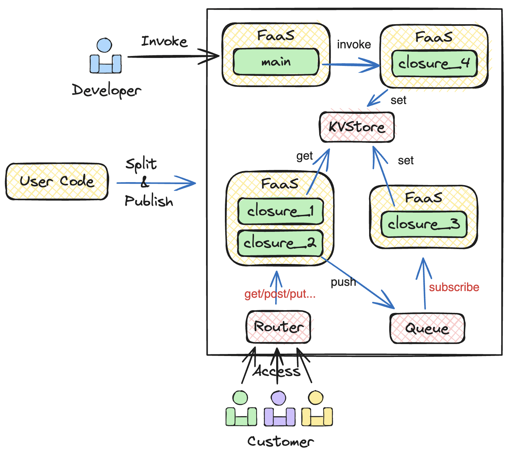
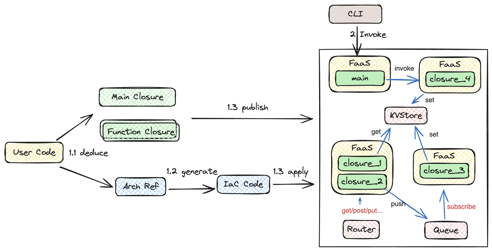

# Execution Mode Based on Compute Closures

Pluto breaks down program code into compute closures, each being an independent, importable module. Different closures may share resource objects, such as queues or key-value stores. The connections between closures are formed through their access to these shared resources. These connections link all closures into a network, forming the application's [reference architecture](../concepts/arch-ref.en.md).

During deployment, Pluto wraps closures into FaaS instances and builds shared resources into BaaS instances. Through access relationships and event triggers, all FaaS and BaaS instances are connected. This completes the mapping of the reference architecture to cloud resources, transforming a locally written monolithic application into a distributed, cloud-native application running on a cloud platform.

## Compute Closures

A compute closure is a basic unit in Pluto, and each closure in an application has a unique ID. In a Node.js program, each closure exists as an importable module, saved in a separate folder's `index.js` file. The exported `default` function is the entry point of the closure.

Closures are generated by the deducer during the deduction phase. The [deducer](../concepts/deducer.en.md) analyzes the cloud resource types and infrastructure APIs called in the program code, extracts function arguments into closures, and analyzes the resource objects accessed in the closures. For more details on the deduction process, see the [deducer](../concepts/deducer.en.md) section.

There are two types of closures, Main and Function, which behave identically but are obtained differently. The closures extracted from function arguments are Function closures. The remaining code after removing all infrastructure API calls forms the Main closure. _The current version does not yet support Main closures_

## The Execution Process of a Pluto Application

The entire execution process of a Pluto application is divided into two phases: compilation and execution. The compilation phase includes three steps: deduction, generation, and deployment.

### Compilation Phase

#### Deduction: Generate Reference Architecture and Compute Closures

The deduction phase corresponds to the [deducer](../concepts/deducer.en.md) component. The main purpose of this phase is to deduce the intent from the program code, split the program code into several computational modules, and build the application's reference architecture.

#### Generation: Generate Infrastructure Definition Code

The generation phase corresponds to the [generator](../concepts/generator.en.md) component. The main purpose of this phase is to generate a infrastructure definition code based on the application's reference architecture.

#### Deployment: Execute Infrastructure Definition Code

The deployment phase corresponds to the [adapter](../concepts/adapter.en.md) component. The adapter executes the generated infrastructure definition code to create resource instances on the cloud platform.

#### SDK: Dependency of the Compilation Phase

The entire compilation phase depends on the [Pluto-mode SDK](../concepts/sdk.en.md), which appears in pairs, including the Client SDK and Infra SDK. The Client SDK uses the client SDK of the cloud platform to implement resource type function methods, such as the push method of Queue. The Infra SDK writes the IaC code to implement the creation and association of resource instances, such as the constructor of each resource type and the subscribe method of Queue.

Users write code facing the Client SDK, create resource objects, call the Client API and Infra API of resource objects, etc. The deducer deduces the code intent based on the type definition of the resource object. The generated infrastructure definition code depends on the Infra SDK to instantiate the Infra implementation class corresponding to the resource object. In the deployment phase, executing the infrastructure definition code is executing the IaC code in the Infra SDK, realizing the creation of resource instances.

### Execution Phase

_The current version does not yet have this phase, support is in progress..._

In the compilation phase, the application has been published to the cloud platform. Subsequently, the execution phase is automatically triggered. In this phase, the FaaS instance corresponding to the Main closure is called by default once. During execution, all logs of the FaaS instances executed in the process are output to the developer's terminal in chronological order. After the execution phase ends, the application published to the cloud platform will not be destroyed by default. If it needs to be destroyed, you can manually execute the destroy command. After this phase ends, the entire execution process of the application is completed.

In addition to the Main closure in the application, there may be other access points, such as Router. After the end of the compilation phase, these entrances can be accessed by application users. However, it should be noted that it is currently impossible to guarantee that the Main closure will be executed before other entrances are accessed. Therefore, if there are initialization steps in the Main closure, you need to consider restricting access before completing the initialization.
