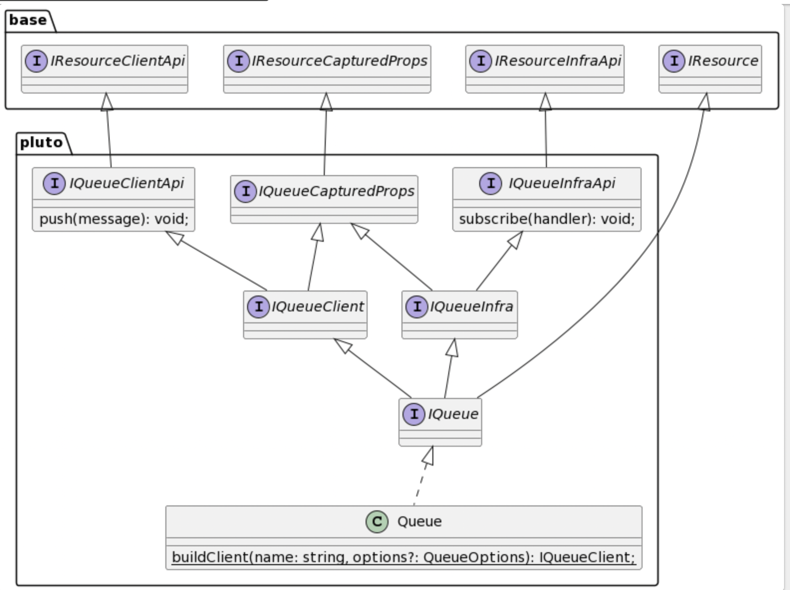
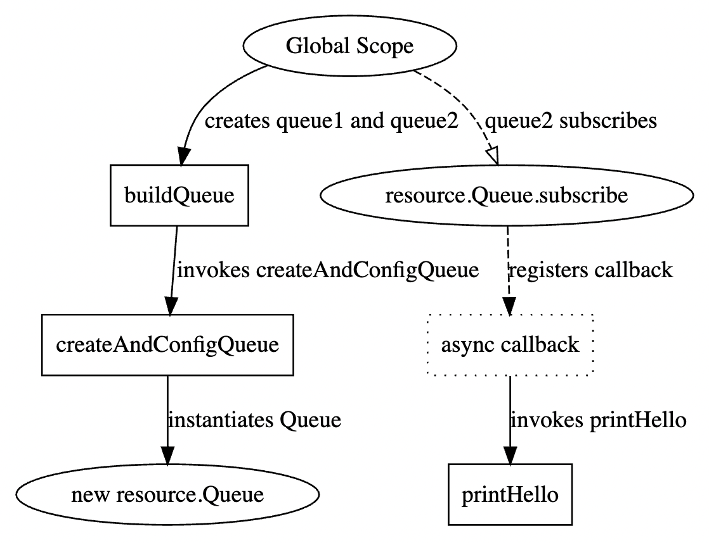
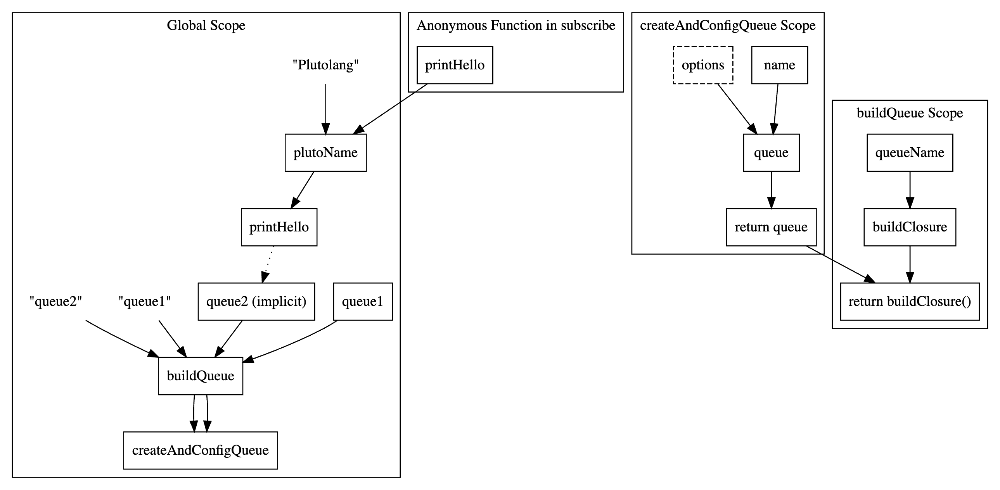

# Deducer 需求与设计

本篇文档对 Deducer 的功能需求与实现思路进行详细描述，不局限于具体语言。

## 功能需求

Deducer 对一类特殊类型的实例化对象（下称特殊对象）予以特殊关注，关注特殊类型的实例化过程（即构造函数的调用），以及特殊类型的实例化对象（特殊对象）对特殊方法的调用。具体地，关注构造函数、特殊方法每一次调用时传入的参数信息，如果函数定义中对应的参数类型是函数类型，则需要将其提取成计算闭包，其他类型，则需要将其具体的值推导出来，推导或提取失败可报错。

- **根类型(Root Type)**：指 Pluto 在 Base SDK 中规定的一组特殊接口，不同接口的含义与效果不尽相同。这些根接口是 Deducer 判断某对象或方法是否需要被特殊关注的根本依据。例如，下方示例中的 `base.IResource`、`base.IResourceClientApi`、`base.IResourceInfraApi`、`base.IResourceCapturedProps` 都是根类型，其中 `base.IResource` 用于标识其子类或接口是云资源类型；`base.IResourceClientApi` 表示其子类或接口中的方法为云资源实例的功能方法，可被运行时访问；`base.IResourceInfraApi` 用于标识其子类或接口中的方法为部署时需执行的方法，用于构建云资源实例与关系；`base.IResourceCapturedProps` 用于标识其子类或接口中的方法为云资源属性，且该属性的具体值是在部署时才产生的，感兴趣可以阅读[这篇文档](./capture-value.zh-CN.mdx)。
- **特殊类型(Special Type)**：指实现或扩展了某个根类型的类或接口。例如，下方示例中 `resource.Queue` 扩展了 `base.IResource` 根类型，因此 `resource.Queue` 是一种特殊类型。
- **特殊方法(Special Method)**：实现或扩展了某个根类型的类或接口中包含的方法。例如，下方示例中 `resource.IQueueClientApi` 、`resource.IQueueInfraApi`、`resource.IQueueCapturedProps` 分别扩展了 `base.IResourceClientApi`、`base.IResourceInfraApi`、`base.IResourceCapturedProps` 三个根类型，这三个接口中包含的方法都属于特殊方法。需要注意的是，只有特殊方法的调用方是特殊类型时，才会被特殊关注，否则认为是普通方法。例如，示例中的 `push`、`subscribe`、`id` 方法只有被作为 `resource.Queue` 类型的方法被调用时，才被认为是特殊方法。
- **特殊对象(Special Object)**：特殊类型的实例化对象。

通过实现特殊类型与特殊方法，可以将平台能力提供到用户的业务编程界面中，即以用户友好的形式将平台能力暴露给用户。例如用户在程序代码中创建一个 `resource.Queue` 类型的对象，在部署时即可自动创建一个 AWS SNS 实例或 K8s 集群中的 Redis Deployment。特殊类型与特殊方法的实现过程通常存在于 [Pluto 模式的 SDK](../concepts/sdk.zh-CN.md) 中，具体扩展过程可参考[这篇文档](../../dev_guide/extend-sdk.zh-CN.md)。

TypeScript 示例：

```typescript filename="TypeScript 示例"
// base package
interface IResource {}
interface IResourceClientApi {}
interface IResourceInfraApi {}
interface IResourceCapturedProps {}

// resource package
interface IQueueClientApi extends base.IResourceClientApi {
  push(message: string): Promise<void>; // special method
}

interface IQueueInfraApi extends base.IResourceInfraApi {
  subscribe(handler: Function): void; // special method
}

interface IQueueCapturedProps extends base.IResourceCapturedProps {
  id(): string; // special method
}

// following interface is a special type
interface Queue extends base.IResource, IQueueClientApi, IQueueInfraApi, IQueueCapturedProps {}
```

Python 示例：

```python filename="Python 示例"
# base module
class IResource(ABC):
    pass


class IResourceClientApi(ABC):
    pass


class IResourceInfraApi(ABC):
    pass


class IResourceCapturedProps(ABC):
    pass


# resource module
class IQueueClientApi(ABC, base.IResourceClientApi):
    @abstractmethod
    def push(message: str) -> None:  # special method
        pass


class IQueueInfraApi(ABC, base.IResourceInfraApi):
    @abstractmethod
    def subscribe(handler: Callable) -> None:  # special method
        pass


class IQueueCapturedProps(ABC, base.IResourceCapturedProps):
    @abstractmethod
    def id() -> str:  # special method
        pass


# following class is a special type
class Queue(base.IResource, IQueueClientApi, IQueueInfraApi, IQueueCapturedProps):
    def push(message: str) -> None:  # special method
        # do something
        pass

    def subscribe(handler: Callable) -> None:  # special method
        # do something
        pass

    def id() -> str:  # special method
        # do something
        return _id
```

因此，Deducer 需要在程序代码中找到：1）特殊对象被实例化的过程（构造函数的调用过程）；2）特殊对象对特殊方法的调用过程。同时确定这些调用过程中的信息。由于，程序代码的组织形式复杂多样，这些过程可能出现在各类位置，包括嵌套函数、函数闭包、依赖库等情况，这里列举几个例子，在实现中并不一定全部支持，但需要给用户友好提示。

**（1）实例化过程在闭包内**

下面例子中，实例化过程封装在一个函数 `createAndConfigQueue` 中，构造函数的参数由上层函数入参给定。 `createAndConfigQueue` 函数作为参数入参传入 `buildQueue` 函数中，并在其中被调用。

Deducer 需要确定：

1. `new resource.Queue` 被调用两次，两次传入的参数分别是 `queue1` 和 `queue2`，分别对应于 `queue1`、`queue2` 两个特殊对象。

```typescript
function createAndConfigQueue(name: string, options?: ConfigOptions): resource.Queue {
  const queue = new resource.Queue(name, options);
  // do something
  return queue;
}

function buildQueue(queueName: string, buildClosure: Function): resource.Queue {
  return buildClosure(queueName);
}

const queue1 = buildQueue("queue1", createAndConfigQueue);
const queue2 = buildQueue("queue2", createAndConfigQueue);
```

**（2）隐含特殊对象**

下面例子中，特殊类型的构造函数返回没有赋值给变量，而是直接调用了该返回值的特殊方法`subscribe`。

Deducer 需要确定：

1. `new resource.Queue` 被调用一次，且参数为空，这次实例化过程产生了一个特殊对象；
2. 随后调用了这个特殊对象的 `subscribe` 特殊方法，传入此次调用的参数是一个函数；
3. Deducer 将该函数提取为闭包函数。

```typescript
new resource.Queue().subscribe(async () => {
  console.log("Hello, Pluto!");
});
```

**（3）函数入参做特殊方法的调用方**

下面例子中，特殊方法 `push` 在函数 `pushOneMessage` 被调用，而调用方，则是根据函数入参确定。

Deducer 需要确定：

1. `new resource.Queue` 被调用两次，两次传入的参数分别是 `queue1` 和 `queue2`，分别对应于 `queue1`、`queue2` 两个特殊对象。
2. `queue.push` 特殊方法被调用一次，调用方是特殊对象 `queue1` ，传入的参数是 `"Hello, Pluto!"`。

```typescript
const queue1 = new resource.Queue("queue1");
const queue2 = new resource.Queue("queue2");

function pushOneMessage(queue: resource.Queue, msg: string) {
  queue.push(msg);
}

pushOneMessage(queue1, "Hello, Pluto!");
```

**（4）函数参数是函数返回值**

下面例子中，特殊类型 `resource.Queue` 的构造函数传入的参数是 `getName()` 的返回值。

Deducer 需要确定：

1. `new resource.Queue` 被调用一次，传入的参数是 `queueName`，对应 `queue` 是一个特殊对象。

```typescript
function getName(): string {
  return "queueName";
}

const queue = new resource.Queue(getName());
```

**（5）特殊方法重命名，间接访问**

下面例子中，特殊对象 `queue` 的特殊方法 `subscribe` 被赋值给 subFunc 函数变量，随用调用了该函数变量。

Deducer 需要确定：

1. `new resource.Queue` 被调用一次，传入的参数是 `queue`，对应 `queue` 是一个特殊对象；
2. 特殊方法 `subscribe` 被调用一次，调用方是特殊对象 `queue`，传入的参数是一个函数；
3. 将该函数参数提取成闭包。

```typescript
const queue = new resource.Queue("queue");

const subFunc = queue.subscribe.bind(queue);

subFunc(async () => {
  console.log("Hello, Pluto!");
});
```

**（6）动态资源对象访问，间接访问**

下面例子中，构建了一个 JS 对象 `queues`，该对象包含键值对，值都为特殊对象。随后，通过索引访问其中一个特殊对象。

Deducer 需要确定：

1. `new resource.Queue` 被调用两次，传入的参数分别是 `queue1`和 `queue2`，对应有两个特殊对象；
2. 特殊方法 `subscribe` 被调用一次，调用方是 `queues["one"]` 对应的特殊对象，传入的参数是一个函数；
3. 将该函数参数提取成闭包。

```typescript
const queues = {
  one: new resource.Queue("queue1"),
  two: new resource.Queue("queue2"),
};

queues["one"].subscribe(async () => {
  console.log("Hello, Pluto!");
});
```

## 所需的原子能力

从以上描述与实例可以总结，Deducer 所需的能力包括如下 4 个：

1. **特殊对象的构造过程查找**：确定程序代码调用了哪些特殊类型的构造函数，进而创建了哪些特殊对象，对应示例 1、2、3、4、5、6。
2. **特殊方法的调用过程查找**：确定程序代码中哪些特殊对象的哪些特殊方法被调用，对应示例 2、3、5、6。
3. **值演算**：
   - 一种情况用于在分析构造函数、特殊方法的调用时，确定传入的非函数类型参数的具体值是多少，对应示例 1、3、4、5；
   - 另一情况用于确定特殊方法的调用方具体是哪个特殊对象，对应示例 3、6。
4. **闭包提取**：用于在分析构造函数、特殊方法的调用时，将传入的函数类型参数提取成闭包，对应示例 2、5、6。

## 原子能力的实现思路

由于 Pluto 希望在不执行用户代码的情况下完成意图理解，因此采用静态程序分析的方式来实现以上能力，以下实现思路使用了 Call Graph 、控制流图、数据流图、静态类型判断等手段。

构建应用程序的 **Call Graph**，确定整个应用程序可能执行到的函数。然后逐个遍历每一个函数中的每一个表达式，查找两类过程发生的位置。由于两类过程可能发生在依赖库中，因此 Call Graph 的构建应该包括调用的依赖库函数，但为降低开销，可以根据条件筛选只关注部分依赖库，例如具有 Pluto 标识的依赖库。

判断一处表达式是否为特殊对象的构造过程或特殊方法的调用过程，需要通过类的继承链来查找链上是否存在标识特殊类型或特殊方法的接口或类。

针对每一处构造特殊对象的表达式，从**控制流图**中统计有多少条控制链路导向了该表达式，即表示该表达式被调用了多少次，也就表示了程序创建多少个特殊对象。根据**控制流图**判断控制链路是否处在条件、循环等控制结构中，即执行次数不确定的链路中。如果处在此类控制链路中，则直接报错，并给出控制结构位置与依赖的链路。针对每一条构造特殊对象的控制链路，利用**数据流图**推导此次控制链路中，构造表达式传入的各项参数的具体值。如果存在静态不可推导的参数值，则直接报错，并给出不可推导的位置与依赖该值的链路。

同理，针对每一处调用特殊方法的表达式，同样利用**控制流图**统计被执行的次数，并判断是否存在执行次数不确定的链路。然后，利用**数据流图**完成值演算，推导调用表达式时传入的各项参数的具体值。

在推导传入参数具体值时，如果遇到函数类型参数，需要将其提取成闭包。提取时，首先利用**数据流图**找到函数变量定义的位置，然后利用**控制流图**将函数依赖的所有过程抽取。对于闭包捕获的变量，必须保证其是常量变量，因为闭包的执行环境本身是无状态的，因此，如果不是常量，应该给用户报错。此外，由于函数参数没有被调用，所以该函数并没有体现在 **Call Graph** 中，因此在提取闭包时，需要同时查看是否存在特殊对象的构造过程和特殊方法的调用过程，判断是否存在不应该出现在闭包中的过程。

### 边界情况

Deducer 要求特殊对象的类型不能发生变化，特殊对象不能复制给其他类型的变量，同时其他类型的变量也不能赋值或强制类型转换成特殊对象。在针对特殊对象进行值演算时，需要检查在整个数据链路中，特殊对象的类型是否发生变化、丢失，或被强制类型转换，如果发现此类行为，则报错并提示发生位置。

Deducer 工作的前提是能够查找出特殊类型与特殊方法，如果程序代码中没有任何类型信息，则直接报错退出。如果存在部分 `any` 类型的使用，则给出警告信息。

如果在对参数值进行值演算时发生类型丢失，如果影响值的推断，则报错并提示发生位置，否则忽略。

## 案例分析

针对具体示例推演整个分析过程，验证实现思路可行性。

### 示例代码

```typescript
function createAndConfigQueue(name: string, options?: ConfigOptions): resource.Queue {
  const queue = new resource.Queue(name, options);
  // do something
  return queue;
}

function buildQueue(queueName: string, buildClosure: Function): resource.Queue {
  return buildClosure(queueName);
}

const queue1 = buildQueue("queue", createAndConfigQueue);

const plutoName = "Plutolang";

function printHello() {
  console.log(`Hello, ${plutoName}!`);
}

buildQueue("queue2", createAndConfigQueue).subscribe(async () => {
  printHello();
});
```

### 基础能力

#### 类的继承链分析

能够深入依赖库，获取指定类型的继承链，包括类实现方法的继承链，得到下图所示的关系



### 分析过程

#### 1）寻找 构造特殊对象的语句 与 调用特殊方法的语句



上图是示例程序的 Call Graph，从 Call Graph 中，可以看到程序调用了 `buildQueue`、`createAndConfigQueue`、`resource.Queue` 函数，其中 `resource.Queue` 是 Pluto 资源特殊类型。我们自顶向下进行遍历每个函数，遍历时首先判断该函数是否特殊对象的构造过程或特殊方法的调用过程。

- 判断“是否特殊对象的构造过程”的方法是：
  1.  首先判断是否为 new 操作
  2.  如果是，判断该类的继承链上是否有 `@plutolang/base.IResource` 接口
  3.  如果是，说明是这是一次特殊对象的构造过程，实例化得到的对象为特殊对象
- 判断“是否特殊方法的调用过程”的方法是：
  1.  首先判断函数调用是否是某对象的方法调用
  2.  如果是，判断该对象的类型是否是特殊类型，即判断继承链上是否有 `@plutolang/base.IResource` 接口
  3.  如果是，判断这个方法是否属于某个接口，如果是，这个接口的继承链上是否有 `@plutolang/base.IResourceCapturedProps`、`@plutolang/base.IResourceClientApi`、`@plutolang/base.IResourceInfraApi` 其中之一。 _特殊方法会被声明在扩展了根类型的接口中，特殊类型的基类会实现这些接口。_
  4.  如果是，说明是这是一次特殊方法的调用过程

如果判断出该函数是否特殊对象的构造过程或特殊方法的调用过程，则将其记录，并且不再继续深入遍历。

根据分析方法可以得到，示例代码中 `new resource.Queue` 特殊对象的构造过程，`resource.Queue.subscribe`是特殊方法的调用过程。

#### 2）寻找构造的若干个特殊对象

程序的控制流图：


程序的数据流图：


接下来，需要确定程序构造了哪些特殊对象、每个特殊对象构造时传入的参数是什么。

从上一个阶段，我们已经知道特殊对象的构造过程是 `new resource.Queue`，因此，本阶段的目标是：找到 `resource.Queue` 被调用了几次，每次调用传入的参数是什么。从 Call Graph 自底向上追溯，可以知道 `resource.Queue` 被调用的链路是：`Global -> buildQueue -> createAndConfigQueue -> resource.Queue`。

**首先，分析这条调用链路在程序中被执行了几次。**分析每一个函数的控制流图，分别判断 `buildQueue`、`createAndConfigQueue`、 `new resource.Resource` 的调用过程是否处于条件、循环等控制结构中，如果是，则记录为错误信息。示例代码中没有处在条件、循环等控制结构中，最终可以获知 `new resource.Queue` 被执行了两次，可以得到两条链，分别记录了两次执行链路上的节点。

**接下来，分析每一次执行时传入的参数。**针对每一条执行链路，自底向上分析，进行值演算。首先，通过 `createAndConfigQueue` 的数据流图可以知道 `resource.Queue` 传入的两个参数 `name, options` 都直接依赖于 `createAndConfigQueue` 入参。`createAndConfigQueue` 在 `buildQueue` 中被调用，分析 `buildQueue` 数据流图可知传入调用 `createAndConfigQueue` 两个参数分别是自身的入参 `queueName` 和 `undefined`。继续向上追溯，在全局域的数据流图中，可以得到两次执行链路上传入 `buildQueue` 的参数分别是 `"queue1"`、`"queue2"`。在分析过程中，如果发现参数依赖于某个函数的执行，则记录为错误信息。

**最后，需要记录执行链路上有哪些变量是特殊对象，且分别对应哪个特殊对象，**便于后续进行闭包依赖分析等操作。首先 `resource.Queue` 的返回值是特殊对象，返回值赋值给 `queue` 变量，则 `queue` 为特殊对象，`queue` 是 `createAndConfigQueue` 的返回值，所以该返回值是特殊对象，返回值又作为 `buildQueue` 的返回值返回到了全局域，因此 `buildQueue` 的返回值是特殊对象，第一次调用`buildQueue`的返回值赋值给了 `queue1`，所以 `queue1` 是特殊对象。

经过以上分析，可以得到：

- `resource.Queue` 被调用了 2 次，分别传入的参数是 `"queue1", undefined` 和 `"queue2", undefined`。
- 每条执行链路上，部分节点被标记为特殊对象。

#### 3）寻找调用的若干次特殊方法

接下来，需要确定每一个特殊方法被执行了几次、调用的是哪个特殊对象的特殊方法、调用时传入的参数是什么。分析方法与特殊对象的确定过程相近，额外需要确定特殊方法的调用方对应哪个特殊对象。确定方法同样是递归查找调用方的数据链路，并判断数据链路与哪个特殊对象构造过程的执行链路（上一阶段的结果）有交点，即表示调用方为哪个特殊对象。

经过分析可以得到：

- `resource.Queue.subscribe` 被调用 1 次，调用方是 `buildQueue` 第二次执行的返回值所在的节点，传入的参数是一个匿名函数，后续将提取为计算闭包。

#### 4）闭包提取

针对特殊对象构造过程和特殊方法调用过程中传入的函数参数，需要将其提取并构造成计算闭包。

通过 Call Graph，可以直接获取到函数参数依赖的所有函数，接下来需要获取计算闭包依赖的所有变量。

针对每个函数中访问的每一个变量，判断它是否是函数外的变量，如果不是忽略即可，如果是，则需要将其封装到闭包内：

- 如果访问的外部变量是特殊对象，则通过确定特殊方法调用方的方式获取具体依赖哪个特殊对象，并记录在闭包信息中，同时记录调用了特殊对象的哪个方法。
- 如果不是特殊对象，我们则可以采用上述通过数据链路确定参数的方式来演算出外部变量具体的值，如果推导不出来，则记录为错误信息。

在演算过程中，需要在外部变量的节点上记录其被该闭包依赖。当同一个非特殊对象的变量被多个闭包依赖，且变量不是字面量常量时，说明该变量为程序的状态变量，在 FaaS 中不支持有状态，需要记录为错误信息。当一个闭包访问的外部变量在闭包中被修改时，同样说明该变量为程序的状态变量，需要记录为错误信息。

在提取过程中，如果发现特殊对象的构造过程或特殊方法的调用过程，则记录为报错信息。

最终，通过以上操作可以提取出计算闭包的函数依赖、变量依赖、特殊对象依赖。

#### 其他

整个分析过程中记录到的错误信息，随版本迭代逐步支持。
