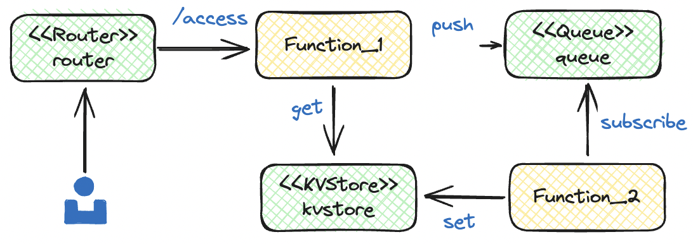
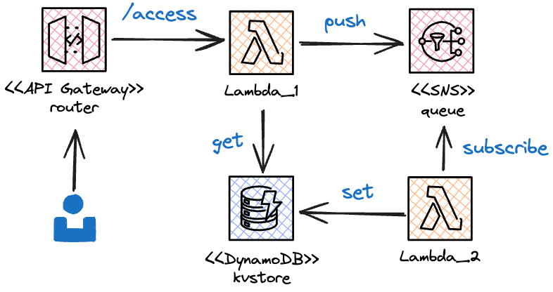

# 快速开始

让我们通过快速开发一个简单的 Web 应用来了解 Pluto 应用开发流程。如果你不想在本地配置研发环境，可以使用我们提供的[在线沙盒或容器](#其他使用方式)体验，环境中已经配置了第 0、1 步安装的软件。

我们要开发的应用叫做 Timestamp Store，整体架构如下图，主要有 2 个路由：1）`/hello`，产生一个时间戳，并将这个时间戳发布到消息队列；2）`/store`，从 KV 数据库中获取上次访问 `/hello` 的时间戳，并返回。消息队列会有一个订阅者，将消息保存到 KV 数据库中。我们可以将这个应用部署在 AWS 或 Kubernetes 上。

<p align="center">
  
</p>

完成这个示例后，你将了解 Pluto 开发的基本流程，并可以开始使用 Pluto 开发自己的云应用程序。

## 0 前置

- [Node.js](https://nodejs.org/): Pluto 运行在 Node.js 环境中，最好使用 20 版本以上。
- [Pulumi](https://www.pulumi.com/docs/install/): Pluto 使用 Pulumi 与云平台（AWS 或 K8s）进行交互，部署云资源，请参照 Pulumi 安装文档进行安装。
- [Python](https://www.python.org/): 如果你想开发 Python 应用，需要安装 Python 环境，最好是 3.10 版本以上。

## 1 安装

Pluto 命令行工具可以使用 [npm](https://www.npmjs.com/) 进行安装:

```shell
npm install -g @plutolang/cli
```

Pluto 的命令是 `pluto`，可以通过以下命令验证是否安装成功:

```shell
pluto --help
```

## 2 编写

首先，我们运行以下命令创建一个 Pluto 工程项目:

```shell
pluto new
```

这条命令将交互式地创建一个项目，根据你的需要选择编程语言、目标平台、项目信息等，Pluto 会使用提供的项目名称创建一个目录。进入刚创建的项目目录，首先需要安装依赖：

```shell
cd <project_dir>
npm install # 国内安装 @pulumi/aws 时可能会遇到网络问题，容器镜像体已缓存该包，欢迎体验

# 如果是 Python 项目，除了 npm install，还需要安装 Python 依赖
pip install -r requirements.txt
```

在 `src/index.ts` 或 `app/main.py` 中已经有了一个简单的示例代码，你可以根据自己的需求修改，也可以直接部署体验。

## 3 部署

在正式部署之前，我们需要配置目标平台的凭证信息。

如果你选择的目标平台为 AWS，可以使用 `aws configure` 配置用户凭证，或自行创建 `~/.aws/credentials` 文件并配置，格式如下：

```ini
[default]
aws_access_key_id = <your_access_key_id>
aws_secret_access_key = <your_secret_access_key>
```

此外，Pluto 会尝试读取你的 AWS 配置文件 `~/.aws/config` 以获取默认的 AWS Region，如果没有配置，会尝试从环境变量 `AWS_REGION` 获取。**如果两者都没有配置，Pluto 在部署时将会报错。**

如果你选择的目标平台为 Kubernetes，需要事先在 K8s 中安装 Knative，并关闭缩容到零的功能（因为 Pluto 尚不支持 Ingress 转发到 Knative servering，欢迎大佬来改进）。你可以根据[这篇文档](../dev_guide/setup-k8s-dev-env.en.md)配置所需的 Kubernetes 环境。

配置完成后，只需要执行下面这一条命令就能将应用发布到最初配置的云平台上：

```shell
pluto deploy
```

<p align="center">
  
</p>

Pluto 将从应用代码中推导出需要 1 个路由、1 个消息队列、1 个 KV 数据库和 3 个函数对象，然后，Pluto 将自动地在你指定的云平台上创建相应的资源实例，并配置好它们之间的依赖关系。以 AWS 为例，将会创建 1 个 API Gateway、1 个 SNS、1 个 DynamoDB 和 3 个 Lambda 函数，同时配置好触发器、角色、权限等。

## 4 测试

恭喜！你已经成功部署了一个完整的 Web 应用程序。你应该会从终端中看到输出的 URL 地址，访问这个地址，就可以使用这个应用了。你可以使用 `curl` 或者浏览器访问这个地址，测试你的应用是否正常工作。如果使用 `curl`，可以按照以下方式测试：

```shell
curl <your_url>/hello?name=pluto
# 上面这条 URL 会打印出发布了一条消息，消息中带有访问时间
# 示例： Publish a message: pluto access at 1712654279444.

curl <your_url>/store?name=pluto
# 上面这条 URL 会打印出你上次访问 /hello 的时间
# 示例： Fetch pluto access message: pluto access at 1712654279444.
```

## 5 清理

如果你想从云平台上下线这个应用，可以使用以下命令：

```shell
pluto destroy
```

## 多平台部署

如果你想部署到其他云平台可以通过创建新的 stack，并在部署时指定 stack 的方式进行：

创建新的 stack：

```shell
pluto stack new
```

部署时指定 stack：

```shell
pluto deploy --stack <new_stack>
```

## 其他使用方式

### 在线沙盒

如果你不想在本地配置 Pluto 环境，可以使用 CodeSandbox 提供的在线 IDE 来体验 Pluto 的开发流程，我们提供了 TypeScript 和 Python 两个模板应用，沙盒环境中已经安装了 AWS CLI、Pulumi、Pluto 等基础依赖，你可以直接在浏览器中编辑代码，根据模板应用的 README 操作即可将应用部署到 AWS 云平台上。

- [TypeScript 模板应用 | CodeSandbox](https://codesandbox.io/p/devbox/github/pluto-lang/codesandbox/tree/main/typescript?file=/README_zh.md)
- [Python 模板应用 | CodeSandbox](https://codesandbox.io/p/devbox/github/pluto-lang/codesandbox/tree/main/python?file=/README_zh.md)

### 容器

我们提供了用于应用开发的容器镜像 `plutolang/pluto:latest`，镜像中包含了 AWS CLI、Pulumi、Pluto 等基础依赖，并配置了 Node.js 20.x 和 Python 3.10 环境。如果你只希望开发 TypeScript 应用，可以使用 `plutolang/pluto:latest-typescript` 镜像。拉取镜像后，通过以下命令就可以在容器中体验 Pluto 开发了：

```shell
docker run -it --name pluto-app plutolang/pluto:latest bash
```

## 更多示例

- TypeScript 示例应用：
  - [基于 LangChain、Llama2、DynamoDB、SageMaker 的会话聊天机器人](https://github.com/pluto-lang/pluto/tree/main/examples/langchain-llama2-chatbot-sagemaker)
  - [基于 OpenAI API 的聊天机器人](https://github.com/pluto-lang/pluto/tree/main/examples/chat-bot)
  - [每日笑话 Slack 机器人](https://github.com/pluto-lang/pluto/tree/main/examples/daily-joke-slack)
- Python 示例应用：
  - [部署 FastAPI 应用到 AWS](https://github.com/pluto-lang/pluto/tree/main/examples/fastapi)
  - [部署 LangServe 示例应用到 AWS](https://github.com/pluto-lang/pluto/tree/main/examples/langserve-agent-with-history)
  - [基于 LangChain、Llama2、DynamoDB、SageMaker 的会话聊天机器人](https://github.com/pluto-lang/pluto/tree/main/examples/langchain-llama2-chatbot-sagemaker-python)
