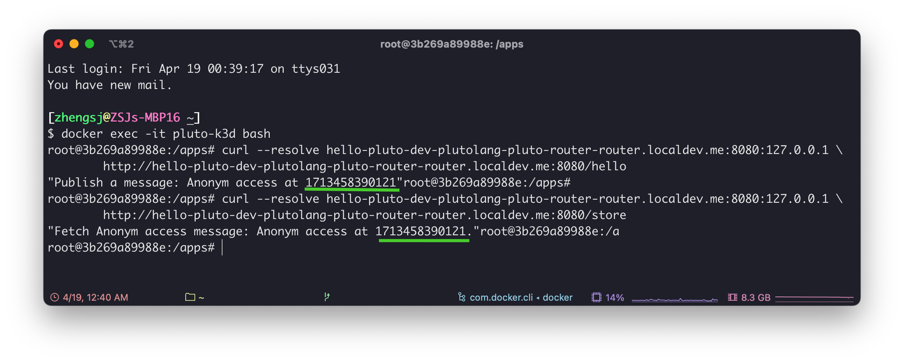

# 🐳 在容器中开发 Pluto 应用

import { Callout, Tabs, Tab, Steps } from "nextra/components";
import Formatter from "./repo-formatter";

我们提供了一组用于开发 Pluto 应用的容器镜像，镜像中包含了 AWS CLI、Pulumi、Pluto 等基础依赖，并配置了 Node.js 20.x 和 Python 3.10 环境，你可以根据需求选择合适的镜像。

| 镜像 | Node.js | Python | k3d |
| --- | --- | --- | --- |
| `plutolang/pluto:latest` | 20.x | 3.10 | ❌ |
| `plutolang/pluto:latest-typescript` | 20.x | ❌ | ❌ |
| `plutolang/pluto:latest-k3d` | 20.x | 3.10 | ✅ |

接下来，我们以在 K3s、AWS 为例，演示如何在容器中开发 Pluto 应用。

<Steps>

### 创建容器

首先，执行以下命令来创建一个 Pluto 应用开发容器：

<Tabs items={["K3s", "AWS"]} storageKey="platform">

<Tab>

```shell
docker run -it --privileged \
    -v /var/run/docker.sock:/var/run/docker.sock \
    -v /lib/modules:/lib/modules \
    --name pluto-k3d \
    plutolang/pluto:latest-k3d bash
```

创建完成后，会自动进入容器。在容器中，我们执行下面这条命令来自动创建一个 `k3s` 集群，并安装 Knative，最后一个参数为集群名称，可以修改成其他名称：

```shell
bash /scripts/create-cluster.sh pluto-cluster
```

上一条命令执行结束后，执行以下命令应该可以看到 `k3s` 集群中的节点：

```shell
kubectl get nodes
```

<Callout>
请确保你的容器有足够的存储空间，否则可能会导致 Kubernetes Pod 无法正常启动。你可以通过执行 `df -h` 命令，查看当前容器的存储空间使用情况。
</Callout>

</Tab>

<Tab>

```shell
docker run -it --name pluto-app plutolang/pluto:latest bash
```

</Tab>

</Tabs>

### 开发应用

执行下面这条命令可以交互式地创建一个 Pluto 应用，在过程中你可以配置应用名称、编程语言、目标平台等信息，创建结束后会在当前目录以应用名称创建一个目录：

```
pluto new
```

<Callout>
K3s 环境暂时仅支持 TypeScript 应用。
</Callout>

使用 `cd project_name{:sh}` 命令进入项目目录，进入后可以看到已经配置有基本的项目结构，接下来我们执行下面的命令来安装依赖，不同编程语言的安装方式稍用不同：

<Tabs items={["Python", "TypeScript"]} storageKey="lang">

<Tab>

```shell
npm install
pip install -r ./requirements.txt
```

安装完依赖后，你就可以根据自己的需求修改 `app/main.py` 文件，完成应用开发。当然，你也可以直接部署示例应用来体验 Pluto 的使用。

</Tab>

<Tab>

```shell
npm install
```

安装完依赖后，你就可以根据自己的需求修改 `src/index.ts` 文件，完成应用开发。当然，你也可以直接部署示例应用来体验 Pluto 的使用。

</Tab>

</Tabs>

### 配置环境

应用开发完成后，我们还需要对访问凭证、镜像仓库等环境信息进行配置，以便后续能够正常部署应用。

<Tabs items={["K3s", "AWS"]} storageKey="platform">
<Tab>

在部署时，Pluto 会将应用中包含的若干个函数分别打包成容器镜像，并上传到指定镜像仓库中。在前面的集群创建过程中，执行脚本自动创建了一个本地的镜像仓库，仓库名称由集群名称加上 `-registry` 组成，端口为 `5432`，例如 `pluto-cluster-registry:5432`。

接下来，我们将镜像仓库地址填写到 Pluto 的配置文件中。我们打开项目目录下的 `.pluto/pluto.yml` 配置文件，找到你创建的 stack，默认是 `dev`，修改其中的 `configs` 字段，将镜像仓库地址填写进去，填写方式如下：

```yaml {4-6}
...
stacks:
  - name: dev
    configs:
      kubernetes:registry: pluto-cluster-registry:5432
      kubernetes:platform: auto
...
```

<Callout type="info">

如果你希望**上传至公开镜像仓库**，仍需要对镜像仓库地址进行配置。Pluto 构建的容器镜像名称由这几部分构成：`<registry>/<formatted_project_name>:<function_id>-<timestamp>`。因此，你需要先在 Docker Hub 等平台上创建以项目名称命名的镜像仓库，然后采用相同的方式将镜像仓库地址配置到 Pluto 配置文件中。注意，为了避免违法字符，我们在上传镜像时会将项目名称格式化为小写字母和短横线的组合，你可以在下方输入项目名称，获取格式化的结果，并以此创建镜像仓库：

<Formatter />

</Callout>

<Callout type="info">
默认情况下， Pluto 打包镜像的目标平台是 `linux/amd64` 架构。如果你的 K8s 集群是其他架构，则需要在 Pluto 配置文件中配置 `kubernetes:platform` 字段，可选项有 `linux/amd64`、`linux/arm64` 和 `auto`，其中 `auto` 会根据当前设备架构自动选择。
</Callout>

</Tab>

<Tab>
镜像中已经安装了 AWS CLI，我们可以通过下面这条命令就能配置 AWS 的访问凭证：

```shell
aws configure
```

执行命令时会提示你输入 AWS Access Key ID、AWS Secret Access Key、默认的区域和输出格式，前三个必须填写，最后一个可以留空。你可以从 [AWS 控制台](https://us-east-1.console.aws.amazon.com/iam/home#security_credential)中获取到前两项信息。

</Tab>
</Tabs>

### 部署

在配置完环境信息后，我们就可以执行下面这条命令来部署 Pluto 应用了：

```shell
pluto deploy
```

这条命令可能会执行一段时间，取决于你的应用规模和网络环境。执行完成后，你可以从输出中看到应用的访问地址。你可以从[部署细节](#部署细节)中了解 Pluto 具体部署了哪些资源。


### 测试

<Tabs items={["K3s", "AWS"]} storageKey="platform">

<Tab>

在 K3s 集群中，我们可以通过 `kubectl port-forward` 命令将服务暴露到本地，然后通过 `curl` 命令来测试服务是否正常。你可以使用下面这条命令在后台执行 `kubectl port-forward` 命令，也可以选择再打开一个终端窗口执行：

```shell
nohup kubectl port-forward --namespace=ingress-nginx service/ingress-nginx-controller 8080:80 > /dev/null 2>&1 &
```

然后，我们可以通过先后执行以下两条命令来测试服务是否正常，其中 `hello-pluto-dev-plutolang-pluto-router-router.localdev.me` 是 Pluto 部署结束时输出的访问地址，如果你的 Pluto 应用名称不是 `hello-pluto`，则需要将其完整替换为你获取到的访问地址：

```shell
curl --resolve hello-pluto-dev-plutolang-pluto-router-router.localdev.me:8080:127.0.0.1 \
	http://hello-pluto-dev-plutolang-pluto-router-router.localdev.me:8080/hello

curl --resolve hello-pluto-dev-plutolang-pluto-router-router.localdev.me:8080:127.0.0.1 \
	http://hello-pluto-dev-plutolang-pluto-router-router.localdev.me:8080/store
```

部署成功的话，你应该可以看到类似下面的输出：



<Callout type="info">
如果你在测试时遇到错误，你可以通过 `kubectl get pods -A{:sh}` 命令查看所有 Pod 的状态，其中，带有 `svclb-` 前缀的 Pod 可以处于 Pending 状态，其他所有非 Job 类 Pod 都应该已经正常启动。如果你的集群不是这样，请等待 Pod 启动完成后再进行测试。可能需要重新部署 Pluto 应用。
</Callout>

</Tab>

<Tab>

我们可以通过先后执行以下两条命令来测试服务是否正常，其中 `https://fvz3jhc4z2.execute-api.us-east-1.amazonaws.com/dev` 是 Pluto 部署结束时输出的访问地址，需要将其完整替换为你获取到的访问地址：

```shell
curl https://fvz3jhc4z2.execute-api.us-east-1.amazonaws.com/dev/hello

curl https://fvz3jhc4z2.execute-api.us-east-1.amazonaws.com/dev/store
```

部署成功的话，你应该可以看到类似下面的输出：


</Tab>

</Tabs>

### 清理

<Tabs items={["K3s", "AWS"]} storageKey="platform">

<Tab>

执行下面这条命令可以将 Pluto 应用从 `k3s` 集群中下线：

```shell
pluto destroy
```

如果你希望删除 `k3s` 集群，可以执行以下命令，集群名称需要修改为你的集群名称：

```shell
k3d cluster delete pluto-cluster
```

如果你想销毁开发环境，可以在宿主机执行以下命令：

```shell
docker stop pluto-k3d
docker rm pluto-k3d
```

</Tab>

<Tab>

执行以下命令可以将 Pluto 应用从 AWS 上下线：

```shell
pluto destroy
```

</Tab>

</Tabs>

</Steps>

<Callout>
1. 如果你希望将应用同时部署到多个平台上，可以参考[多平台部署](./multi-platform-deployment.zh-CN)文档。
2. 如果你想了解更多 Pluto 应用示例，可以查看[案例](/cookbook)文档。
</Callout>

### 部署细节


Pluto 将从应用代码中推导出需要 1 个路由、1 个消息队列、1 个 KV 数据库和 3 个函数对象，然后，Pluto 将自动地在你指定的云平台上创建相应的资源实例，并配置好它们之间的依赖关系。

<Tabs items={["Kubernetes", "AWS"]}>
<Tab>
在 Kubernetes 中，将会配置 1 个 Ingress、2 个 Redis 和 3 个 Knative Service。
</Tab>

<Tab>

<p align="center">
  
</p>


在 AWS 上，将会创建 1 个 API Gateway、1 个 SNS、1 个 DynamoDB 和 3 个 Lambda 函数，同时配置好触发器、角色、权限等。
</Tab>
</Tabs>
