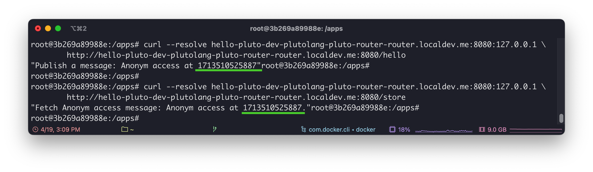
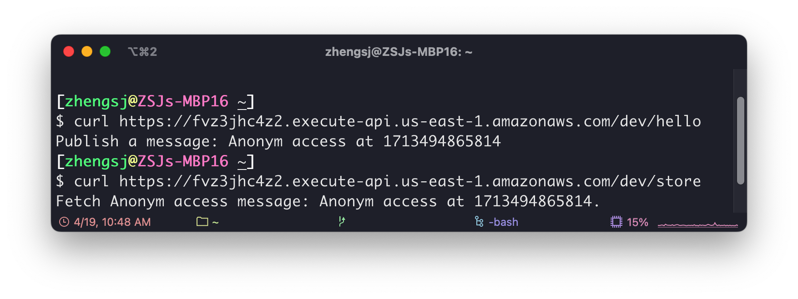
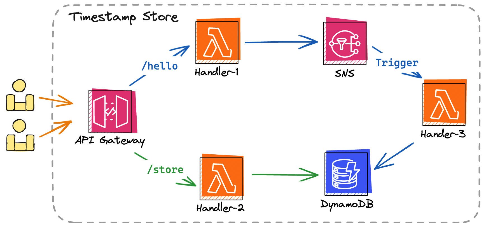

# 💻 Developing a Pluto Application Locally

import { Callout, Tabs, Tab, Steps } from 'nextra/components'
import Formatter from "./repo-formatter"

<Steps>

### Prerequisites

- [Node.js](https://nodejs.org/): Pluto runs on the Node.js environment, version 20 or higher is recommended.
- [Python](https://www.python.org/): If you wish to develop Python applications, you need to install the Python environment, preferably version 3.10 or above.

### Installation

The Pluto command line tool can be installed using [npm](https://www.npmjs.com/):

```shell
npm install -g @plutolang/cli
```

The command for Pluto is `pluto`, and you can verify the installation with the following command:

```shell
pluto --help
```

### Create an Application

First, run the following command to create a Pluto application. This command will interactively create a project, allowing you to choose the programming language, target platform, project information, etc. After configuration, Pluto will create a directory with the provided project name.

```shell
pluto new
```

### Develop the Application

Use the `cd project_name{:sh}` command to enter the project directory. Once inside, you will see a basic project structure configured. Next, execute the command below to install dependencies. The installation method differs slightly between programming languages:

<Tabs items={["Python", "TypeScript"]} storageKey="lang">
<Tab>

```shell
npm install
pip install -r ./requirements.txt
```

After installing the dependencies, you can modify the `app/main.py` file according to your requirements to complete the application development. Of course, you can also directly deploy the example application to experience the use of Pluto.

</Tab>
<Tab>

```shell
npm install
```

After installing the dependencies, you can modify the `src/index.ts` file according to your requirements to complete the application development. Of course, you can also directly deploy the example application to experience the use of Pluto.

</Tab>
</Tabs>

### Configure the Environment

After the application development is complete, we still need to configure environment information such as access credentials and image repositories to ensure the application can be deployed properly.

<Tabs items={["Kubernetes", "AWS"]} storageKey="platform">
<Tab>

When deploying, Pluto will package several functions included in the application into container images and upload them to the specified image repository. The container image name built by Pluto consists of: `<registry>/<formatted_project_name>:<function_id>-<timestamp>`.

Therefore, if you wish to upload to a public image repository, you need to create an image repository named after the project on platforms like Docker Hub, then configure the image repository address in the Pluto configuration file in the same manner. Note that to avoid illegal characters, we format the project name into a combination of lowercase letters and hyphens when uploading images. You can enter the project name below to get the formatted result and create the image repository accordingly:

<Formatter />

Next, we fill in the image repository address into Pluto's configuration file. Open the `.pluto/pluto.yml` configuration file in the project directory, find the stack you created (default is `dev`), modify the `configs` field, and fill in the image repository address as follows:

```yaml {4-6}
...
stacks:
  - name: dev
    configs:
      kubernetes:registry: docker.io/your-username/
      kubernetes:platform: auto # or linux/amd64, linux/arm64
...
```

<Callout type="info">
By default, the target platform for Pluto's image packaging is `linux/amd64` architecture. If your Kubernetes cluster is of another architecture, you will need to configure the `kubernetes:platform` field in the Pluto configuration file. The options include `linux/amd64`, `linux/arm64`, and `auto`, where `auto` will automatically select based on the current device architecture.
</Callout>

<Callout type="info">
Pluto will publish the application as multiple Knative Services, so Knative must be installed in Kubernetes in advance, and the scaling to zero feature should be turned off (because Pluto does not yet support Ingress forwarding to Knative Serving, contributions from the community are welcome to help improve this). You can configure the required Kubernetes environment according to [this document](../../dev_guide/setup-k8s-dev-env.en.md).
</Callout>

</Tab>
<Tab>

You can use `aws configure` to set up user credentials, or create a `~/.aws/credentials` file and configure it as follows:

```ini
[default]
aws_access_key_id = <your_access_key_id>
aws_secret_access_key = <your_secret_access_key>
```

In addition, Pluto will attempt to read your AWS configuration file `~/.aws/config` to get the default AWS Region. If it is not configured, it will try to get it from the `AWS_REGION` environment variable. **If neither is configured, Pluto will throw an error during deployment.**

<Callout type="info">
`aws configure` will prompt you to enter AWS Access Key ID, AWS Secret Access Key, the default region, and output format. The first three are required, and the last one can be left blank. You can obtain the first two pieces of information from the [AWS Console](https://us-east-1.console.aws.amazon.com/iam/home#security_credential).
</Callout>

</Tab>
</Tabs>

### Deploying the App

After configuring the environment information, we can execute the following command to deploy the Pluto application:

```shell
pluto deploy
```

This command may take some time, depending on the scale of your application and network environment. After execution, you can see the application's access address in the output. You can find out what resources Pluto has specifically deployed from the [Details](#details).

### Testing

<Tabs items={["Kubernetes", "AWS"]} storageKey="platform">
<Tab>

In the Kubernetes cluster, we can use the `kubectl port-forward` command to expose the service locally and then test whether the service is working properly with the `curl` command. You can use the following command to run `kubectl port-forward` in the background, or you can choose to open another terminal window to execute it:

```shell
nohup kubectl port-forward --namespace=ingress-nginx service/ingress-nginx-controller 8080:80 > /dev/null 2>&1 &
```

Then, we can test whether the service is working properly by executing the following two commands in sequence. `hello-pluto-dev-plutolang-pluto-router-router.localdev.me` is the access address output at the end of Pluto's deployment. If your Pluto application name is not `hello-pluto`, you need to replace it completely with the access address you obtained:

```shell
curl --resolve hello-pluto-dev-plutolang-pluto-router-router.localdev.me:8080:127.0.0.1 \
	http://hello-pluto-dev-plutolang-pluto-router-router.localdev.me:8080/hello
curl --resolve hello-pluto-dev-plutolang-pluto-router-router.localdev.me:8080:127.0.0.1 \
	http://hello-pluto-dev-plutolang-pluto-router-router.localdev.me:8080/store
```

If deployed successfully, you should see an output similar to the one below:



<Callout type="info">

If you encounter an error during testing, you can check the status of all Pods with the `kubectl get pods -A{:sh}` command to see if all non-Job Pods have started normally. If your cluster is not in this state, please wait for the Pods to start before testing again. You may need to redeploy the Pluto application.
</Callout>

</Tab>
<Tab>

We can test whether the service is working properly by executing the following two commands in sequence. `https://fvz3jhc4z2.execute-api.us-east-1.amazonaws.com/dev` is the access address output at the end of Pluto's deployment, which needs to be completely replaced with the access address you obtained:

```shell
curl https://fvz3jhc4z2.execute-api.us-east-1.amazonaws.com/dev/hello
curl https://fvz3jhc4z2.execute-api.us-east-1.amazonaws.com/dev/store
```

If deployed successfully, you should see an output similar to the one below:


</Tab>
</Tabs>

### Cleanup

If you wish to take the application offline from the target platform, you can use the following command:

```shell
pluto destroy
```

</Steps>

<Callout>
1. If you want to deploy your application to multiple platforms simultaneously, you can refer to the [Multi-Platform Deployment](./multi-platform-deployment.en) documentation.
2. If you're interested in exploring more examples of Pluto applications, you can check out the [Cookbook](/cookbook) documentation.
</Callout>

### Details

During the deployment process, Pluto will deduce that it needs one route, one message queue, one KV database, and three function objects from the application code. Then, Pluto will automatically create the corresponding resource instances on your specified cloud platform and configure their dependencies.

<Tabs items={["Kubernetes", "AWS"]}>
<Tab>
In Kubernetes, one Ingress, two Redis, and three Knative Services will be configured.
</Tab>

<Tab>
<p align="center">
  
</p>

If the target platform is AWS, Pluto will create one API Gateway, one SNS topic, one DynamoDB, and three Lambda functions while configuring triggers, roles, permissions, etc.
</Tab>
</Tabs>
