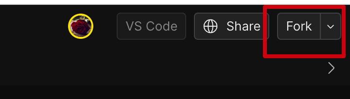

# 🌐 在线开发 Pluto 应用

import { Callout, Tabs, Tab, Steps } from 'nextra/components' 

我们使用 [CodeSandbox](https://codesandbox.io/) 提供的在线 IDE 构建了 Pluto 的在线研发环境，环境中已经安装了 AWS CLI、Pulumi、Pluto 等基础依赖，并包含有一个 Pluto 示例应用。你可以直接在浏览器中开发 Pluto 应用，也可以通过 VS Cdoe 远程连接在线环境，无需安装任何软件。

这里提供了 TypeScript 和 Python 两个模板应用，你可以根据自己的需求选择。

- [TypeScript 模板应用 | CodeSandbox](https://codesandbox.io/p/devbox/github/pluto-lang/codesandbox/tree/main/typescript?file=/README_zh.md)
- [Python 模板应用 | CodeSandbox](https://codesandbox.io/p/devbox/github/pluto-lang/codesandbox/tree/main/python?file=/README_zh.md)

接下来，我们以 AWS 为例，介绍在线开发 Pluto 应用的基本流程。

<Steps>

### 创建

根据你的需要选择 TypeScript 或 Python 模板应用，点击链接进入 CodeSandbox 在线 IDE。打开后你应该处于模板同步模式，请点击屏幕右上角的 `Fork` 按钮创建一个属于你的研发环境。

<p align="center">
  
</p>


### 配置

进入你的研发环境后，下方控制台会自动弹出一个 `Configure AWS Certificate` 的标签页。请在这里输入你的 AWS 证书信息，以便应用程序能够顺利部署到 AWS 上。你可以不填写 `output format` 字段，填写完其他必要信息后，如果一切正确，你可以在标签名旁边看到一个绿色的勾选标记 ✔️。

<p align="center">
  
</p>

### 编程

现在，你可以开始在 `src/index.ts` 或 `app/main.py` 文件中编写应用程序代码。

在这个文件里，已经有了一些示例代码，可以帮助开发者了解 Pluto 编写代码的基本方式。请根据你的具体需求修改代码。

### 部署

编码完成后，你可以点击终端图标并从菜单中选择 `Deploy`。你的应用程序就可以一键直接部署到 AWS 上，不需要你执行任何额外的步骤。部署完成后，你可以从输出中看到应用的访问地址。

<p align="center">
  
</p>

你可以从[部署细节](#部署细节)中了解 Pluto 具体部署了哪些资源。

### 测试

你现在可以打开一个新的终端，然后先后执行以下两条命令来测试服务是否正常，其中 `https://fvz3jhc4z2.execute-api.us-east-1.amazonaws.com/dev` 是 Pluto 部署结束时输出的访问地址，需要将其完整替换为你获取到的访问地址：

```shell
curl https://fvz3jhc4z2.execute-api.us-east-1.amazonaws.com/dev/hello

curl https://fvz3jhc4z2.execute-api.us-east-1.amazonaws.com/dev/store
```

部署成功的话，你应该可以看到类似下面的输出：


### 清理

如果你想将应用程序下线，只需从菜单中点击 `Destroy`，配置的资源就会被完全删除。

<p align="center">
  
</p>

</Steps>

<Callout>
1. 如果你希望将应用同时部署到多个平台上，可以参考[多平台部署](./multi-platform-deployment.zh-CN)文档。
2. 如果你想了解更多 Pluto 应用示例，可以查看[案例](/cookbook)文档。
</Callout>

### 部署细节

Pluto 将从应用代码中推导出需要 1 个路由、1 个消息队列、1 个 KV 数据库和 3 个函数对象，然后，Pluto 将自动地在你指定的云平台上创建相应的资源实例，并配置好它们之间的依赖关系。

<p align="center">
  
</p>

在 AWS 上，将会创建 1 个 API Gateway、1 个 SNS、1 个 DynamoDB 和 3 个 Lambda 函数，同时配置好触发器、角色、权限等。
