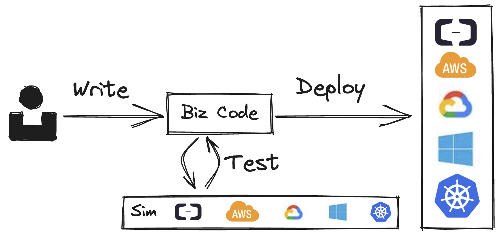

# How Pluto Works

This document will introduce how Pluto works.

## User Workflow

  

`Write - Test - Deploy` is the workflow provided by Pluto to users.

- **In the `Write` phase**, users rely on the SDK to develop their applications. In the code, users define the resource variables they need.
- **In the `Test` phase**, Pluto provides the capability to perform unit testing in both simulated and real environments. Users can choose according to the development stage. Testing in a real environment ensures the consistency between the test environment and the production environment, allowing for the discovery of potential issues before deployment. Testing in a simulated environment avoids the time-consuming process of testing in a real environment and quickly verifies the correctness of the business logic.
- **In the `Deploy` phase**, users specify the cloud platform to deploy to, and Pluto automates the entire process from code to runtime.

## Engine Workflow

So, how does Pluto deploy user code step by step to the runtime? The following diagram summarizes the overall workflow of Pluto.

  

Pluto's overall workflow consists of three stages: deduction, generation, and deployment. The functional components of each stage are respectively called deducers, generators, and adapters. The deducers and generators can be extended or replaced as needed.

After the user submits the code, the deducers deduce the required cloud resources and the dependencies between resources from the user code, and build a cloud reference architecture. Then, the generators generate IaC (Infrastructure as Code) code based on the architecture reference, and split the user code into multiple business modules. Finally, the adapters call the corresponding IaC engine to execute the deployment based on the type of IaC code and deploy the application to the specified cloud platform.

### Deduction Stage

The main purpose of the deduction stage is to deduce the dependencies of the application on infrastructure resources from the user code and determine the reference architecture of the application on the cloud platform. There is no restriction on the implementation of deducers as long as they implement the corresponding interfaces and achieve this purpose.

Deducer based on static program analysis

The Pluto repository provides an implementation of [a deducer based on static program analysis](https://github.com/pluto-lang/pluto/tree/main/components/deducers/static). This deducer mainly combines the API SDK to deduce the resource dependencies and build the reference architecture.

This deducer determines the dependencies of infrastructure resources by examining the resource variables defined in the user-written code, such as `const queue = new Queue();`, with the type of the resource variable being defined by the SDK that is being used. The type of the resource variable implements the `Resource` interface. The static analyzer determines whether a variable is a type of infrastructure resource by checking if it is an instance object of the `Resource` type.

By analyzing the invocation relationships between variables, the deducer can further deduce the relationships between the generated infrastructure resources. For example, when `queue.subscribe(fn)` is called, the function parameter `fn` is the subscription process for the queue. This means that when deploying the infrastructure, we need to deploy this function as a compute component (such as a Lambda function) and configure the component's trigger condition related to the queue. When `queue.push` is called, it indicates that the function calling this method will use the queue as an infrastructure resource at runtime.

Through these means, the dependencies of the infrastructure resources during deployment and the invocation relationships at runtime can be analyzed. By using the above methods, all the infrastructure resources that the application depends on, as well as the relationships between resources, can be analyzed to build the cloud reference architecture.

### Generation Stage

The main purpose of the generation stage is to generate IaC code based on the reference architecture and perform operations such as splitting, transforming, and compiling the user code. Similar to deducers, there are no restrictions on the implementation of generators as long as they implement the corresponding interfaces.

Generator based on IaC SDK

The Pluto repository provides an implementation of [a generator based on the IaC SDK](https://github.com/pluto-lang/pluto/tree/main/components/generators/static). This generator uses the IaC SDK to define infrastructure resources and splits the user code into multiple Lambda function modules. The API SDK has a corresponding IaC SDK that provides IaC implementations for each resource type defined by the API SDK on different platforms. The generator generates an instance object of the IaC type for each resource variable based on the reference architecture and configures the dependencies between the IaC objects, such as access permissions. In addition, the generator also splits the user code into multiple code files based on the division of compute modules in the reference architecture, with each file being an importable compute module. Finally, all the code is compiled.

### Deployment Stage

Finally, Pluto calls the corresponding adapter based on the generated IaC code type. The adapter then calls the corresponding IaC engine to execute the IaC code, completing the creation of infrastructure resources and the deployment of application compute modules. During the execution of the IaC code, operations such as encapsulation and packaging are performed to adapt to the deployment rules of various cloud platforms.
