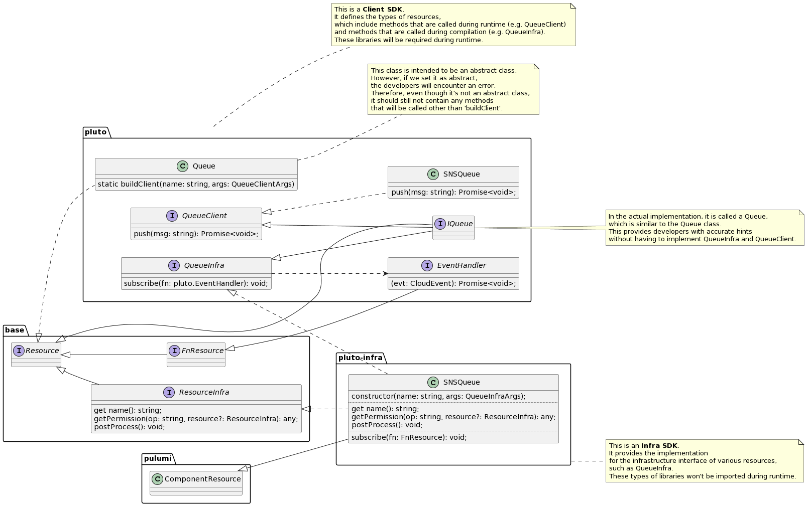

# SDK 工作原理



上方类图以消息队列为例展示 SDK 中类的继承关系，该图中消息队列最终使用 AWS SNS 实现。

在 Pluto 中与云平台相关的有两类 SDK，这两类 SDK 都包含多种运行时的实现，他们分别是：

- 客户端 SDK（Client SDK）：
  - 定义两类方法 1）资源组件在运行时支持的功能；2）资源组件间的关联方法。
  - 基于资源组件的 SDK 对第一类方法进行实现，这类方法通常为 BaaS 组件在运行时支持的功能方法，例如将 SNS 的 `PublishCommand` 封装在 `pluto.SNSQueue` 的 `push` 方法中，并由 Lambda 在运行过程中调用。
- 基础设施 SDK（Infra SDK）：基于 IaC SDK 对第二类方法进行实现。
  - 在构造方法中完成资源创建的过程，例如在 `pluto-infra.SNSQueue` 中进行 AWS SNS 组件的定义。
  - 在类方法中实现资源间的关联，例如 `pluto-infra.SNSQueue` 的 `subscribe` 中通过触发器构建 SNS 与 Lambda 之间的关联。

在 `@plutolang/base` 库中包含三个基本接口：

- Resource：表明该类或接口与云资源相关，在编译时，通过查看开发者实例化对象的类型是否实现该接口来判断是否是云资源。
- FnResource：表明该类或接口与 FaaS 资源相关，在编译时，通过查看函数类型是否继承该接口来判断该函数是否是 FaaS 资源实例。
- ResourceInfra：基础设施实现类时必须实现的接口，用于完成基础设施组件的创建。
  - `get name()`：获取资源对象的基本名称，可能与创建的资源实例的名称不同。
  - `getPermission()`: 用于生成调用自身特定操作时所需的权限。
  - `postProcess()`: 存在某些操作需要待所有配置过程完成后再开始进行，将该类操作放置在函数中。例如，AWS 的 ApiGateway 需要在配置完所有路由后，再配置 Deployment 和 Stage。

如果你想扩展 SDK，请参考[这篇文档](../../dev_guide/extend-sdk_zh.md).

## FAQ

### 如何在编译时发现 Infra SDK

用户在编程时看到的 SDK 为 Client SDK，那么如何在编译时发现 Infra SDK，并生成相应的 IaC 代码？

目前初步约定 Infra SDK 的包名为 Client SDK 包名加 ‘-infra’。

### 编译时如何确定具体的 Infra 实现类

在 Infra SDK 中会 export 一个 `register` 方法，该方法会调用 `Registry` 类的 `register` 的逐个注册针对具体资源实现的类。

```typescript
interface Registry {
  register(rtType: runtime.Type, engType: engine.Type, resType: ResourceCls, cls: InfraCls): void;
}

type ResourceCls =
  | {
      new (name: string, opts?: object): Resource;
    }
  | "FnResource";

type InfraCls = {
  new (name: string, opts?: object): ResourceInfra;
};
```

在生成的 IaC 代码中，会首先调用各个 Infra SDK 的 `register`，构建一个有效的 `Registry`，然后根据 `RUNTIME_TYPE` 和 `ENGINE_TYPE` 两环境变量，以及要创建的资源类型，选择最终的实现类。

### 运行时如何构建具体的 Client 实现类

在用户态编写的 `new Queue(...)` 等资源构建过程，在最终的计算模块代码中会被重写为 `Queue.buildClient(...)`。同时，Pluto 会在运行时实例中注入 `RUNTIME_TYPE` 的环境变量，在运行时上 `buildClient` 会根据该环境变量创建具体的实现类。

### 为什么将 Client SDK 与 Infra SDK 分包

1. Infra SDK 依赖 IaC 的 SDK，通常体积较大，且不会在运行过程中被调用。
2. Infra SDK 中的代码定义表示应用在线上的目标状态，独立发布使得 Pluto 可独立检测各个应用的目标状态变化情况，如果目标状态发生变化，则可以提醒用户其应用的目标状态与实际状态已不一致，可更新部署。
