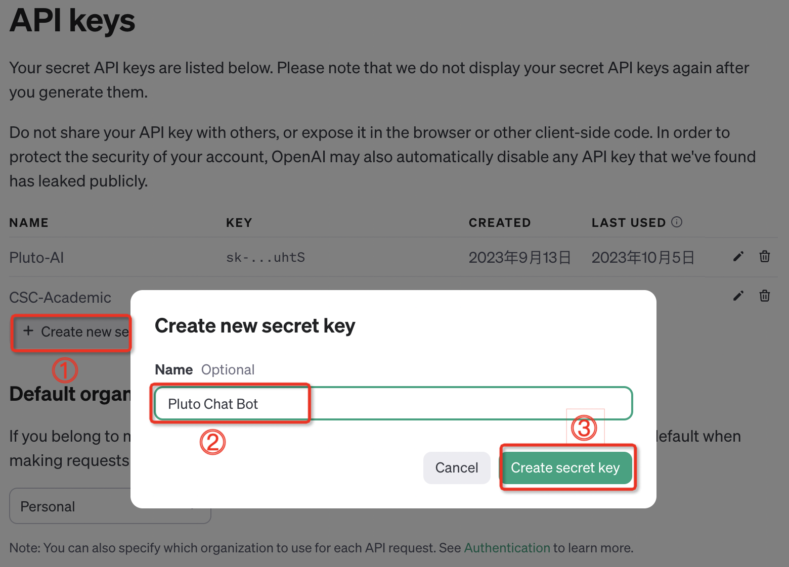
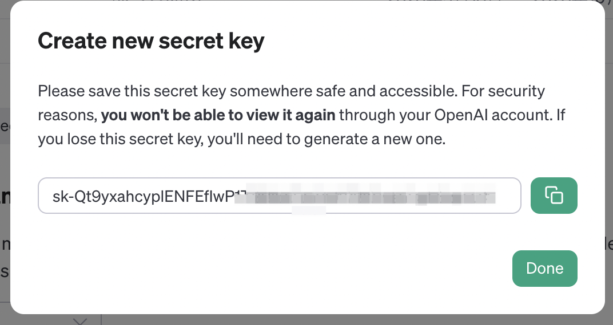
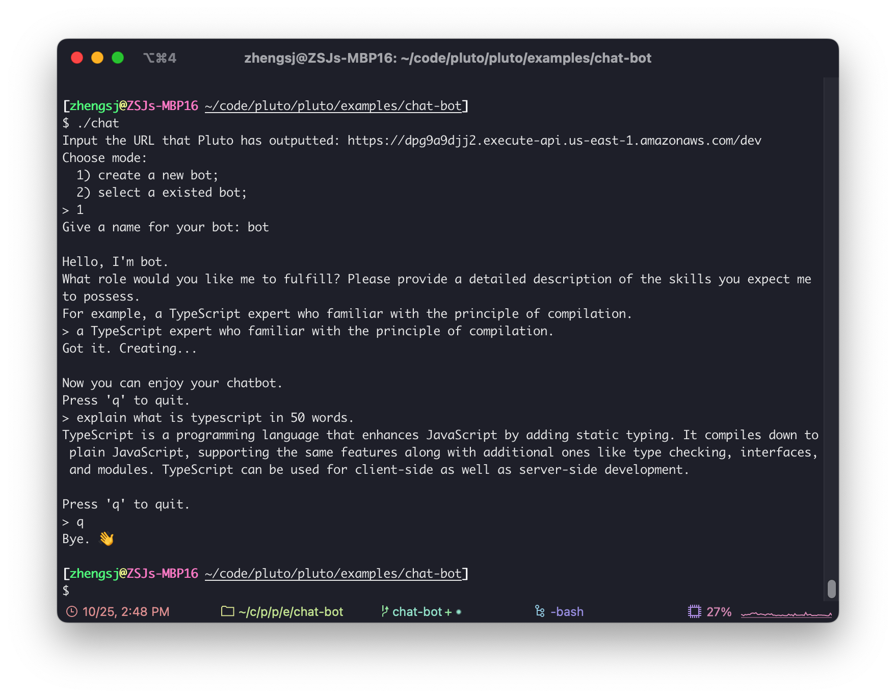

# A Command Line Chatbot using OpenAI API

This article presents a Pluto example application that creates a chatbot running in a command line terminal. The chatbot supports multiple sessions and automatically saves and restores sessions.

By default, this example assumes the AWS cloud platform for the specified stack. However, you can create a new stack using `pluto stack new` and deploy it to other platforms.

## Preparation

### Creating an OpenAI API Key

To begin, please register for an OpenAI account and open [this]([https://platform.openai.com/account/api-keys](https://platform.openai.com/account/api-keys) webpage. Click on "Create new secret key" and set a name. This will generate an API key. Make sure to save the key immediately, as you won't be able to view it again after clicking "Done".

  
  

### Install Pluto

If you haven't installed Pluto yet, you can refer to the installation steps [here](https://github.com/pluto-lang/pluto#-quick-start).

## Modifying the Code

Modify the `src/index.ts` file and replace the `OPENAI_API_KEY` with the API key obtained earlier.

Additionally, you can modify the `MODEL` to select the desired model. OpenAI provides various models, and the Chat Bot example only supports text-based chat. You can find the available models [here](https://platform.openai.com/docs/models).

## One-Click Deployment

In the root directory of this example program, execute `pluto deploy` to deploy it.

## Show Time

We offer a command-line tool called `chat` to interact with the Chat Bot server that you have just deployed. You can simply run `chat` in the root directory of this example to utilize it.

  

