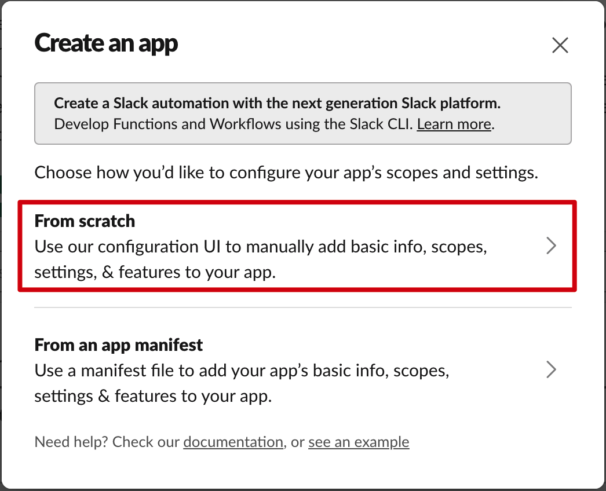
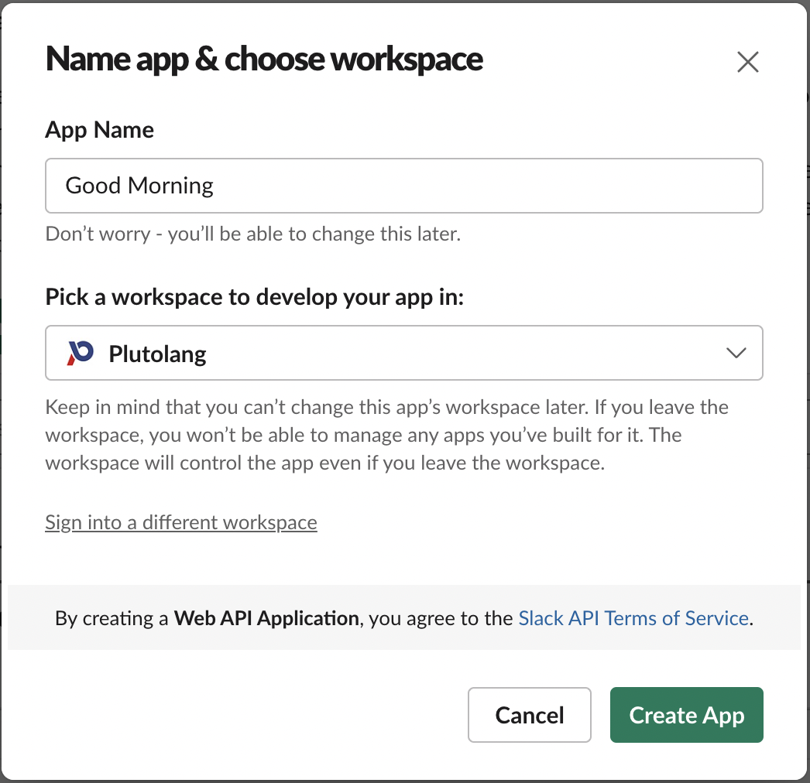
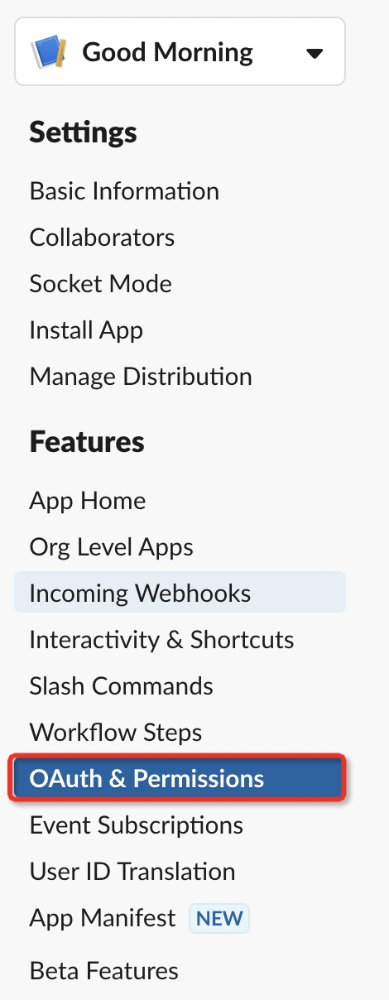
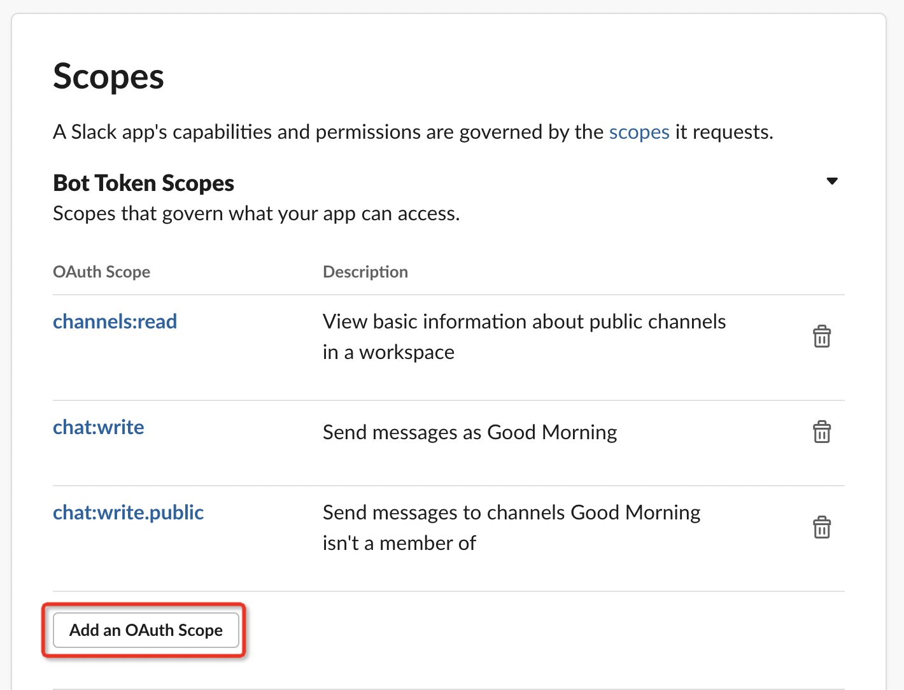
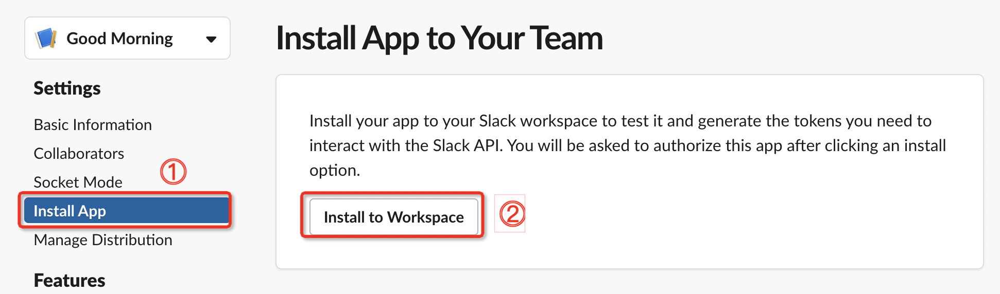
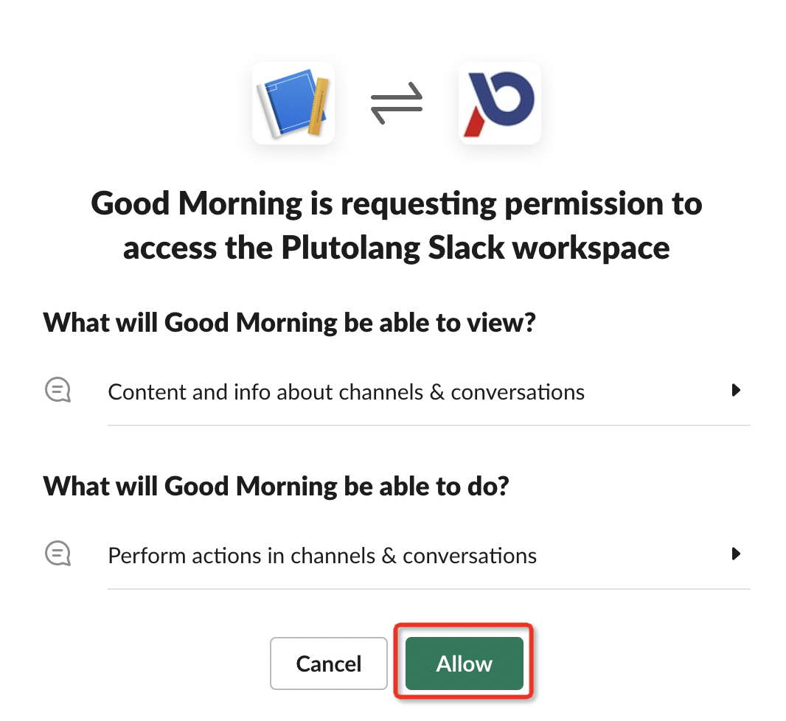
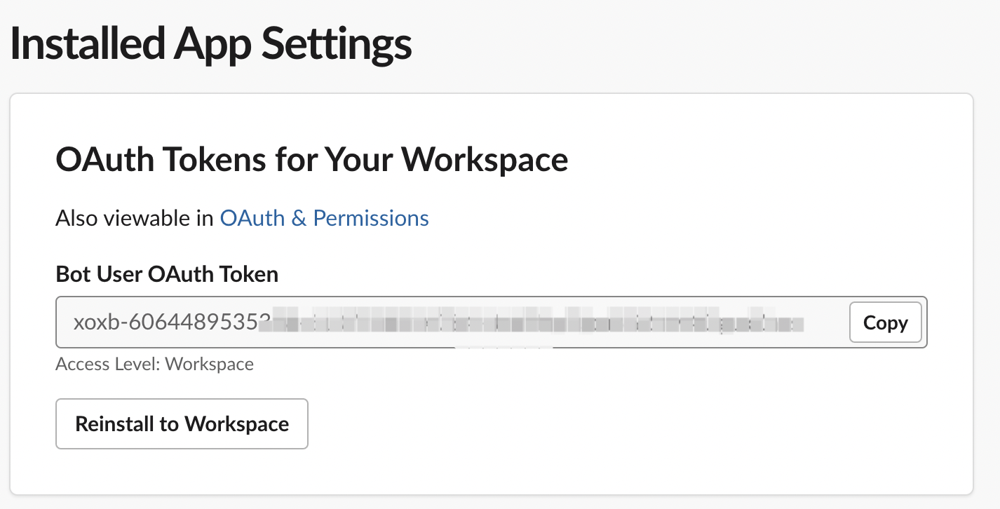
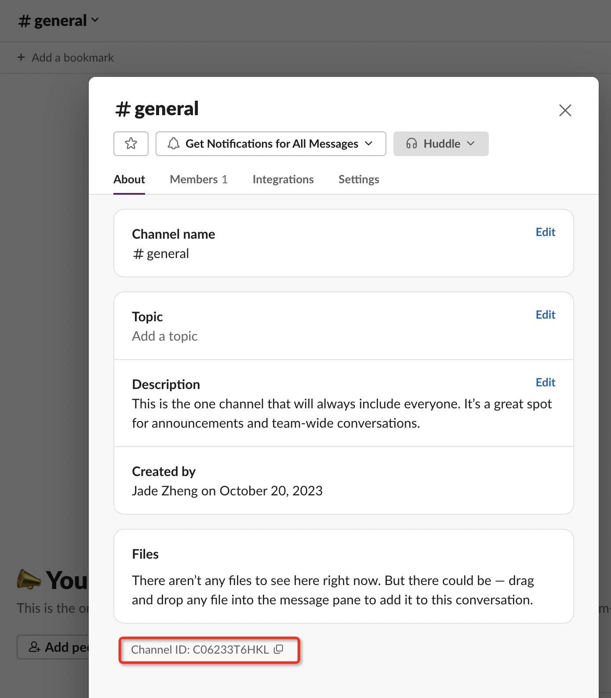
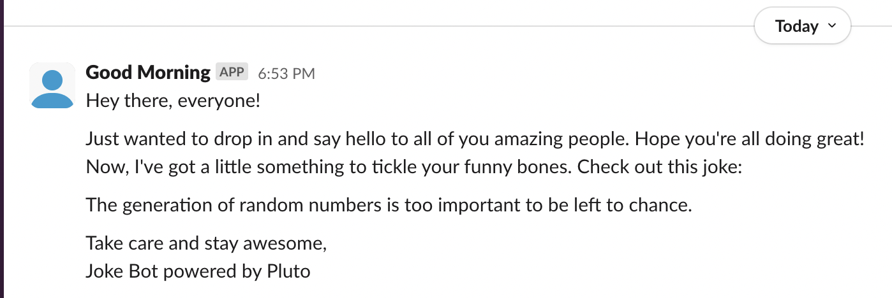

# A Joke Bot for Slack

This article presents a sample application using Pluto that creates a simple joke bot on AWS using the Slack WebAPI. The bot will send a daily joke to a specified channel.

## Preparation

### Creating a Slack App

To begin, you need to create a Slack App. Click [here](https://api.slack.com/apps?new_app=1) to start the creation process.

Once you're in the creation process, you'll see the following interface. Choose the first option, "From scratch."

  

In the next steps, provide a desired name for your bot and select the space where it will send messages.

After the creation is complete, select "OAuth & Permissions" from the sidebar. Scroll down and set the necessary permissions for the bot. In this case, we need the `channels:read`, `chat:write`, and `chat:write.public` permissions.

  
  

Next, select "Install App" from the sidebar and click "Install to Workspace" to complete the authorization process.

  

  

Afterwards, you will obtain a Bot User OAuth Token.

  

Once you have the token, you need to obtain the ID of the channel where you want the bot to send messages. This ID can be found in the Slack client. Find the desired channel, click on its name, and you will find the ID at the bottom.

  

### Installing Pluto

If you haven't installed Pluto yet, you can refer to the installation steps [here](https://github.com/pluto-lang/pluto#-quick-start).

## Modifying the Code

Modify the `src/index.ts` file and replace the `slackAppToken` and `channelId` with the Bot User OAuth Token and the channel ID obtained earlier.

## One-Click Deployment

In the root directory of this example program, execute `pluto deploy` to deploy it.

## Show Time

  

