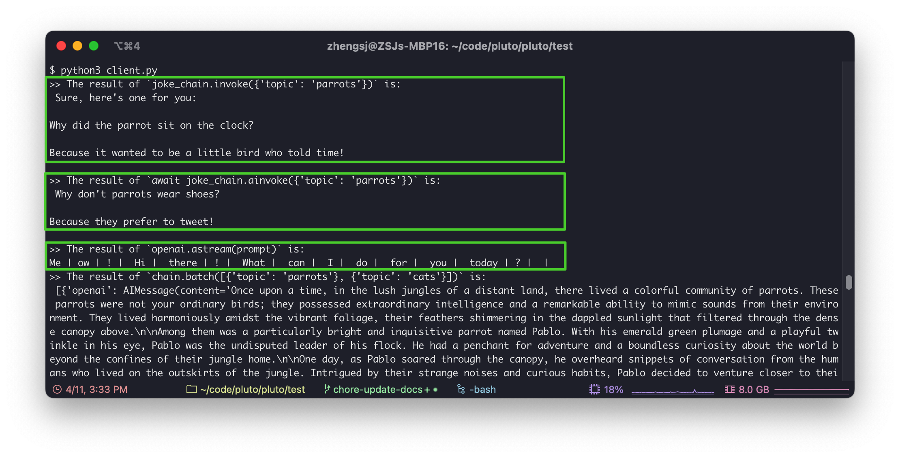
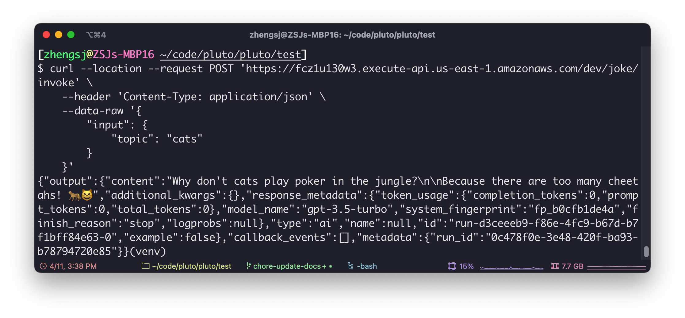
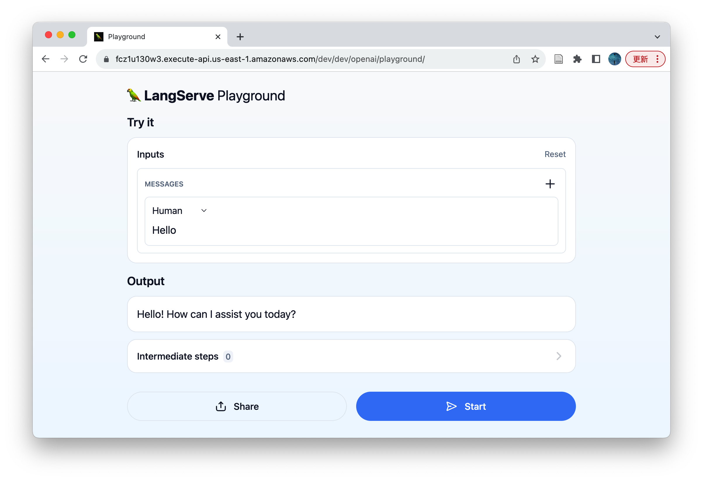
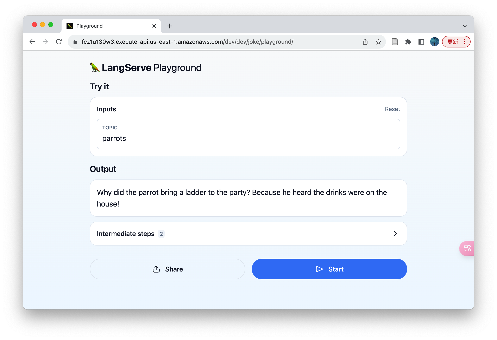

# Deploy LangServe Application to AWS

**This guide will introduce how to deploy the LangServe application to AWS with one click through Pluto, requiring only AWS access credentials, no need to learn AWS operations or log in to the AWS console.**

[LangServe](https://github.com/langchain-ai/langserve) is a subproject of LangChain, which can help developers deploy LangChain's Runnable and Chain through REST API. At the same time, it also provides a client for calling Runnable deployed on the server, including multiple versions such as Python and TypeScript, and provides Playground by default for online trial after deployment.

You can get all the code for this example from [here](./). [This link](https://codesandbox.io/p/devbox/deploy-langserve-application-to-aws-csj8wj) provides an online IDE for this sample application. Click the Fork button in the upper right corner to create your own development environment, and then you can directly modify the code and deploy it to AWS in the browser.

**⚠️Note:**

1. Since Pluto currently only supports single files, the code of the LangServe application needs to be placed in one file.
2. Limited by the current packaging method of Pluto, it does not yet support LangChain's [Template Ecosystem](https://github.com/langchain-ai/langchain/tree/master/templates). _Coming soon_

## Environment Preparation

If you have not configured the Pluto development environment, please refer to steps 0 and 1 in [Getting Started](../../docs/documentation/getting-started.zh-CN.md) for configuration, or you can use the [online sandbox or container](../../docs/documentation/getting-started.zh-CN.md#other-usage-methods) provided by Pluto for experience.

## Developing LangServe Application

Here we introduce two different ways to develop LangServe applications: one is the development method mentioned in the [langserve tutorial](https://github.com/langchain-ai/langserve), using the `langchain app new` command to create a new LangChain application; the other is using the `pluto new` command to create a new Pluto application.

### Method 1: langchain app new

#### Install LangChain CLI

```sh
pip install langchain-cli
```

#### Create LangServe Application

Use the `langchain app new` command to create a new LangChain application. This command will create a new directory in the current directory, and the directory name is the application name you specified:

```sh
langchain app new --non-interactive my-app
cd my-app
```

Note: The `langchain app new` command depends on `git`, please make sure `git` is installed in your environment. If you are using the container environment provided by Pluto, please execute this command `apt-get update && apt-get install -y git` to install `git`:

#### Write LangServe Application

You can develop AI applications based on LangChain in the `app/server.py` file according to your needs. In the end, you should develop one or more Runnable instances such as LangChain's Agent, Chain, etc. These instances can be added to FastAPI through the `add_routes` method provided by LangServe, and then provided to users in the form of HTTP services.

We take the [sample application on the LangServe homepage](https://github.com/langchain-ai/langserve?tab=readme-ov-file#sample-application) as an example. This example uses the `add_routes` method to add multiple Runnable instances of LangChain to FastAPI:

<details><summary>🔘 Click to expand and view the sample application code</summary>

_Since Pluto does not yet support passing environment variables, we need to configure the API Key of OpenAI and Anthropic in the code._

```python
from fastapi import FastAPI
from langchain.prompts import ChatPromptTemplate
# from langchain.chat_models import ChatAnthropic, ChatOpenAI
from langchain_anthropic import ChatAnthropic
from langchain_openai import ChatOpenAI
from langserve import add_routes
from langchain.pydantic_v1 import SecretStr

OPENAI_API_KEY = SecretStr("sk-EUk0Tal8cIkmG4vJF904F57a9eE241A8Ae72666fAxxxxxxx")
ANTHROPIC_API_KEY = SecretStr("sk-EUk0Tal8cIkmG4vJF904F57a9eE241A8Ae72666fAxxxxxxx")

app = FastAPI(
    title="LangChain Server",
    version="1.0",
    description="A simple api server using Langchain's Runnable interfaces",
)

add_routes(
    app,
    ChatOpenAI(api_key=OPENAI_API_KEY),
    path="/openai",
)

add_routes(
    app,
    ChatAnthropic(api_key=ANTHROPIC_API_KEY),
    path="/anthropic",
)

model = ChatAnthropic(api_key=ANTHROPIC_API_KEY)
prompt = ChatPromptTemplate.from_template("tell me a joke about {topic}")
add_routes(
    app,
    prompt | model,
    path="/joke",
)

if __name__ == "__main__":
    import uvicorn

    uvicorn.run(app, host="localhost", port=8000)
```

</details>

#### Modify Code to Adapt to Pluto

Next, we need to adapt the LangServe application to the Pluto application so that Pluto can deploy it to AWS. The adaptation process is also very simple, just two steps

1. First, you need to put the code related to the FastAPI app into a function and make this function return the FastAPI app instance. Here we assume that the function name is `return_fastapi_app`.
2. Then, replace the entire `if __name__ == "__main__":` code block with the following 4 statements. You can modify `router_name` to your favorite name. This name is related to the name of the Api Gateway instance created on AWS.

```python
from mangum import Mangum
from pluto_client import Router

router = Router("router_name")
router.all("/*", lambda *args, **kwargs: Mangum(return_fastapi_app(), api_gateway_base_path="/dev")(*args, **kwargs), raw=True)
```

The final code is as follows:

<span id="modified-code"></span>

```python
from fastapi import FastAPI
from langchain.prompts import ChatPromptTemplate
# from langchain.chat_models import ChatAnthropic, ChatOpenAI
from langchain_anthropic import ChatAnthropic
from langchain_openai import ChatOpenAI
from langserve import add_routes
from langchain.pydantic_v1 import SecretStr

from mangum import Mangum
from pluto_client import Router

OPENAI_API_KEY = SecretStr("sk-EUk0Tal8cIkmG4vJF904F57a9eE241A8Ae72666fAxxxxxxx")
ANTHROPIC_API_KEY = SecretStr("sk-EUk0Tal8cIkmG4vJF904F57a9eE241A8Ae72666fAxxxxxxx")

model = ChatAnthropic(api_key=ANTHROPIC_API_KEY)
prompt = ChatPromptTemplate.from_template("tell me a joke about {topic}")

def return_fastapi_app():
    # The langserve depends on this, but it may not come pre-installed.
    # So, we write it here to ensure it is installed.
    import sse_starlette

    app = FastAPI(
        title="LangChain Server",
        version="1.0",
        description="A simple api server using Langchain's Runnable interfaces",
    )

    add_routes(
        app,
        ChatOpenAI(api_key=OPENAI_API_KEY),
        path="/openai",
    )

    add_routes(
        app,
        ChatAnthropic(api_key=ANTHROPIC_API_KEY),
        path="/anthropic",
    )

    add_routes(
        app,
        prompt | model,
        path="/joke",
    )

    return app

router = Router("router_name")
router.all(
    "/*",
    lambda *args, **kwargs: Mangum(return_fastapi_app(), api_gateway_base_path="/dev")(*args, **kwargs),
    raw=True,
)
```

#### Deploy to AWS

Before the official deployment, we need to initialize this project as a Pluto project, so that Pluto can recognize and deploy the project. Run the following command in the project root directory, Pluto will guide you to initialize the project interactively, please choose Python for the programming language:

```sh
pluto init
```

After the initialization is completed, we need to install some necessary dependencies, execute the following two commands:

```sh
npm install

# When the Python version does not match, please modify the python version number in pyproject.toml
poetry add pluto-client mangum langchain-openai langchain_anthropic
```

Finally, we can deploy the LangServe application to AWS by executing the following command:

```bash
poetry shell
pluto deploy app/server.py
```

**Note: If your development environment is Arm64 architecture**, please install and start `docker` in the environment. If you are using the container environment provided by Pluto, `docker` has been installed in the environment, but you need to configure the `--privileged` parameter when starting, and then manually start the `docker` service in the container, the startup command is:

```sh
dockerd > /dev/null 2>&1 &
```

This command will deploy your LangServe application as a serverless application to AWS, creating an Api Gateway instance and a Lambda function instance to handle requests. At the same time, the URL of AWS's Api Gateway will be printed in the terminal. You can access the deployed application by visiting this URL.

### Method 2: pluto new

#### Create Pluto Application

Use the `pluto new` command to create a new Pluto application. This command will interactively create a new Pluto application and create a new directory in the current directory. The directory name is the application name you specified. Please choose Python for the programming language:

```sh
pluto new
```

After creation, enter the created application directory and install the necessary dependencies:

```sh
cd <project name>
npm install
pip install -r requirements.txt
```

#### Write LangServe Application

You can develop AI applications based on LangChain in the `app/main.py` file according to your needs. In the end, you should develop one or more Runnable instances such as LangChain's Agent, Chain, etc. These instances can be added to FastAPI through the `add_routes` method provided by LangServe, and then provided to users in the form of HTTP services.

However, here, we need to put the code related to the FastAPI app into a function and make this function return the FastAPI app instance, and finally encapsulate this function in the `all` method of `Router`, so that Pluto can deploy it to AWS.

Take the sample application on the LangServe homepage as an example, the final code is the same as the [adapted code](#modified-code) in the previous method.

#### Deploy to AWS

Ensure that all dependencies are installed, and you can deploy the LangServe application to AWS by executing the following command:

```sh
pluto deploy
```

**Note: If your development environment is Arm architecture**, please install and start `docker` in the environment. If you are using the container environment provided by Pluto, `docker` has been installed in the environment, but you need to configure the `--privileged` parameter when starting, and then manually start the `docker` service in the container, the startup command is:

```sh
dockerd > /dev/null 2>&1 &
```

`pluto deploy` will deploy your LangServe application as a serverless application to AWS, creating an Api Gateway instance and a Lambda function instance to handle requests. At the same time, the URL of AWS's Api Gateway will be printed in the terminal. You can access the deployed application by visiting this URL.

## Access

After the deployment is complete, you can see the URL output by Pluto from the terminal. You can access your LangServe application through this URL.

**⚠️Note:**

- Pluto does not yet support Stream access, and the result is still returned at once when using the `astream` method of LangServe.
- Because the first load of LangChain dependencies may be slow, the first call to the LangServe service or access to the Playground may be slow, and it will automatically time out after 30 seconds. Therefore, if you encounter a timeout issue when accessing, please try again.
- Each instance of an AWS Lambda function can only handle one request at a time, and the initialization time of each LangChain Lambda instance is close to 2 minutes, so there may be request timeout issues in high concurrency situations.

### Call via RemoteRunnable

Still taking the [Client provided by the sample application on the LangServe homepage](https://github.com/langchain-ai/langserve?tab=readme-ov-file#client) as an example, you only need to replace the local URL in the LangServe example with the URL output by Pluto.

We did not use the Anthropic model, so we only retained the call of the OpenAI and Joke models. The modified Python client code is as follows, please replace the `https://fcz1u130w3.execute-api.us-east-1.amazonaws.com/dev` in the code with the URL output by Pluto:

<details><summary>🔘 Click to expand and view Python client code</summary>

```python
import asyncio

from langchain.schema import SystemMessage, HumanMessage
from langchain.prompts import ChatPromptTemplate
from langchain.schema.runnable import RunnableMap
from langserve import RemoteRunnable


openai = RemoteRunnable(
    "https://fcz1u130w3.execute-api.us-east-1.amazonaws.com/dev/openai/"
)
joke_chain = RemoteRunnable(
    "https://fcz1u130w3.execute-api.us-east-1.amazonaws.com/dev/joke/"
)


def sync_inoke():
    result = joke_chain.invoke({"topic": "parrots"})
    print(
        ">> The result of `joke_chain.invoke({'topic': 'parrots'})` is:\n",
        result.content,
        "\n",
    )


async def async_inoke():
    result = await joke_chain.ainvoke({"topic": "parrots"})
    print(
        ">> The result of `await joke_chain.ainvoke({'topic': 'parrots'})` is:\n",
        result.content,
        "\n",
    )

    prompt = [
        SystemMessage(content="Act like either a cat or a parrot."),
        HumanMessage(content="Hello!"),
    ]

    # Supports astream
    print(">> The result of `openai.astream(prompt)` is:")
    async for msg in openai.astream(prompt):
        print(msg.content, end=" | ", flush=True)
    print()


def custom_chain():
    prompt = ChatPromptTemplate.from_messages(
        [("system", "Tell me a long story about {topic}")]
    )

    # Can define custom chains
    chain = prompt | RunnableMap(
        {
            "openai": openai,
            "anthropic": openai,
        }
    )

    result = chain.batch([{"topic": "parrots"}, {"topic": "cats"}])
    print(
        ">> The result of `chain.batch([{'topic': 'parrots'}, {'topic': 'cats'}])` is:\n",
        result,
    )


async def main():
    sync_inoke()
    await async_inoke()
    custom_chain()


asyncio.run(main())
```

</details>

The following figure shows the result of executing the Python client code:

<p align="center">
   
</p>

The modified TypeScript client code is as follows, please replace the `<your-api-gateway-url>` in the code with the URL output by Pluto:

```typescript
import { RemoteRunnable } from "@langchain/core/runnables/remote";

const chain = new RemoteRunnable({
  url: `<your-api-gateway-url>/joke/`,
});
const result = await chain.invoke({
  topic: "cats",
});
```

### Access via curl

Similarly, you only need to replace the `<your-api-gateway-url>` in the example with the URL output by Pluto:

```sh
curl --location --request POST '<your-api-gateway-url>/joke/invoke' \
    --header 'Content-Type: application/json' \
    --data-raw '{
        "input": {
            "topic": "cats"
        }
    }'
```

The following figure shows the result of executing the curl command:

<p align="center">
   
</p>

### Access Playground via Browser

Due to the current routing policy of LangServe, we cannot directly access LangServe's Playground through the browser without modifying the code. After [this PR](https://github.com/langchain-ai/langserve/pull/580) is merged, LangServe's Playground can be directly accessed through the browser.

Now, we need to add an additional `add_routes` method for each `add_routes` method, and add the `/dev` prefix to the `path` parameter, so that LangServe's Playground can be accessed in the browser. Below is a sample code:

```python
add_routes(
    app,
    ChatOpenAI(api_key=OPENAI_API_KEY),
    path="/openai",
)

add_routes(
    app,
    ChatOpenAI(api_key=OPENAI_API_KEY),
    path="/dev/openai",
)
```

After modifying and deploying, you can access the Playground of the sample application through the following URL. Note that you need to add `/dev` in the access path, that is, there are two `/dev` in the path. Note that the URL may be redirected. If it is modified, please adjust the path and try again.

- OpenAI: `<your-api-gateway-url>/dev/openai/playground`
- Anthropic: `<your-api-gateway-url>/dev/anthropic/playground`
- Joke: `<your-api-gateway-url>/dev/joke/playground`

The two figures below show the results of accessing the Playground of OpenAI and Joke through the browser, respectively:

<p align="center">
   
   
</p>

## Cleanup

If you want to take the deployed LangServe application offline from AWS, you only need to execute the following command:

```sh
pluto destroy
```

## Conclusion

In this article, we have explored in detail how to use Pluto to deploy the LangServe application to the AWS cloud platform with one click. This method allows you to easily deploy the LangServe application to the cloud and implement remote calls and Playground access, even if you are not familiar with AWS operations.

Pluto also provides the ability to automatically create resources such as DynamoDB, SNS, SageMaker, etc. You only need to write code, and `pluto deploy` will automatically create and configure these resources on AWS, providing you with the computing, storage and other capabilities of the cloud more conveniently, helping you to develop powerful AI applications more easily, and realize your ideas💡. You can get more information from [More Resources](#more-resources).

We try to make the steps in this article as simple and easy to understand as possible, so even if you are not very familiar with Pluto or AWS, you can easily get started. If you encounter problems during reading and practice, or have new ideas, please feel free to seek help by [submitting an issue](https://github.com/pluto-lang/pluto/issues/new/choose) or [joining the Pluto Slack community](https://join.slack.com/t/plutolang/shared_invite/zt-25gztklfn-xOJ~Xvl4EjKJp1Zn1NNpiw).

## More Resources

- [LangServe](https://github.com/langchain-ai/langserve)
- [LangChain](https://www.langchain.com/)
- [Pluto Documentation](https://pluto-lang.vercel.app/zh-CN)
- [Pluto Sample Applications](https://pluto-lang.vercel.app/zh-CN/cookbook/)
- [Pluto GitHub Repository](https://github.com/pluto-lang/pluto)
- [Pluto Slack Community](https://join.slack.com/t/plutolang/shared_invite/zt-25gztklfn-xOJ~Xvl4EjKJp1Zn1NNpiw)

---

## Quick Experience

Replace the `OPENAI_API_KEY`, `ANTHROPIC_API_KEY`, `AWS_ACCESS_KEY_ID`, `AWS_SECRET_ACCESS_KEY`, `AWS_REGION` and other parameters in this script with your actual values, and then save this script to your local machine.

Executing this script will automatically create a LangServe sample application and deploy it to AWS, finally outputting the deployed URL. You can refer to the [Access](#access) section in the text above to access the deployed application.

After execution, it will enter an interactive command line, making it easy for you to take the deployed application offline with `pluto destroy`.

```sh
OPENAI_API_KEY="<your-openai-api-key>"
AWS_ACCESS_KEY_ID="<your-aws-access-key-id>"
AWS_SECRET_ACCESS_KEY="<your-aws-secret-access-key>"
AWS_REGION="us-east-1"

# Prepare the modified code of LangServe application
MODIFIED_CODE=$(cat <<EOF
from fastapi import FastAPI
from langchain.prompts import ChatPromptTemplate
from langchain_openai import ChatOpenAI
from langserve import add_routes
from langchain.pydantic_v1 import SecretStr

from mangum import Mangum
from pluto_client import Router

OPENAI_API_KEY = SecretStr("${OPENAI_API_KEY}")

model = ChatOpenAI(api_key=OPENAI_API_KEY)
prompt = ChatPromptTemplate.from_template("tell me a joke about {topic}")

def return_fastapi_app():
    # The langserve depends on this, but it may not come pre-installed.
    # So, we write it here to ensure it is installed.
    import sse_starlette

    app = FastAPI(
      title="LangChain Server",
      version="1.0",
      description="A simple api server using Langchain's Runnable interfaces",
    )

    add_routes(
      app,
      ChatOpenAI(api_key=OPENAI_API_KEY),
      path="/openai",
    )

    add_routes(
      app,
      ChatOpenAI(api_key=OPENAI_API_KEY),
      path="/dev/openai",
    )

    add_routes(
      app,
      prompt | model,
      path="/joke",
    )

    add_routes(
      app,
      prompt | model,
      path="/dev/joke",
    )

    return app

router = Router("router_name")
router.all(
    "/*",
    lambda *args, **kwargs: Mangum(return_fastapi_app(), api_gateway_base_path="/dev")(*args, **kwargs),
    raw=True,
)
EOF
)

# Prepare the package.json file, used by the Pluto
PACKAGE_JSON=$(cat <<EOF
{
  "name": "my-app",
  "private": true,
  "version": "0.0.0",
  "scripts": {
    "test:dev": "pluto test --sim",
    "test:prod": "pluto test",
    "deploy": "pluto deploy",
    "destroy": "pluto destroy"
  },
  "dependencies": {},
  "devDependencies": {
    "@types/node": "^20",
    "typescript": "^5.2.2",
    "@plutolang/base": "latest",
    "@plutolang/pluto-infra": "latest",
    "@pulumi/pulumi": "^3.88.0"
  },
  "main": "dist/index.js"
}
EOF
)

# Prepare the Pluto configuration file
PLUTO_YML=$(cat <<EOF
current: aws
language: python
stacks:
  - configs: {}
    name: aws
    platformType: AWS
    provisionType: Pulumi
EOF
)

# Prepare the AWS credentials
AWS_CREDENTIALS=$(cat <<EOF
[default]
aws_access_key_id = ${AWS_ACCESS_KEY_ID}
aws_secret_access_key = ${AWS_SECRET_ACCESS_KEY}
EOF
)

# Prepare the AWS configuration
AWS_CONFIG=$(cat <<EOF
[default]
region = ${AWS_REGION}
EOF
)

# Prepare the script to run inside the Docker container
cat <<EOF1 > script.sh
#!/bin/bash

apt update
apt install -y git

pip install langchain-cli poetry

langchain app new --non-interactive my-app
cd my-app

cat << EOF2 > app/server.py
${MODIFIED_CODE}
EOF2

cat << EOF3 > package.json
${PACKAGE_JSON}
EOF3

mkdir -p .pluto
cat << EOF4 > .pluto/pluto.yml
${PLUTO_YML}
EOF4

npm install
sed -i 's/\^3.11/\^3.10/' pyproject.toml
poetry add pluto-client mangum langchain-openai

mkdir -p ~/.aws
cat << EOF5 > ~/.aws/credentials
${AWS_CREDENTIALS}
EOF5
cat << EOF6 > ~/.aws/config
${AWS_CONFIG}
EOF6

source \$(poetry env info --path)/bin/activate
pluto deploy -y --force app/server.py

bash
EOF1

# Run the script inside the Docker container
docker run -it --rm \
  --platform linux/amd64 \
  -v $(pwd)/script.sh:/script.sh \
  plutolang/pluto:latest bash -c "bash /script.sh"
```
