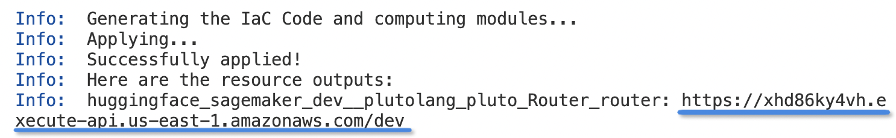
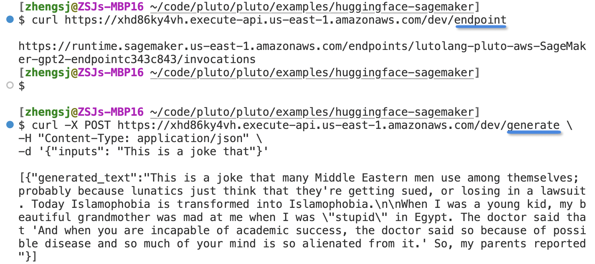
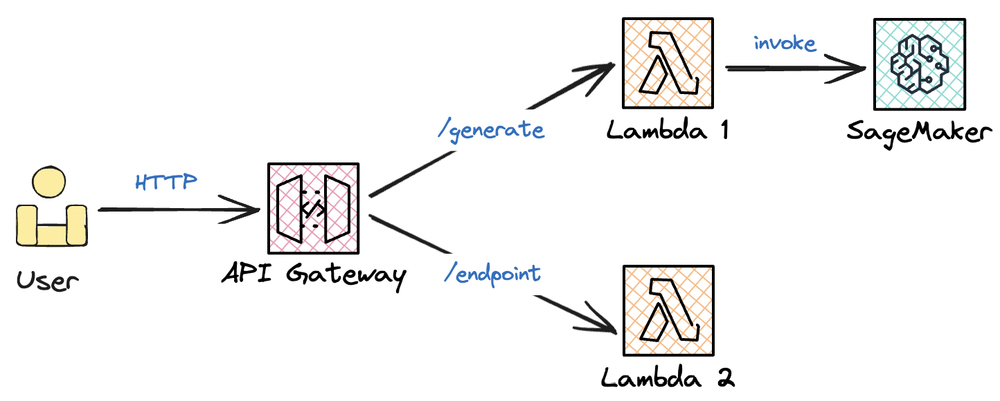

# 在 AWS SageMaker 上部署 GPT2 大语言模型

使用 Pluto 可以将 Hugging Face 模型轻松部署到 AWS SageMaker 上，同时还能与 SNS、DynamoDB、Lambda、API Gateway 等其他 AWS 服务集成。

这篇文档会构建一个简单的例子，将 Hugging Face 上的 GPT2 部署到 AWS SageMaker 上，并且通过 API Gateway 暴露出来，供用户通过 HTTP 请求调用。

你可以直接通过 [CodeSandbox](https://codesandbox.io/p/devbox/gpt2-hf-sagemaker-27h3qh) 使用体验这个示例应用。

<details><summary>这个示例的完整代码</summary>

```typescript
import { Router, SageMaker } from "@plutolang/pluto";

/**
 * Deploy the GPT2 model on AWS SageMaker using the Hugging Face Text Generation Inference (TGI)
 * container. You can find suitable containers from:
 *
 * AWS Available Deep Learning Containers Images:
 * https://github.com/aws/deep-learning-containers/blob/master/available_images.md
 *
 * HuggingFace Text Generation Inference (TGI) Containers:
 * https://github.com/aws/deep-learning-containers/releases?q=tgi+AND+gpu&expanded=true
 */
const sagemaker = new SageMaker(
  "gpt2",
  "763104351884.dkr.ecr.us-east-1.amazonaws.com/huggingface-pytorch-tgi-inference:2.1.1-tgi1.4.0-gpu-py310-cu121-ubuntu20.04",
  {
    instanceType: "ml.m5.xlarge",
    envs: {
      HF_MODEL_ID: "openai-community/gpt2",
      HF_TASK: "text-generation",
    },
  }
);

// Create a router to handle the HTTP requests
const router = new Router("router");

// Receive the requsets from users and send them the response from the SageMaker endpoint.
router.post("/generate", async (req) => {
  const payload = req.body;
  if (!payload) {
    return {
      statusCode: 400,
      body: "The request body is empty. Please provide a valid input.",
    };
  }

  const data = JSON.parse(payload);
  if (!data["inputs"]) {
    // The payload should be a JSON object with a key "inputs".
    return {
      statusCode: 400,
      body: "The request body is invalid. Please provide a valid input.",
    };
  }

  // Invoke the SageMaker endpoint with the input data and return the response to the users.
  const output = await sagemaker.invoke(data);
  return {
    statusCode: 200,
    body: JSON.stringify(output),
  };
});

// Return the SageMaker endpoint URL to the users
router.get("/endpoint", async () => {
  const endpointUrl = sagemaker.endpointUrl();
  return {
    statusCode: 200,
    body: endpointUrl,
  };
});
```

</details>

## 准备工作

如果你还没有安装 Pluto，请参考[这里](https://github.com/pluto-lang/pluto#-quick-start)的步骤安装 Pluto，并配置好 AWS 的访问凭证。

## 创建项目

首先，在你的工作目录下，执行 `pluto new` 命令，这会交互式地创建一个新项目，并在你当前目录下创建一个新文件夹，其中包含了 Pluto 项目的基本结构。

这里，我的项目名称命名为 `gpt2-hf-sagemaker`，选择 AWS 平台，并且使用 Pulumi 作为部署引擎。

```
$ pluto new
? Project name gpt2-hf-sagemaker
? Stack name dev
? Select a platform AWS
? Select an provisioning engine Pulumi
Info:  Created a project, gpt2-hf-sagemaker
```

创建完成后，进入创建的项目文件夹 `gpt2-hf-sagemaker`，会看到这样的目录结构：

```
gpt2-hf-sagemaker/
├── README.md
├── package.json
├── src
│   └── index.ts
└── tsconfig.json
```

然后，执行 `npm install` 下载所需依赖。

## 编写代码

接下来，我们修改 `src/index.ts` 文件来构建我们的示例应用，过程也非常简单。

### 1）创建 SageMaker 实例

首先，我们引入 `@plutolang/pluto` 包，然后创建一个 `SageMaker` 实例，来部署我们的模型。

在 `SageMaker` 构造函数中，我们需要提供名称、模型的 Docker 镜像 URI 和一些配置信息，其中名称与想要部署的模型没有关系，只是用于确定 SageMaker 实例的名称。

```typescript
import { Router, SageMaker } from "@plutolang/pluto";

const sagemaker = new SageMaker(
  /* name */ "gpt2",
  /* imageUri */ "763104351884.dkr.ecr.us-east-1.amazonaws.com/huggingface-pytorch-tgi-inference:2.1.1-tgi1.4.0-gpu-py310-cu121-ubuntu20.04",
  /* options */ {
    instanceType: "ml.m5.xlarge",
    envs: {
      HF_MODEL_ID: "openai-community/gpt2", // Replace with the model ID you want to deploy
      HF_TASK: "text-generation", // Replace with the task type according to the model
    },
  }
);
```

这里使用的 Docker 镜像是 Hugging Face 的 TGI 容器，你可以在[这里](https://github.com/aws/deep-learning-containers/releases?q=tgi+AND+gpu&expanded=true)找到更多可选的容器。

如果你想部署其他大语言模型，只需要确定你要部署的大语言模型支持 TGI 即可。在[这里](https://huggingface.co/models?other=text-generation-inference)可以找到支持 TGI 的模型。找到需要部署的模型后，需要将模型的 ID 和任务类型填入 `envs` 中。模型 ID 就是网页上模型的名称，任务类型则体现在模型的标签中。

### 2）创建路由

接下来，我们创建一个路由 `router`，并编写两个路由处理函数，一个用于接收用户的生成请求，并返回 SageMaker 执行后的结果，另一个用于返回 SageMaker 实例的 Endpoint URL。

Pluto 的 Router 类型对应于 AWS 的 ApiGateway，在部署时，Pluto 会自动创建一个 API Gateway。

```typescript
// Create a router to handle the HTTP requests
const router = new Router("router");

// Receive the requsets from users and send them the response from the SageMaker endpoint.
router.post("/generate", async (req) => {
  const payload = req.body;
  if (!payload) {
    return {
      statusCode: 400,
      body: "The request body is empty. Please provide a valid input.",
    };
  }

  const data = JSON.parse(payload);
  if (!data["inputs"]) {
    // The payload should be a JSON object with a key "inputs".
    return {
      statusCode: 400,
      body: "The request body is invalid. Please provide a valid input.",
    };
  }

  // Invoke the SageMaker endpoint with the input data and return the response to the users.
  const output = await sagemaker.invoke(data);
  return {
    statusCode: 200,
    body: JSON.stringify(output),
  };
});

// Return the SageMaker endpoint URL to the users
router.get("/endpoint", async () => {
  const endpointUrl = sagemaker.endpointUrl();
  return {
    statusCode: 200,
    body: endpointUrl,
  };
});
```

至此，我们的代码就已经编写完成，接下来我们只要将其部署到 AWS 上，就可以通过 HTTP 请求来调用我们的模型了。

## 一键部署

部署 Pluto 项目也非常简单，只需要在项目根目录下执行 `pluto deploy` 命令，Pluto 就会自动将项目部署到 AWS 上。



最终，你会得到一个 API Gateway 的 URL，通过这个 URL 就可以访问你的模型了。





整个应用部署后的架构就像上面这张图所展示的，整体上由一个 SageMaker 实例、两个 Lambda 函数和一个 API Gateway所构成。但是，在实际部署的时候，远比展示的复杂，我们需要创建与配置**将近 30 个配置项**，其中就包括 SageMaker 的 Model、Endpoint，Api Gateway 的 Deployment、Stage，以及多个 IAM 角色、权限等。而如果使用 Pluto 的话，这所有的操作只需要一行命令就可以自动化地完成。

**注意：SageMaker 的部署时间较长，请耐心等待。**
