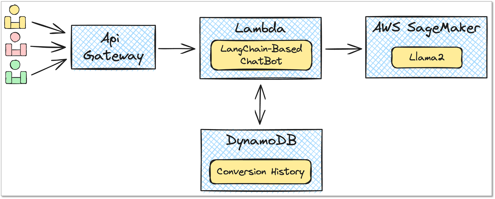

# 基于 AWS 和 LangChain 的 Llama2 会话聊天机器人

在本指南中，你将了解如何结合 Pluto、AWS 服务、LangChain 和 Llama2 构建一个简易的会话型聊天机器人。我们将介绍示例应用的架构组件，以及如何使用 Pluto 进行部署和使用。

## 架构概览



如图所示，该示例应用依赖以下 AWS 服务和资源：

- **Amazon SageMaker**: 用于部署 Llama2 模型
  - Model, EndpointConfiguration, Endpoint, Role
- **Amazon DynamoDB**: 用来持久化会话消息
  - Table
- **AWS Lambda**: 执行后端业务逻辑
  - Function, Role, Policy
- **Amazon API Gateway**: 提供 HTTP API 端点以供用户访问服务
  - Api, Route, Integration, Deployment, Stage

## 比较

我们尝试使用其他工具构建相同的示例应用，以下表格展示了 Pluto 与其他工具在代码量和类型上的对比：

|                                                           | 代码类型            | 代码量/行            | 代码地址                                             |
| --------------------------------------------------------- | ------------------- | -------------------- | ---------------------------------------------------- |
| 应用程序 - TypeScript                                     | 业务逻辑            | 83(.ts)              | [源码](./comparison/application)                     |
| [Terraform](https://www.terraform.io/)                    | 基础设施配置        | 201(.tf)             | [源码](./comparison/terraform)                       |
| [Pulumi](https://www.pulumi.com/)                         | 基础设施配置        | 157(.ts)             | [源码](./comparison/pulumi)                          |
| [Pulumi Serverless](https://www.pulumi.com/serverless/)   | 业务逻辑 + 配置     | 256(.ts)             | [源码](./comparison/pulumi-app)                      |
| [Winglang - TypeScript](https://github.com/winglang/wing) | 业务逻辑 + 配置     | 100(.ts)             | [源码](./comparison/wing-ts)                         |
| [Winglang - Wing](https://github.com/winglang/wing)       | 业务逻辑 + 配置     | 71(.w) + 47(.ts)     | [源码](./comparison/wing-wing)                       |
| [Serverless](https://github.com/serverless/serverless)    | 业务逻辑 + 配置     | 79(.ts) + 120(.yaml) | [源码](./comparison/serverless)                      |
| **Pluto - TypeScript**                                    | **业务逻辑 + 配置** | **100(.ts) **        | [源码](./src)                                        |
| 应用程序 - Python                                         | 业务逻辑            | 73(.py)              | [源码](./comparison/application-python)              |
| [Lepton](https://www.lepton.ai/)                          | 业务逻辑 + 配置     | 116(.py)             | [源码](./comparison/lepton)                          |
| **Pluto - Python**                                        | **业务逻辑 + 配置** | **84(.py) **         | [源码](../langchain-llama2-chatbot-sagemaker-python) |

通过对比表格数据可以看到，TypeScript 版本与 Python 版本的 Pluto 应用与纯业务逻辑代码相比，增加了 17 行、11 行代码，包含了云资源创建与权限配置相关代码。如果采用 Pulumi 或 Terraform 等 IaC 工具进行基础设施配置，业务逻辑加基础设施配置的整体代码量均在 Pluto 代码量的两倍以上。与 Pulumi 的 Serverless 功能、Winglang、Lepton、Serverless 等简化云使用的工具相比，Pluto 对云、AI 背景知识的要求更低，所需代码量也更少。

我们在使用其他工具构建的过程中，遇到了许多问题，导致这些代码最终并没有部署成功，例如，Winglang 没有提供 SageMaker Model、EndpointConfig 资源类型，Pulumi 运行时报错，繁琐的资源项配置等，如果你有兴趣欢迎进行修复。

## 部署步骤

要部署这个聊天机器人，请按照以下步骤操作：

1. 安装 Pluto 并配置 AWS 访问凭证，详细步骤请参阅 [Pluto 快速开始指南](https://github.com/pluto-lang/pluto#-quick-start)。

2. 在示例应用的根目录下运行以下命令进行初始化：

   ```bash
   npm install
   ```

3. 将 `src/index.ts` 文件中的 `HUGGING_FACE_HUB_TOKEN` 修改成你的 Hugging Face Hub Token。如果你还没有 Token，可以在 [这里](https://huggingface.co/settings/tokens) 生成一个。

4. 部署应用：

   ```bash
   pluto deploy
   ```

**这个过程需要耐心等待一会，因为 SageMaker 部署模型需要一定时间。** 一旦部署完成，控制台会显示出 ApiGateway 的 URL，你可以通过浏览器或 curl 命令来访问它。以下是一个简单的测试命令：

```bash
CHATBOT_API_URL=你的 ApiGateway URL
time curl --get "$CHATBOT_API_URL/chat" \
  --data-urlencode "sessionid=session_1" \
  --data-urlencode "query='What is the capital of China?'"
```

通过使用相同的 `sessionid`，你可以进行连续的多轮对话测试。

如果你想要清理资源，只需要在示例应用根目录执行 `pluto destroy` 命令即可。

## 扩展示例应用

这个示例应用只是一个简单的聊天机器人，但是你可以根据自己的需求进行扩展，使其更加强大和实用，例如：

- **增加自定义业务逻辑**：根据特定的业务需求，你可以编写更多的 Lambda 函数，实现更复杂的业务逻辑。
- **整合更多 AWS 服务**：你可以利用 AWS 提供的丰富服务，例如 Amazon SNS 作为消息队列，实现异步消息处理。
- **增强用户体验**：你可以开发一个前端用户界面，让用户能够通过网页或移动应用与聊天机器人互动，而不仅仅是通过 API 请求。
