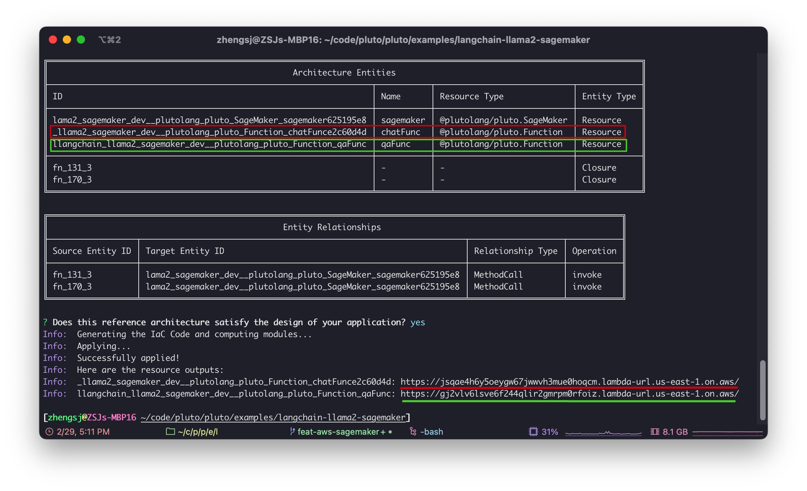
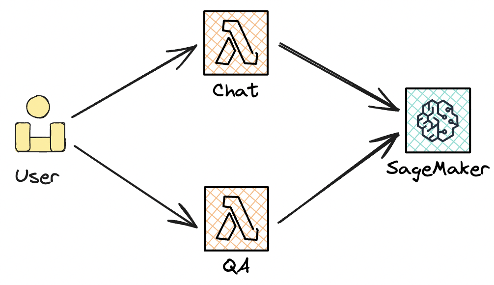
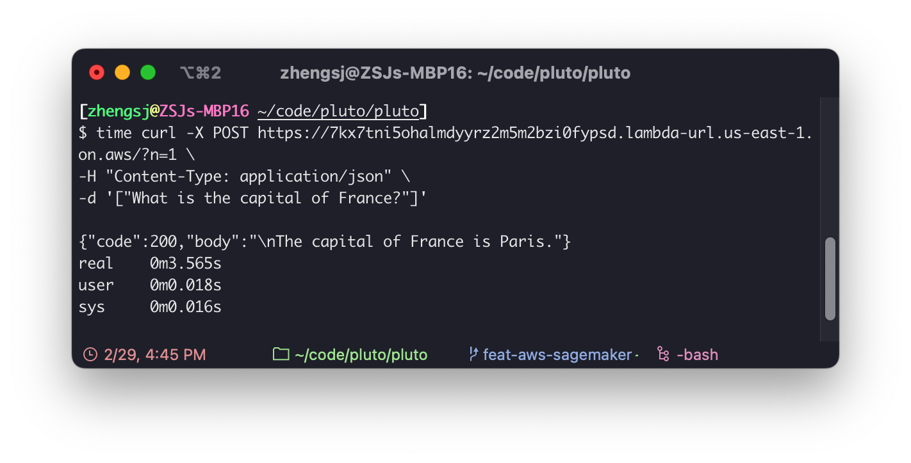
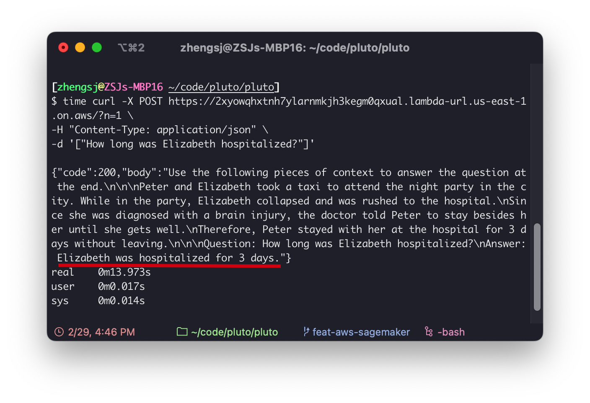

# 部署集成了 Llama2 的 LangChain 应用

这篇文档将介绍使用 Pluto 使 LangChian 应用程序轻松接入 Llama2 大语言模型，并最终将 LangChain 应用产品化部署到 AWS 云平台上，暴露出 HTTP 接口。

这篇文档最终会在 AWS 平台上创建一个 SageMaker 实例来部署一个 [TinyLlama 1.1B](https://huggingface.co/TinyLlama/TinyLlama-1.1B-Chat-v1.0) 大语言模型，同时会创建两个 Lambda 实例，分别基于 LangChain 和部署的大语言模型实现最基本的**对话**和基于文档的**问答**两个功能。

整个研发过程，开发者不需要关心模型部署、AWS 资源配置等琐事，只需要关注业务逻辑的实现即可。当然，这篇文档同样适用于需要部署与接入其他开源模型的场景。

<details><summary>展开查看示例应用的全部代码</summary>

````typescript
import { SageMaker, Function } from "@plutolang/pluto";
import { loadQAChain } from "langchain/chains";
import { Document } from "langchain/document";
import { PromptTemplate } from "langchain/prompts";
import {
  SageMakerEndpoint,
  SageMakerLLMContentHandler,
} from "@langchain/community/llms/sagemaker_endpoint";

/**
 * Deploy the Llama2 model on AWS SageMaker using the Hugging Face Text Generation Inference (TGI)
 * container. Here will deploy the TinyLlama-1.1B-Chat-v1.0 model, which can be run on the
 * ml.m5.xlarge instance.
 *
 * Below is a set up minimum requirements for each model size of Llama2 model:
 * ```
 * Model      Instance Type    Quantization    # of GPUs per replica
 * Llama 7B   ml.g5.2xlarge    -               1
 * Llama 13B  ml.g5.12xlarge   -               4
 * Llama 70B  ml.g5.48xlarge   bitsandbytes    8
 * Llama 70B  ml.p4d.24xlarge  -               8
 * ```
 * The initial limit set for these instances is zero. If you need more, you can request an increase
 * in quota via the [AWS Management Console](https://console.aws.amazon.com/servicequotas/home).
 */
const sagemaker = new SageMaker(
  "llama-2-7b",
  "763104351884.dkr.ecr.us-east-1.amazonaws.com/huggingface-pytorch-tgi-inference:2.1.1-tgi1.4.0-gpu-py310-cu121-ubuntu20.04",
  {
    instanceType: "ml.m5.xlarge",
    envs: {
      // HF_MODEL_ID: "meta-llama/Llama-2-7b-chat-hf",
      HF_MODEL_ID: "TinyLlama/TinyLlama-1.1B-Chat-v1.0",
      HF_TASK: "text-generation",
      // If you want to deploy the Meta Llama2 model, you need to request a permission and prepare the
      // token. You can get the token from https://huggingface.co/settings/tokens
      // HUGGING_FACE_HUB_TOKEN: "hf_EmXPwpnyxxxxxxx"
    },
  }
);

/**
 * TODO: Given the constraints of the current version of Deducer, we have to place the following
 * code within the separated function. Once we've upgraded Deducer, it'll be necessary to move this
 * code outside of the function.
 */
async function createSageMakerModel() {
  // Custom for whatever model you'll be using
  class LLama27BHandler implements SageMakerLLMContentHandler {
    contentType = "application/json";

    accepts = "application/json";

    async transformInput(prompt: string, modelKwargs: Record<string, unknown>): Promise<any> {
      const payload = {
        inputs: prompt,
        parameters: modelKwargs,
      };
      const stringifiedPayload = JSON.stringify(payload);
      return new TextEncoder().encode(stringifiedPayload);
    }

    async transformOutput(output: any): Promise<string> {
      const response_json = JSON.parse(new TextDecoder("utf-8").decode(output));
      const content: string = response_json[0]["generated_text"] ?? "";
      return content;
    }
  }

  return new SageMakerEndpoint({
    endpointName: sagemaker.endpointName,
    modelKwargs: {
      temperature: 0.5,
      max_new_tokens: 700,
      top_p: 0.9,
    },
    endpointKwargs: {
      CustomAttributes: "accept_eula=true",
    },
    contentHandler: new LLama27BHandler(),
    clientOptions: {
      // In theory, there's no need to supply the following details as the code will be executed within
      // the AWS Lambda environment. However, due to the way SageMakerEndpoint is implemented, it's
      // required to specify a region.
      region: process.env["AWS_REGION"],
      // credentials: {
      //   accessKeyId: "YOUR AWS ACCESS ID",
      //   secretAccessKey: "YOUR AWS SECRET ACCESS KEY",
      // },
    },
  });

  // TODO: Use the following statement to help the deducer identify the right relationship between
  // Lambda and SageMaker. This will be used to grant permission for the Lambda instance to call
  // upon the SageMaker endpoint. This code should be removed after the deducer supports the
  // analysis of libraries.
  // TODO: bug: only asynchrous function can be successfully analyzed by deducer.
  await sagemaker.invoke({});
}

/**
 * Why we don't use the Router (Api Gateway) to handle the requests? Because the ApiGateway comes
 * with a built-in 30-second timeout limit, which unfortunately, can't be increased. This means if
 * the generation process takes longer than this half-minute window, we'll end up getting hit with a
 * 503 Service Unavailable error. Consequently, we directly use the Lambda function to handle the
 * requests.
 *
 * For more details, check out:
 * https://docs.aws.amazon.com/apigateway/latest/developerguide/limits.html
 *
 * You can send a POST HTTP request to the Lambda function using curl or Postman. The request body
 * needs to be set as an array representing the function's arguments. Here's an example of a curl
 * request:
 * ```sh
 * curl -X POST https://<your-lambda-url-id>.lambda-url.<region>.on.aws/ \
 *   -H "Content-Type: application/json" \
 *   -d '["What is the capital of France?"]'
 * ```
 * If you get an error message such as `{"code":400,"body":"Payload should be an array."}`, you can
 * add a query parameter, such as `?n=1`, to the URL to resolve it. I don't know why it turns into a
 * GET request when I don't include the query parameter, even though the curl log indicates it's a
 * POST request. If you know the reason, please let me know.
 */

/**
 * The following code is creating a chain for the chatbot task. It can answer the user-provided question.
 */
// TODO: Bug: The deducer fails to identify the function's resources if the return value of the
// constructor isn't assigned to a variable.
const chatFunc = new Function(
  async (query) => {
    const model = await createSageMakerModel();
    const promptTemplate = PromptTemplate.fromTemplate(`<|system|>
You are a cool and aloof robot, answering questions very briefly and directly.</s>
<|user|>
{query}</s>
<|assistant|>`);

    const chain = promptTemplate.pipe(model);
    const result = await chain.invoke({ query: query });

    const answer = result
      .substring(result.indexOf("<|assistant|>") + "<|assistant|>".length)
      .trim();
    return answer;
  },
  {
    name: "chatbot", // The name should vary between different functions, and cannot be empty if there are more than one function instances.
  }
);

/**
 * The following code is creating a chain for the question answering task. It can be used to answer
 * the question based on the given context.
 */
const exampleDoc1 = `
Peter and Elizabeth took a taxi to attend the night party in the city. While in the party, Elizabeth collapsed and was rushed to the hospital.
Since she was diagnosed with a brain injury, the doctor told Peter to stay besides her until she gets well.
Therefore, Peter stayed with her at the hospital for 3 days without leaving.
`;

const promptTemplate = `Use the following pieces of context to answer the question at the end.

{context}

Question: {question}
Answer:`;

const qaFunc = new Function(
  async (query) => {
    const docs = [new Document({ pageContent: exampleDoc1 })];

    const prompt = new PromptTemplate({
      template: promptTemplate,
      inputVariables: ["context", "question"],
    });

    const chain = loadQAChain(await createSageMakerModel(), {
      type: "stuff",
      prompt: prompt,
    });

    const result = await chain.invoke({ input_documents: docs, question: query });
    return result["text"];
  },
  {
    name: "qa",
  }
);
````

</details>

## 准备工作

如果你还没有安装 Pluto，请参考[这里](https://github.com/pluto-lang/pluto#-quick-start)的步骤安装 Pluto，并配置好 AWS 的访问凭证。

## 创建项目

首先，在你的工作目录下，执行 `pluto new` 命令，这会交互式地创建一个新项目，并在你当前目录下创建一个新文件夹，其中包含了 Pluto 项目的基本结构。

这里，我的项目名称命名为 `langchain-llama2-sagemaker`，选择 AWS 平台，并且使用 Pulumi 作为部署引擎。

```
$ pluto new
? Project name langchain-llama2-sagemaker
? Stack name dev
? Select a platform AWS
? Select an provisioning engine Pulumi
Info:  Created a project, langchain-llama2-sagemaker
```

创建完成后，进入创建的项目文件夹 `langchain-llama2-sagemaker`，会看到这样的目录结构：

```
langchain-llama2-sagemaker/
├── README.md
├── package.json
├── src
│   └── index.ts
└── tsconfig.json
```

然后，执行 `npm install` 下载所需依赖。

## 编写代码

接下来，我们修改 `src/index.ts` 文件来构建我们的示例应用，过程也非常简单。

### 1）创建 SageMaker 实例

首先，我们引入 `@plutolang/pluto` 包，然后创建一个 `SageMaker` 实例，来部署我们的模型。

在 `SageMaker` 构造函数中，我们需要提供名称、模型的 Docker 镜像 URI 和一些配置信息，其中名称与想要部署的模型没有关系，只是用于确定 SageMaker 实例的名称。

````typescript
import { SageMaker, Function } from "@plutolang/pluto";
import { loadQAChain } from "langchain/chains";
import { Document } from "langchain/document";
import { PromptTemplate } from "langchain/prompts";
import {
  SageMakerEndpoint,
  SageMakerLLMContentHandler,
} from "@langchain/community/llms/sagemaker_endpoint";

/**
 * Deploy the Llama2 model on AWS SageMaker using the Hugging Face Text Generation Inference (TGI)
 * container. Here will deploy the TinyLlama-1.1B-Chat-v1.0 model, which can be run on the
 * ml.m5.xlarge instance.
 *
 * Below is a set up minimum requirements for each model size of Llama2 model:
 * ```
 * Model      Instance Type    Quantization    # of GPUs per replica
 * Llama 7B   ml.g5.2xlarge    -               1
 * Llama 13B  ml.g5.12xlarge   -               4
 * Llama 70B  ml.g5.48xlarge   bitsandbytes    8
 * Llama 70B  ml.p4d.24xlarge  -               8
 * ```
 * The initial limit set for these instances is zero. If you need more, you can request an increase
 * in quota via the [AWS Management Console](https://console.aws.amazon.com/servicequotas/home).
 */
const sagemaker = new SageMaker(
  "llama-2-7b",
  "763104351884.dkr.ecr.us-east-1.amazonaws.com/huggingface-pytorch-tgi-inference:2.1.1-tgi1.4.0-gpu-py310-cu121-ubuntu20.04",
  {
    instanceType: "ml.m5.xlarge",
    envs: {
      // HF_MODEL_ID: "meta-llama/Llama-2-7b-chat-hf",
      HF_MODEL_ID: "TinyLlama/TinyLlama-1.1B-Chat-v1.0",
      HF_TASK: "text-generation",
      // If you want to deploy the Meta Llama2 model, you need to request a permission and prepare the
      // token. You can get the token from https://huggingface.co/settings/tokens
      // HUGGING_FACE_HUB_TOKEN: "hf_EmXPwpnyxxxxxxx"
    },
  }
);
````

如果你想部署 Meta 完整的 Llama2 7B、13B、70B 模型，有两点你需要注意：

1. 不同的 Llama2 大语言模型对实例的要求不同，需要选择不同的实例类型，以下是各模型对应的最低要求：
   - Llama 7B: `ml.g5.2xlarge`
   - Llama 13B: `ml.g5.12xlarge`
   - Llama 70B: `ml.p4d.24xlarge`
2. 你需要事先向 Meta 请求下载权限，你在[这个网页](https://huggingface.co/meta-llama/Llama-2-7b-chat-hf)应该能看到提示，根据提示完成权限申请。此外，你还需要准备一个 Hugging Face 的 token，你可以从[这里](https://huggingface.co/settings/tokens)获取。

如果你想部署其他大语言模型，只需要确定你要部署的大语言模型支持 TGI 即可。在[这里](https://huggingface.co/models?other=text-generation-inference)可以找到支持 TGI 的模型。找到需要部署的模型后，需要将模型的 ID 和任务类型填入 `envs` 中。模型 ID 就是网页上模型的名称，任务类型则体现在模型的标签中。

### 2）将 SageMaker 部署的模型适配为 LangChain 的 LLM 类型

LangChain 社区中已经提供了一个 `SageMakerEndpoint` 类，用于将 SageMaker 部署的模型适配为 LangChain 接受的 LLM 模型。我们只需要实现 `SageMakerLLMContentHandler` 接口来适配模型的输入输出即可。

`SageMakerEndpoint` 构造函数的参数列表中包括 `EndpointName`，在基于 Pluto 的应用程序中，我们只需要调用 `sagemaker.endpointName` 就可获取到，不需要再去控制台上查找了。并且，由于编写的代码最终会直接部署成 AWS Lambda 实例，clientOptions 所需要的 `region` 参数也可以直接从环境变量中获取。

```typescript
async function createSageMakerModel() {
  class LLama27BHandler implements SageMakerLLMContentHandler {
    contentType = "application/json";

    accepts = "application/json";

    async transformInput(prompt: string, modelKwargs: Record<string, unknown>): Promise<any> {
      const payload = {
        inputs: prompt,
        parameters: modelKwargs,
      };
      const stringifiedPayload = JSON.stringify(payload);
      return new TextEncoder().encode(stringifiedPayload);
    }

    async transformOutput(output: any): Promise<string> {
      const response_json = JSON.parse(new TextDecoder("utf-8").decode(output));
      const content: string = response_json[0]["generated_text"] ?? "";
      return content;
    }
  }

  return new SageMakerEndpoint({
    endpointName: sagemaker.endpointName,
    modelKwargs: {
      temperature: 0.5,
      max_new_tokens: 700,
      top_p: 0.9,
    },
    endpointKwargs: {
      CustomAttributes: "accept_eula=true",
    },
    contentHandler: new LLama27BHandler(),
    clientOptions: {
      region: process.env["AWS_REGION"],
    },
  });

  // Cannot be omitted.
  await sagemaker.invoke({});
}
```

看到这里，你或许会产生一些疑问，`class` 的定义为什么在函数里面？`return` 之后为什么还有一条语句？这是因为当前版本的 Pluto 还不成熟，目前只能通过这种方式来确保能够正确构建 AWS Lambda 实例。如果有大佬对这块原理与实现感兴趣，欢迎阅读[这篇文档](https://pluto-lang.vercel.app/zh-CN/documentation/design/deducer-design)，并且非常非常**欢迎一起参与共建**。

### 3）创建对话功能的 Lambda 函数

接下来，我们基于 LangChain 的 `PromptTemplate` 实现最基本的对话功能。

我们创建一个 `Function` 对象 `chatFunc`，这个对象对应一个 AWS Lambda 实例，这个函数接收一个 `query` 作为输入参数，并返回大语言模型响应的结果。

```typescript
const chatFunc = new Function(
  async (query) => {
    const model = await createSageMakerModel();
    const promptTemplate = PromptTemplate.fromTemplate(`<|system|>
You are a cool and aloof robot, answering questions very briefly and directly.</s>
<|user|>
{query}</s>
<|assistant|>`);

    const chain = promptTemplate.pipe(model);
    const result = await chain.invoke({ query: query });

    const answer = result
      .substring(result.indexOf("<|assistant|>") + "<|assistant|>".length)
      .trim();
    return answer;
  },
  {
    name: "chatbot", // The name should vary between different functions, and cannot be empty if there are more than one function instances.
  }
);
```

这个变量明明后续没有再被使用，却仍不能省略，原因同上...

### 4）创建问答功能 Lambda 函数

最后，我们创建一个 `Function` 对象 `qaFunc`，这个对象同样对应一个 AWS Lambda 实例。这个函数接收一个 `query` 作为输入参数，大语言模型会根据问题与输入的文档响应结果。

```typescript
const exampleDoc1 = `
Peter and Elizabeth took a taxi to attend the night party in the city. While in the party, Elizabeth collapsed and was rushed to the hospital.
Since she was diagnosed with a brain injury, the doctor told Peter to stay besides her until she gets well.
Therefore, Peter stayed with her at the hospital for 3 days without leaving.
`;

const promptTemplate = `Use the following pieces of context to answer the question at the end.

{context}

Question: {question}
Answer:`;

const qaFunc = new Function(
  async (query) => {
    const docs = [new Document({ pageContent: exampleDoc1 })];

    const prompt = new PromptTemplate({
      template: promptTemplate,
      inputVariables: ["context", "question"],
    });

    const chain = loadQAChain(await createSageMakerModel(), {
      type: "stuff",
      prompt: prompt,
    });

    const result = await chain.invoke({ input_documents: docs, question: query });
    return result["text"];
  },
  {
    name: "qa",
  }
);
```

至此，我们的代码就已经编写完成，接下来我们只要将其部署到 AWS 上，就可以通过 HTTP 请求来调用我们的模型了。

## 一键部署

部署 Pluto 项目也非常简单，只需要在项目根目录下执行 `pluto deploy` 命令，Pluto 就会自动将项目部署到 AWS 上。部署的结果会像下面这样，其中红色代表对话功能的 Lambda 实例，绿色代表问答功能的 Lambda 实例。**注意：SageMaker 的部署时间较长，请耐心等待。**





整个应用部署后的架构就像上面这张图所展示的，整体上由一个 SageMaker 实例、两个 Lambda 函数所构成。但是，在实际部署的时候，远比展示的复杂，我们需要创建与配置**将近 20 个配置项**，其中就包括 SageMaker 的 Model、Endpoint，Lambda 实例，以及多个 IAM 角色、权限等。而如果使用 Pluto 的话，这所有的操作只需要一行命令就可以**自动化地完成**。

## 功能测试

接下来，我们就能使用返回的 URL 来访问我们的应用程序了。

我们可以使用 curl 或 Postman 向 Lambda 函数发送 POST HTTP 请求，需要注意的是，请求体需要设置成一个数组的形式，这表示函数入参列表。下面是 curl 请求的示例：

```sh
curl -X POST https://<your-lambda-url-id>.lambda-url.<region>.on.aws/ \
  -H "Content-Type: application/json" \
  -d '["What is the capital of France?"]'
```

如果你收到了一个内容是 `{"code":400,"body":"Payload should be an array."}` 的错误消息，你可以尝试在 URL 上添加一个查询参数来解决，例如 `https://<your-lambda-url-id>.lambda-url.<region>.on.aws/?n=1`。目前还不清楚为什么出现这个问题，即使 curl 日志里明确是一个 POST 请求，但如果不包含查询参数的话，在 Lambda 日志中就变成了 GET 请求。如果有大佬知道其中原因，请告诉我。

下面这张图片展示了对话功能的请求与响应：



下面这张图片展示了文档问答功能的请求与响应：



你还可以尝试使用 Pluto 提供的 KVStore 来实现一个能够保持会话的对话机器人🤖️，欢迎提交 PR！

## Q&A

### 为什么不使用 Router（Api Gateway）来处理请求？

因为 ApiGateway 自带的 30 秒超时限制，无法调整。这意味着如果生成过程超过这个时间窗口，我们就会收到 `503 Service Unavailable` 的错误。因此，我们直接使用 Lambda 函数来处理请求。后续会尝试通过支持 WebSocket 来提升体验。
