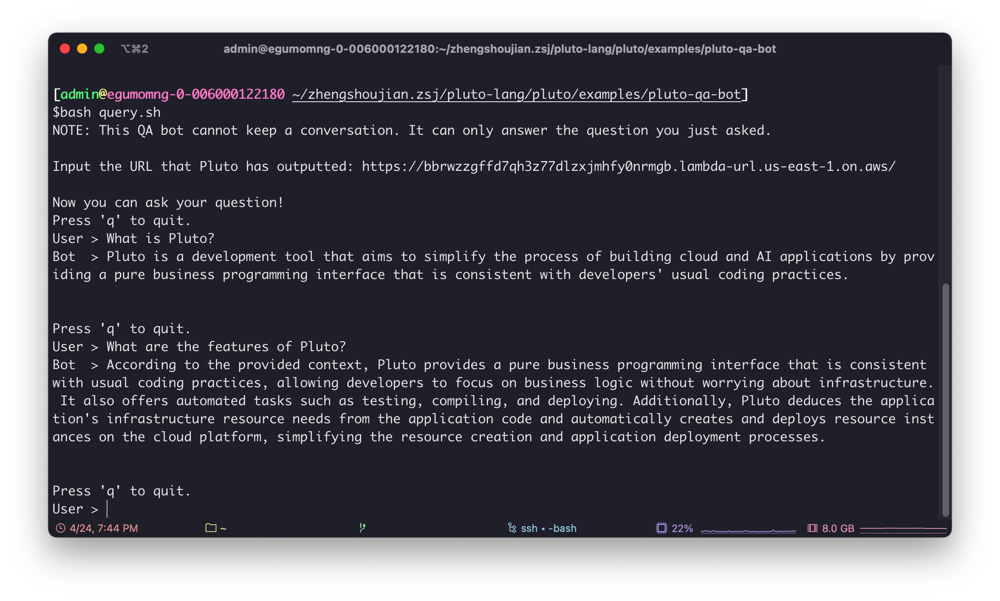
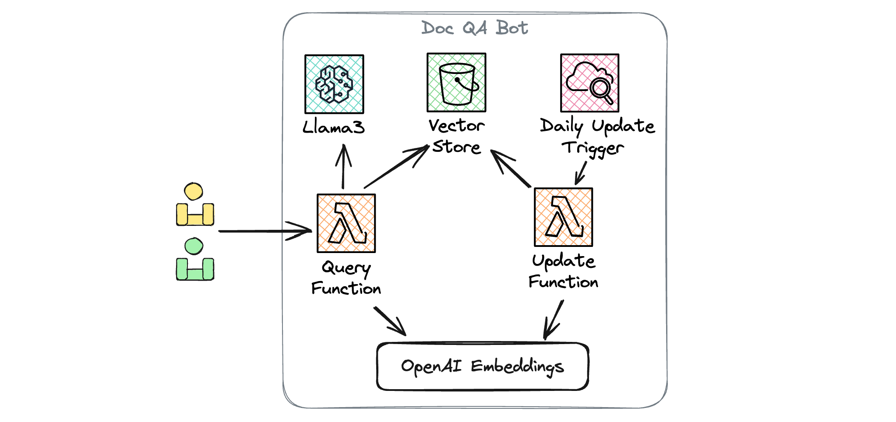

# Document-Q&A Bot based on Llama3

> Llama3, the latest open-source Large Language Model (LLM) launched by Meta, includes the Llama3 8B with 8 billion parameters and the Llama3 70B with 70 billion parameters. Llama3 has made significant progress in performance, with the 8B model outperforming Gemma 7B and Mistral 7B Instruct across various benchmarks such as MMLU, GPQA, HumanEval, while the 70B model has surpassed the proprietary Claude 3 Sonnet and is on par with Google's Gemini Pro 1.5. Additionally, Meta is developing a version with more than 400 billion (400B) parameters, expected to have enhanced multilingual processing capabilities and the ability to understand non-textual patterns such as images.

With Llama3 at our disposal, we can craft an array of innovative applications, from engaging chatbots to intelligent Retrieval-Augmented Generation (RAG) QA bots, and beyond. However, deploying Llama3, integrating the deployed Llama3 with one's application, and deploying the application itself can be challenging for many developers.

This article introduces a development approach based on [Pluto](https://github.com/pluto-lang/pluto), which requires only writing application code and **executing a single command to deploy Llama3 and release the application**. This article will use a RAG-based document QA bot as an example to demonstrate this development method. The main function of this QA bot is to retrieve project documentation from a specified GitHub repository and then use the Llama3 model to answer questions based on the document content.

The following image shows the interaction with this QA bot, with the specified repository being Pluto's documentation repository. Thus, from the content of the image, one can get a basic understanding of what Pluto is:



## Application Architecture

The example application to be implemented is based on the LangChain framework and uses OpenAI Embeddings as the document vectorization tool. The entire application will be deployed on AWS, and the deployed architecture is shown in the figure below:



Specifically, the deployed application will include the following AWS resource instances:

- The Llama3 model will be deployed on SageMaker.
- An S3 bucket will be created to store the document vector database, thus avoiding the need to rebuild the vector database each time a Lambda function is started.
- A CloudWatch rule will be created to update the document vector database daily.
- Two Lambda instances will be created, one for receiving user query requests and the other for updating the document vector database.
  In addition to creating these resource instances, it is also necessary to configure the dependencies between resources, including triggers, IAM roles, and permission policies. However, you don't need to worry about these complex creation and configuration processes, as **Pluto can deduce this information from the code and then automatically complete the creation and configuration of resources**.

## Setting Up Your Development Environment and Tokens

### Prepare the Development Environment

First, you need to prepare the development environment for the Pluto application. Pluto provides three different development methods: container development, online development, and local development:

- Container development: Create a container based on the `plutolang/pluto:latest` container image to serve as the development environment for the Pluto application.
- Online development: Open and fork the [template application](https://codesandbox.io/p/devbox/github/pluto-lang/codesandbox/tree/main/python?file=/README_zh.md) created on CodeSandbox to develop the application directly in the browser.
- Local development: Refer to the [Pluto Local Development Guide](https://pluto-lang.vercel.app/documentation/getting-started/local-development) to configure the Pluto development environment locally.
  You can learn about the detailed usage methods of various environments from the [Pluto Getting Started Guide](https://pluto-lang.vercel.app/documentation/getting-started).

### Prepare AWS Resource Quotas

To deploy the Llama3 8B model, at least the `ml.g5.2xlarge` instance type is required, and to deploy the Llama3 70B model, at least the `ml.p4d.24xlarge` instance type is required. The initial quota for these two types of instances is zero, so if you haven't applied for an increase, you may need to do so through the [AWS Management Console](https://console.aws.amazon.com/servicequotas/home). For a trial experience, you can also use the `TinyLlama-1.1B-Chat-v1.0` model, which is compatible with the `ml.m5.xlarge` instance.

### Prepare Tokens

This example application requires preparing API Keys from several different websites to implement the application functions:

1. OpenAI API Key: Used to access the OpenAI Embeddings API. You can obtain the API Key from [OpenAI](https://platform.openai.com/account/api-keys).
2. GitHub Access Token: Used to fetch documents from the GitHub repository. You can create a personal access token from [GitHub](https://github.com/settings/tokens).
3. Hugging Face Hub Token: Used to download the model from the Hugging Face Hub when deploying the model on AWS SageMaker. You can obtain the Token from [Hugging Face](https://huggingface.co/settings/tokens).

## Create a Pluto Application

If you are in a local or container environment, execute the following command interactively to create a new Pluto application. After completion, a new project directory will be created in the current directory with the project name.

```bash
pluto new
```

The cloud development environment already includes the basic project directory, so there is no need to create a new application.

## Install Application Dependencies

After entering the project root directory, add the following dependency libraries to the `requirements.txt` file. These libraries are the dependencies required for this example application:

```txt
pluto_client
faiss-cpu
langchain-core
langchain-community
langchain-openai
langchain_text_splitters
```

Then execute the following two commands to install the dependency libraries:

```bash
npm install
pip install -r requirements.txt
```

## Write Application Code

After installing the dependencies, you can start writing the application program in the `app/main.py` file. The [example code](#example-code) for the document QA bot is attached at the end of this article. You can directly copy it into the `app/main.py` file and then modify the configuration parameters as needed.

Writing Pluto application code is similar to writing pure business code. Developers do not need to worry about how cloud resources are created and configured. They only need to define the resources required for the application and implement the application's business logic by creating objects in the code. When deploying, Pluto will automatically deduce the dependencies between cloud resources from the application logic and create and configure these resources on the cloud platform.
For example, we can define a SageMaker endpoint with the Llama3 model deployed using the following code snippet:

```python
sagemaker = SageMaker(
    "llama3-model",
    "763104351884.dkr.ecr.us-east-1.amazonaws.com/huggingface-pytorch-tgi-inference:2.1.1-tgi2.0.0-gpu-py310-cu121-ubuntu22.04-v2.0",
    SageMakerOptions(
        instanceType="ml.g5.2xlarge",
        envs={
            "HF_MODEL_ID": "meta-llama/Meta-Llama-3-8B-Instruct",
            "HF_TASK": "text-generation",
            "HUGGING_FACE_HUB_TOKEN": HUGGING_FACE_HUB_TOKEN,
        },
    ),
)
```

In subsequent code, we can directly call the `sagemaker.invoke()` method to trigger the SageMaker endpoint or use `sagemaker.endpointName` to get the name of the SageMaker endpoint. Pluto will automatically set the correct permissions for the functions calling the SageMaker instance, allowing the SageMaker endpoint to be called.

Similarly, creating resources like S3 and Lambda is the same. However, Pluto provides an abstraction layer for these common resource types provided by most cloud platforms to reduce developers' learning costs and facilitate the feature of deploying directly to multiple cloud platforms without modifying the code.
In the code snippet below, the Function resource type corresponds to Lambda functions on AWS and to Knative Service on Kubernetes, while the Bucket resource type corresponds to S3 storage buckets on AWS, and the corresponding type on Kubernetes is expected to be PV, which has not been implemented yet. Everyone is welcome to contribute.

```python
vector_store_bucket = Bucket("vector-store")
Function(query, FunctionOptions(name="query", memory=512))
```

## Deploy the Application

After completing the application code, you only need to execute the following command to directly deploy the application on AWS:

```bash
pluto deploy
```

The process of creating SageMaker may take a long time, even exceeding 20 minutes. Please be patient. After deployment, Pluto will return a URL address, which you can use to access your application.

## Test the Application

This URL address accepts POST requests. The request body must be a JSON array containing only one element, corresponding to the parameter of the `query` function in the code. You can use the `curl` command or other HTTP client tools to interact with your application. For example, you can replace the `URL` in the code snippet below with the URL address you received, and also replace the specific question with the one you want to ask. Then, execute the code to interact with your application:

```bash
curl -X POST <URL> \
    -H "Content-Type: application/json" \
    -d '["What is Pluto?"]'
```

Here is a simple interactive script. You can save this script to a file and then execute the file to interact with your application, achieving the effect shown at the beginning of this article.

```bash
#!/bin/bash
# set -o xtrace
echo "NOTE: This QA bot cannot keep a conversation. It can only answer the question you just asked."
echo ""

read -p "Input the URL that Pluto has outputted: " URL
if [ -z $URL ]; then
    echo "Please set the BOT_URL env var first"
    exit 1
fi

echo -e "\nNow you can ask your question!"
user_message=""
while :; do
    echo "Press 'q' to quit."
    read -p "User > " user_message
    if [[ $user_message == "q" ]]; then
        echo "Bye. 👋"
        break
    fi

    payload=$(jq -n --arg msg "$user_message" '[$msg]')
    response=$(curl -s -w "\n%{http_code}" -X POST "$URL?n=1" -d "$payload" -H 'Content-type: application/json')

    http_code=$(echo "$response" | tail -n1)
    response_content=$(echo "$response" | head -n-1)
    body=$(echo "$response_content" | jq -r '.body')
    code=$(echo "$response_content" | jq -r '.code')

    if [[ "$http_code" -ne 200 || "$code" -ne 200 ]]; then
        echo "Server responded with error: $http_code, $response_content"
        exit 1
    fi

    body=$(echo "$response_content" | jq -r '.body')
    echo "Bot  > $body"
    echo -e "\n"
done
```

## Take Down the Application

If you want to take down the application, you only need to execute the following command:

```bash
pluto destroy
```

## Extend the Application

If you want to implement a **session-based QA bot**, you can use the KVStore resource type to save the session. The example application "[Session Chatbot](https://pluto-lang.vercel.app/cookbook/langchain-llama2-chatbot-sagemaker-python)" can be used as a reference.

If you want to **rewrite the application as a LangServe application** to use LangServe's RemoteRunable and Playground components, you can refer to the "[Deploy LangServe to AWS](https://pluto-lang.vercel.app/cookbook/deploy-langserve-to-aws)" document.

## More Resources

- [Pluto Documentation](https://pluto-lang.vercel.app/)
- [Pluto GitHub Repository](https://github.com/pluto-lang/pluto)
- [Pluto Cookbook](https://pluto-lang.vercel.app/cookbook)

## Example Code

Below is the example code for the document QA bot. You can copy it into the `app/main.py` file and modify the configuration parameters as needed.

```python
import os
import re
import sys
import json
import logging
from typing import Dict

from pluto_client import FunctionOptions, Function, Bucket, Schedule
from pluto_client.sagemaker import SageMaker, SageMakerOptions

from langchain_openai import OpenAIEmbeddings
from langchain_core.pydantic_v1 import SecretStr
from langchain_core.prompts import PromptTemplate
from langchain_core.runnables import RunnablePassthrough
from langchain_core.output_parsers import StrOutputParser
from langchain_community.vectorstores.faiss import FAISS
from langchain_text_splitters import MarkdownTextSplitter
from langchain_community.document_loaders.github import GithubFileLoader
from langchain_community.llms.sagemaker_endpoint import (
    SagemakerEndpoint,
    LLMContentHandler,
)


# ====== Configuration ======
# 1. The OpenAI API key is used to access the OpenAI Embeddings API. You can get the API key from
# https://platform.openai.com/account/api-keys
# 2. The GitHub Access Key is used to fetch the documents from the GitHub repository. You can create
# a personal access token from https://github.com/settings/tokens
# 3. The Hugging Face Hub token is used to download the model from the Hugging Face Hub when
# deploying the model on AWS SageMaker. You can get the token from
# https://huggingface.co/settings/tokens

REPO = "pluto-lang/website"
BRANCH = "main"
DOC_RELATIVE_PATH = "pages"
OPENAI_BASE_URL = "https://api.openai.com/v1"
OPENAI_API_KEY = "<replace_with_your_key>"
GITHUB_ACCESS_KEY = "<replace_with_your_key>"
HUGGING_FACE_HUB_TOKEN = "<replace_with_your_key>"
# ===========================


FAISS_INDEX = "index"
PKL_KEY = f"{FAISS_INDEX}.pkl"
FAISS_KEY = f"{FAISS_INDEX}.faiss"

embeddings = OpenAIEmbeddings(
    base_url=OPENAI_BASE_URL, api_key=SecretStr(OPENAI_API_KEY)
)

vector_store_bucket = Bucket("vector-store")

"""
Deploy the Llama3 model on AWS SageMaker using the Hugging Face Text Generation Inference (TGI)
container. If you're unable to deploy the model because of the instance type, consider using the
TinyLlama-1.1B-Chat-v1.0 model, which is compatible with the ml.m5.xlarge instance.

Below is a set up minimum requirements for each model size of Llama3 model:
Model      Instance Type      # of GPUs per replica
Llama 8B   ml.g5.2xlarge      1
Llama 70B  ml.p4d.24xlarge    8

The initial limit set for these instances is zero. If you need more, you can request an increase
in quota via the [AWS Management Console](https://console.aws.amazon.com/servicequotas/home).
"""
sagemaker = SageMaker(
    "llama3-model",
    "763104351884.dkr.ecr.us-east-1.amazonaws.com/huggingface-pytorch-tgi-inference:2.1.1-tgi2.0.0-gpu-py310-cu121-ubuntu22.04-v2.0",
    SageMakerOptions(
        instanceType="ml.g5.2xlarge",
        envs={
            "HF_MODEL_ID": "meta-llama/Meta-Llama-3-8B-Instruct",
            "HF_TASK": "text-generation",
            # If you want to deploy the Meta Llama3 model, you need to request a permission and
            # prepare the token. You can get the token from https://huggingface.co/settings/tokens
            "HUGGING_FACE_HUB_TOKEN": HUGGING_FACE_HUB_TOKEN,
        },
    ),
)


class ContentHandler(LLMContentHandler):
    content_type = "application/json"
    accepts = "application/json"

    def transform_input(self, prompt: str, model_kwargs: Dict) -> bytes:
        if "stop" not in model_kwargs:
            model_kwargs["stop"] = ["<|eot_id|>"]
        elif "<|eot_id|>" not in model_kwargs["stop"]:
            model_kwargs["stop"].append("<|eot_id|>")

        input_str = json.dumps({"inputs": prompt, "parameters": model_kwargs})
        return input_str.encode("utf-8")

    def transform_output(self, output: bytes) -> str:
        raw = output.read()  # type: ignore
        response_json = json.loads(raw.decode("utf-8"))
        content = response_json[0]["generated_text"]

        assistant_beg_flag = "assistant<|end_header_id|>"
        answerStartPos = content.index(assistant_beg_flag) + len(assistant_beg_flag)
        answer = content[answerStartPos:].strip()
        return answer


def build_logger():
    logger = logging.getLogger(__name__)
    logger.setLevel(logging.INFO)
    # Create a console handler
    handler = logging.StreamHandler()
    handler.flush = sys.stdout.flush
    handler.setLevel(logging.INFO)
    # Create a formatter and add it to the handler
    formatter = logging.Formatter(
        "%(asctime)s - %(name)s - %(levelname)s - %(message)s"
    )
    handler.setFormatter(formatter)
    # Add the handler to the logger
    logger.addHandler(handler)
    return logger


logger = build_logger()


def create_vector_store() -> FAISS | None:
    # Explicitly import Faiss to alert Pluto that this function relies on it, ensuring the inclusion
    # of the Faiss package in the deployment bundle.
    import faiss

    def file_filter(file_path):
        return re.match(f"{DOC_RELATIVE_PATH}/.*\\.mdx?", file_path) is not None

    loader = GithubFileLoader(
        repo=REPO,
        branch=BRANCH,
        access_token=GITHUB_ACCESS_KEY,
        github_api_url="https://api.github.com",
        file_filter=file_filter,
    )
    docs = loader.load()

    if len(docs) == 0:
        logger.info("No documents updated")
        return
    logger.info(f"Loaded {len(docs)} documents")

    for doc in docs:
        doc.metadata["source"] = str(doc.metadata["source"])

    logger.info(f"Starting to split documents")
    text_splitter = MarkdownTextSplitter(chunk_size=2000, chunk_overlap=200)
    splits = text_splitter.split_documents(docs)

    logger.info(f"Starting to create vector store")
    store = FAISS.from_documents(splits, embeddings)
    logger.info(f"Finished creating vector store")

    return store


def download_vector_store(vector_store_dir: str):
    ensure_dir(vector_store_dir)
    vector_store_bucket.get(PKL_KEY, os.path.join(vector_store_dir, PKL_KEY))
    vector_store_bucket.get(FAISS_KEY, os.path.join(vector_store_dir, FAISS_KEY))


def flush_vector_store(vector_store_dir: str = "/tmp/vector_store"):
    vector_store = create_vector_store()
    if vector_store is None:
        return

    ensure_dir(vector_store_dir)
    vector_store.save_local(vector_store_dir, index_name=FAISS_INDEX)
    vector_store_bucket.put(PKL_KEY, os.path.join(vector_store_dir, PKL_KEY))
    vector_store_bucket.put(FAISS_KEY, os.path.join(vector_store_dir, FAISS_KEY))


def build_retriever():
    vector_store_dir = "/tmp/vector_store"
    if not os.path.exists(vector_store_dir):
        try:
            logger.info("Vector store not found, downloading...")
            download_vector_store(vector_store_dir)
        except Exception as e:
            logger.error(f"Failed to download vector store: {e}")
            flush_vector_store(vector_store_dir)

    logger.info("Loading vector store")
    vectorstore = FAISS.load_local(
        vector_store_dir, embeddings, allow_dangerous_deserialization=True
    )
    logger.info("Vector store loaded")
    return vectorstore.as_retriever()


def ensure_dir(dir: str):
    if not os.path.exists(dir):
        os.makedirs(dir)


def get_aws_region() -> str:
    aws_region = os.environ.get("AWS_REGION")
    if aws_region is None:
        raise ValueError("AWS_REGION environment variable must be set")
    return aws_region


# Leaving the following variable outside the handler function will allow them to be reused across
# multiple invocations of the function.
retriever = build_retriever()

# Create the prompt template in accordance with the structure provided in the Llama3 documentation,
# which can be found at https://llama.meta.com/docs/model-cards-and-prompt-formats/meta-llama-3/
prompt = PromptTemplate.from_template(
    """<|begin_of_text|><|start_header_id|>system<|end_header_id|>

You are an assistant for question-answering tasks. Use the following pieces of retrieved context to answer the question. If you don't know the answer, just say that you don't know. Use three sentences maximum and keep the answer concise. In case the query requests a link, respond that you don't support links.
Context: {context}<|eot_id|><|start_header_id|>user<|end_header_id|>

{question}<|eot_id|><|start_header_id|>assistant<|end_header_id|>"""
)

llm = SagemakerEndpoint(
    endpoint_name=sagemaker.endpoint_name,  # SageMaker endpoint name
    region_name=get_aws_region(),
    content_handler=ContentHandler(),
    model_kwargs={
        "max_new_tokens": 512,
        "do_sample": True,
        "temperature": 0.6,
        "top_p": 0.9,
    },
)


def query(query):
    def format_docs(docs):
        return "\n\n".join(doc.page_content for doc in docs)

    rag_chain = (
        {"context": retriever | format_docs, "question": RunnablePassthrough()}
        | prompt
        | llm
        | StrOutputParser()
    )

    return rag_chain.invoke(query)
    # The line below serves as a notification to Pluto that the function will trigger SageMaker
    # endpoint. So, Pluto will set the appropriate permissions for the function.
    sagemaker.invoke("")


schd = Schedule("schedule")
schd.cron("0 0 * * *", flush_vector_store)

# This application requires a minimum of 256MB memory to run.
Function(query, FunctionOptions(name="query", memory=512))
```

## Q&A

### Why Not Use Api Gateway?

There are two reasons:

1. ApiGateway has an inalterable 30-second timeout limit. This means if the generation process exceeds this time window, we would receive a `503 Service Unavailable` error. Therefore, we use Lambda functions directly to handle requests. We will attempt to improve the experience by supporting WebSocket in the future.
2. The application example requires more than the default 128MB memory. As for the routing functions for ApiGateway, Pluto currently does not support setting the memory size. For the Function resource type corresponding to AWS Lambda, the memory size can be set.
