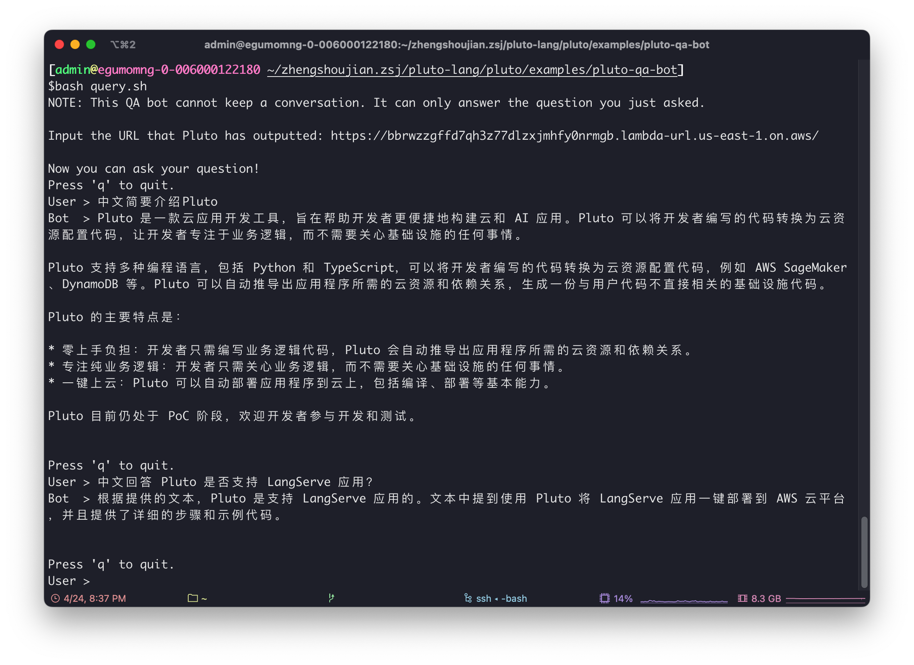

# 基于 Llama3 的文档问答机器人

> Llama3 是由 Meta 公司最新推出的一款开源的大规模语言模型，包含 80 亿参数的 Llama3 8B 和包含 700 亿参数的 Llama3 70B。Llama3 在性能上实现了重大进步，8B 模型在 MMLU、GPQA、HumanEval 等多项基准上均胜过 Gemma 7B 和 Mistral 7B Instruct，而 70B 模型则超越了闭源的 Claude 3 Sonnet，与谷歌的 Gemini Pro 1.5 旗鼓相当。此外，Meta 还在研发一个参数规模超过 4000 亿（400B）的版本，预计将具有更强大的多语言处理能力以及理解图像等非文本模式的能力。

基于 Llama3 我们可以开发聊天机器人、RAG (Retrieval-Augmented Generation，检索增强生成) 问答机器人等各类应用。但是，如何将 Llama3 部署起来，如何将部署后的 Llama3 与自己的应用程序结合，如何部署应用程序，这些问题对于很多开发者来说仍有一定的难度。

这篇文章介绍一种基于 [Pluto](https://github.com/pluto-lang/pluto) 的开发方式，只需要编写应用代码，然后**执行一条命令就可以完成 Llama3 的部署和应用的发布**。本文会以一个基于 RAG 的文档问答机器人为例来介绍这种开发方式，这个问答机器人主要功能是从指定 GitHub 仓库中获取项目文档，然后使用 Llama3 模型根据文档内容进行问答。

下面这幅图是和这个问答机器人交互的效果，给这个机器人指定的仓库是 Pluto 的文档仓库，因此，大家可以从图片中的内容简单了解 Pluto 是什么：



## 应用架构

接下来要实现的示例应用基于 LangChain 框架实现，使用 OpenAI Embeddings 作为文档的向量化工具。最终整个应用会部署到 AWS 上，部署后的架构如下图所示：


具体地，这个应用部署后会包括以下 AWS 资源实例：

- Llama3 模型会被部署到 SageMaker 上。
- 创建一个 S3 Bucket 用于存储文档的向量数据库，避免每次启动 Lambda 都构建一次向量数据库。
- 创建一个 CloudWatch 规则，用于每天更新一次文档的向量数据库。
- 创建两个 Lambda 实例，分别用于接收用户的查询请求，以及更新文档的向量数据库。

除了创建这些资源实例外，还需要配置资源间的依赖关系，包括触发器、IAM 角色和权限策略等。不过，你不需要担心这些繁琐的创建与配置过程，**Pluto 可以从代码中推导出来这些信息，然后自动完成资源的创建与配置**。

## 准备开发环境与 Token

### 准备开发环境

首先需要准备 Pluto 应用的开发环境，Pluto 提供了容器开发、在线开发、本地开发三种不同的开发方式：

- 容器开发：基于 `plutolang/pluto:latest` 容器镜像创建一个容器作为 Pluto 应用的开发环境。
- 在线开发：打开并 Fork 在 CodeSandbox 上创建的[模板应用](https://codesandbox.io/p/devbox/github/pluto-lang/codesandbox/tree/main/python?file=/README_zh.md)，就可以直接在浏览器中开发应用。
- 本地开发：参考 [Pluto 本地开发指南](https://pluto-lang.vercel.app/zh-CN/documentation/getting-started/local-development) 在本地配置 Pluto 开发环境。

可以从 [Pluto 上手指南](https://pluto-lang.vercel.app/zh-CN/documentation/getting-started) 中了解各种环境详细的使用方法。

### 准备 AWS 资源配额

部署 Llama3 8B 模型所需的实例类型至少为 `ml.g5.2xlarge`，部署 Llama3 70B 模型所需的实例类型至少为 `ml.p4d.24xlarge`。这两类实例的初始配额为零，所以，如果你没有申请过，可能需要通过 [AWS 管理控制台](https://console.aws.amazon.com/servicequotas/home) 申请提额。也可以使用 `TinyLlama-1.1B-Chat-v1.0` 模型体验，该模型与 `ml.m5.xlarge` 实例兼容。

### 准备 Token

本示例应用需要准备以下几个不同网站的 API Key 来实现应用功能：

1. OpenAI API Key：用于访问 OpenAI Embeddings API。你可以从 [OpenAI](https://platform.openai.com/account/api-keys) 获取 API Key。
2. GitHub Access Token：用于从 GitHub 仓库获取文档。你可以从 [GitHub](https://github.com/settings/tokens) 创建个人访问令牌。
3. Hugging Face Hub Token：用于在 AWS SageMaker 上部署模型时从 Hugging Face Hub 下载模型。你可以从 [Hugging Face](https://huggingface.co/settings/tokens) 获取 Token。

## 创建 Pluto 应用

如果是本地或容器环境，执行下面这条命令交互式地创建一个新的 Pluto 应用，结束后会在当前目录以项目名创建一个新的项目目录。

```bash
pluto new
```

云端开发环境中已经包含了基本的项目目录，无需新建应用。

## 安装应用依赖

进入项目根目录后，在 `requirements.txt` 文件中添加以下依赖库，这些依赖库是本示例应用所需的依赖库：

```txt
pluto_client
faiss-cpu
langchain-core
langchain-community
langchain-openai
langchain_text_splitters
```

然后执行下面这两条命令安装依赖库：

```bash
npm install
pip install -r requirements.txt
```

## 编写应用代码

安装完依赖后，就可以在 `app/main.py` 文件中编写应用程序了，本文最后附了一份文档问答机器人的[示例代码](#示例代码)，你可以直接复制到 `app/main.py` 文件中，然后修改其中的配置参数即可。

编写 Pluto 应用代码与编写纯业务代码类似，开发者不需要关心云资源是怎么被创建和配置的，只需要在代码中通过创建对象的方式，定义应用需要的资源，以及实现应用程序的业务逻辑。在部署时，Pluto 会自动从应用逻辑中推导出云资源间的依赖关系，并在云平台创建和配置这些资源。

例如，我们可以通过下面这段代码来定义一个部署了 Llama3 模型的 SageMaker 端点：

```python
sagemaker = SageMaker(
    "llama3-model",
    "763104351884.dkr.ecr.us-east-1.amazonaws.com/huggingface-pytorch-tgi-inference:2.1.1-tgi2.0.0-gpu-py310-cu121-ubuntu22.04-v2.0",
    SageMakerOptions(
        instanceType="ml.g5.2xlarge",
        envs={
            "HF_MODEL_ID": "meta-llama/Meta-Llama-3-8B-Instruct",
            "HF_TASK": "text-generation",
            "HUGGING_FACE_HUB_TOKEN": HUGGING_FACE_HUB_TOKEN,
        },
    ),
)
```

在后续的代码中，我们可以直接调用 `sagemaker.invoke()` 方法来触发 SageMaker 端点，或通过 `sagemaker.endpointName` 获取 SageMaker 端点的名称，Pluto 会自动为调用的 SageMaker 实例的函数设置正确的权限，以便调用 SageMaker 端点。

同理，创建一个 S3、Lambda 等资源也是一样，不同的是，Pluto 针对此类常用且大多数云平台都提供的资源类型，Pluto 提供了一层抽象类型来降低开发者的学习成本，同时也便于实现多云部署的特性——**不修改代码即可直接部署到多个云平台**。

下面代码中，Function 资源类型在 AWS 上对应 Lambda 函数，在 Kubernetes 上对应 Knative Service，而 Bucket 资源类型在 AWS 上对应 S3 存储桶，在 Kubernetes 上的对应类型预期为 PV，还未实现，欢迎大家参与贡献。

```python
vector_store_bucket = Bucket("vector-store")
Function(query, FunctionOptions(name="query", memory=512))
```

## 部署应用

在完成应用代码编写后，只需要执行下面这条命令就可以直接将应用部署到 AWS 上：

```bash
pluto deploy
```

创建 SageMaker 的过程可能非常漫长，甚至超过 20 分钟，请耐心等待。部署完成后，Pluto 会返回一个 URL 地址，你可以通过这个 URL 地址来访问你的应用。

## 测试应用

这个 URL 地址接受 POST 请求，请求体要求是一个 JSON 数组，数组中只能有一个元素，对应代码中 `query` 函数的参数。你可以使用 `curl` 命令或者其他 HTTP 客户端工具来与你的应用进行交互。例如，你可以将下面这段代码保存中的 `URL` 替换为你得到的 URL 地址，具体问题也可以替换为你想问的问题，然后执行这段代码，就可以与你的应用进行交互了：

```bash
curl -X POST <URL> \
    -H "Content-Type: application/json" \
    -d '["What is Pluto?"]'
```

这里提供一个简单的交互式脚本，你可以将这个脚本保存到一个文件中，然后执行这个文件来与你的应用进行交互，就能获得本文在最开始展示的效果了。

```bash
#!/bin/bash
# set -o xtrace

echo "NOTE: This QA bot cannot keep a conversation. It can only answer the question you just asked."
echo ""

read -p "Input the URL that Pluto has outputted: " URL
if [ -z $URL ]; then
    echo "Please set the BOT_URL env var first"
    exit 1
fi

echo -e "\nNow you can ask your question!"
user_message=""
while :; do
    echo "Press 'q' to quit."
    read -p "User > " user_message
    if [[ $user_message == "q" ]]; then
        echo "Bye. 👋"
        break
    fi

    payload=$(jq -n --arg msg "$user_message" '[$msg]')
    response=$(curl -s -w "\n%{http_code}" -X POST "$URL?n=1" -d "$payload" -H 'Content-type: application/json')

    http_code=$(echo "$response" | tail -n1)
    response_content=$(echo "$response" | head -n-1)
    body=$(echo "$response_content" | jq -r '.body')
    code=$(echo "$response_content" | jq -r '.code')

    if [[ "$http_code" -ne 200 || "$code" -ne 200 ]]; then
        echo "Server responded with error: $http_code, $response_content"
        exit 1
    fi

    body=$(echo "$response_content" | jq -r '.body')
    echo "Bot  > $body"
    echo -e "\n"
done
```

## 下线应用

如果你想下线应用，只需要执行下面这条命令：

```bash
pluto destroy
```

## 扩展应用

如果你想实现**基于会话的问答机器人**，你可以使用 KVStore 资源类型来保存会话，示例应用「[会话聊天机器人](https://pluto-lang.vercel.app/zh-CN/cookbook/langchain-llama2-chatbot-sagemaker-python)」可做参考。

如果你想将该应用**改写成 LangServe 应用**，以使用 LangServe 的 RemoteRunable、Playground 组件，你可以参考「[部署 LangServe 到 AWS](https://pluto-lang.vercel.app/zh-CN/cookbook/deploy-langserve-to-aws)」文档

## 更多资源

- [Pluto 文档](https://pluto-lang.vercel.app/zh-CN/)
- [Pluto GitHub 仓库](https://github.com/pluto-lang/pluto)
- [Pluto 案例集](https://pluto-lang.vercel.app/zh-CN/cookbook)

## 示例代码

以下是文档问答机器人的示例代码。你可以将它复制到 `app/main.py` 文件中，并根据需要修改配置参数。

```python
import os
import re
import sys
import json
import logging
from typing import Dict

from pluto_client import FunctionOptions, Function, Bucket, Schedule
from pluto_client.sagemaker import SageMaker, SageMakerOptions

from langchain_openai import OpenAIEmbeddings
from langchain_core.pydantic_v1 import SecretStr
from langchain_core.prompts import PromptTemplate
from langchain_core.runnables import RunnablePassthrough
from langchain_core.output_parsers import StrOutputParser
from langchain_community.vectorstores.faiss import FAISS
from langchain_text_splitters import MarkdownTextSplitter
from langchain_community.document_loaders.github import GithubFileLoader
from langchain_community.llms.sagemaker_endpoint import (
    SagemakerEndpoint,
    LLMContentHandler,
)


# ====== Configuration ======
# 1. The OpenAI API key is used to access the OpenAI Embeddings API. You can get the API key from
# https://platform.openai.com/account/api-keys
# 2. The GitHub Access Key is used to fetch the documents from the GitHub repository. You can create
# a personal access token from https://github.com/settings/tokens
# 3. The Hugging Face Hub token is used to download the model from the Hugging Face Hub when
# deploying the model on AWS SageMaker. You can get the token from
# https://huggingface.co/settings/tokens

REPO = "pluto-lang/website"
BRANCH = "main"
DOC_RELATIVE_PATH = "pages"
OPENAI_BASE_URL = "https://api.openai.com/v1"
OPENAI_API_KEY = "<replace_with_your_key>"
GITHUB_ACCESS_KEY = "<replace_with_your_key>"
HUGGING_FACE_HUB_TOKEN = "<replace_with_your_key>"
# ===========================


FAISS_INDEX = "index"
PKL_KEY = f"{FAISS_INDEX}.pkl"
FAISS_KEY = f"{FAISS_INDEX}.faiss"

embeddings = OpenAIEmbeddings(
    base_url=OPENAI_BASE_URL, api_key=SecretStr(OPENAI_API_KEY)
)

vector_store_bucket = Bucket("vector-store")

"""
Deploy the Llama3 model on AWS SageMaker using the Hugging Face Text Generation Inference (TGI)
container. If you're unable to deploy the model because of the instance type, consider using the
TinyLlama-1.1B-Chat-v1.0 model, which is compatible with the ml.m5.xlarge instance.

Below is a set up minimum requirements for each model size of Llama3 model:
Model      Instance Type      # of GPUs per replica
Llama 8B   ml.g5.2xlarge      1
Llama 70B  ml.p4d.24xlarge    8

The initial limit set for these instances is zero. If you need more, you can request an increase
in quota via the [AWS Management Console](https://console.aws.amazon.com/servicequotas/home).
"""
sagemaker = SageMaker(
    "llama3-model",
    "763104351884.dkr.ecr.us-east-1.amazonaws.com/huggingface-pytorch-tgi-inference:2.1.1-tgi2.0.0-gpu-py310-cu121-ubuntu22.04-v2.0",
    SageMakerOptions(
        instanceType="ml.g5.2xlarge",
        envs={
            "HF_MODEL_ID": "meta-llama/Meta-Llama-3-8B-Instruct",
            "HF_TASK": "text-generation",
            # If you want to deploy the Meta Llama3 model, you need to request a permission and
            # prepare the token. You can get the token from https://huggingface.co/settings/tokens
            "HUGGING_FACE_HUB_TOKEN": HUGGING_FACE_HUB_TOKEN,
        },
    ),
)


class ContentHandler(LLMContentHandler):
    content_type = "application/json"
    accepts = "application/json"

    def transform_input(self, prompt: str, model_kwargs: Dict) -> bytes:
        if "stop" not in model_kwargs:
            model_kwargs["stop"] = ["<|eot_id|>"]
        elif "<|eot_id|>" not in model_kwargs["stop"]:
            model_kwargs["stop"].append("<|eot_id|>")

        input_str = json.dumps({"inputs": prompt, "parameters": model_kwargs})
        return input_str.encode("utf-8")

    def transform_output(self, output: bytes) -> str:
        raw = output.read()  # type: ignore
        response_json = json.loads(raw.decode("utf-8"))
        content = response_json[0]["generated_text"]

        assistant_beg_flag = "assistant<|end_header_id|>"
        answerStartPos = content.index(assistant_beg_flag) + len(assistant_beg_flag)
        answer = content[answerStartPos:].strip()
        return answer


def build_logger():
    logger = logging.getLogger(__name__)
    logger.setLevel(logging.INFO)
    # Create a console handler
    handler = logging.StreamHandler()
    handler.flush = sys.stdout.flush
    handler.setLevel(logging.INFO)
    # Create a formatter and add it to the handler
    formatter = logging.Formatter(
        "%(asctime)s - %(name)s - %(levelname)s - %(message)s"
    )
    handler.setFormatter(formatter)
    # Add the handler to the logger
    logger.addHandler(handler)
    return logger


logger = build_logger()


def create_vector_store() -> FAISS | None:
    # Explicitly import Faiss to alert Pluto that this function relies on it, ensuring the inclusion
    # of the Faiss package in the deployment bundle.
    import faiss

    def file_filter(file_path):
        return re.match(f"{DOC_RELATIVE_PATH}/.*\\.mdx?", file_path) is not None

    loader = GithubFileLoader(
        repo=REPO,
        branch=BRANCH,
        access_token=GITHUB_ACCESS_KEY,
        github_api_url="https://api.github.com",
        file_filter=file_filter,
    )
    docs = loader.load()

    if len(docs) == 0:
        logger.info("No documents updated")
        return
    logger.info(f"Loaded {len(docs)} documents")

    for doc in docs:
        doc.metadata["source"] = str(doc.metadata["source"])

    logger.info(f"Starting to split documents")
    text_splitter = MarkdownTextSplitter(chunk_size=2000, chunk_overlap=200)
    splits = text_splitter.split_documents(docs)

    logger.info(f"Starting to create vector store")
    store = FAISS.from_documents(splits, embeddings)
    logger.info(f"Finished creating vector store")

    return store


def download_vector_store(vector_store_dir: str):
    ensure_dir(vector_store_dir)
    vector_store_bucket.get(PKL_KEY, os.path.join(vector_store_dir, PKL_KEY))
    vector_store_bucket.get(FAISS_KEY, os.path.join(vector_store_dir, FAISS_KEY))


def flush_vector_store(vector_store_dir: str = "/tmp/vector_store"):
    vector_store = create_vector_store()
    if vector_store is None:
        return

    ensure_dir(vector_store_dir)
    vector_store.save_local(vector_store_dir, index_name=FAISS_INDEX)
    vector_store_bucket.put(PKL_KEY, os.path.join(vector_store_dir, PKL_KEY))
    vector_store_bucket.put(FAISS_KEY, os.path.join(vector_store_dir, FAISS_KEY))


def build_retriever():
    vector_store_dir = "/tmp/vector_store"
    if not os.path.exists(vector_store_dir):
        try:
            logger.info("Vector store not found, downloading...")
            download_vector_store(vector_store_dir)
        except Exception as e:
            logger.error(f"Failed to download vector store: {e}")
            flush_vector_store(vector_store_dir)

    logger.info("Loading vector store")
    vectorstore = FAISS.load_local(
        vector_store_dir, embeddings, allow_dangerous_deserialization=True
    )
    logger.info("Vector store loaded")
    return vectorstore.as_retriever()


def ensure_dir(dir: str):
    if not os.path.exists(dir):
        os.makedirs(dir)


def get_aws_region() -> str:
    aws_region = os.environ.get("AWS_REGION")
    if aws_region is None:
        raise ValueError("AWS_REGION environment variable must be set")
    return aws_region


# Leaving the following variable outside the handler function will allow them to be reused across
# multiple invocations of the function.
retriever = build_retriever()

# Create the prompt template in accordance with the structure provided in the Llama3 documentation,
# which can be found at https://llama.meta.com/docs/model-cards-and-prompt-formats/meta-llama-3/
prompt = PromptTemplate.from_template(
    """<|begin_of_text|><|start_header_id|>system<|end_header_id|>

You are an assistant for question-answering tasks. Use the following pieces of retrieved context to answer the question. If you don't know the answer, just say that you don't know. Use three sentences maximum and keep the answer concise. In case the query requests a link, respond that you don't support links.
Context: {context}<|eot_id|><|start_header_id|>user<|end_header_id|>

{question}<|eot_id|><|start_header_id|>assistant<|end_header_id|>"""
)

llm = SagemakerEndpoint(
    endpoint_name=sagemaker.endpoint_name,  # SageMaker endpoint name
    region_name=get_aws_region(),
    content_handler=ContentHandler(),
    model_kwargs={
        "max_new_tokens": 512,
        "do_sample": True,
        "temperature": 0.6,
        "top_p": 0.9,
    },
)


def query(query):
    def format_docs(docs):
        return "\n\n".join(doc.page_content for doc in docs)

    rag_chain = (
        {"context": retriever | format_docs, "question": RunnablePassthrough()}
        | prompt
        | llm
        | StrOutputParser()
    )

    return rag_chain.invoke(query)
    # The line below serves as a notification to Pluto that the function will trigger SageMaker
    # endpoint. So, Pluto will set the appropriate permissions for the function.
    sagemaker.invoke("")


schd = Schedule("schedule")
schd.cron("0 0 * * *", flush_vector_store)

# This application requires a minimum of 256MB memory to run.
Function(query, FunctionOptions(name="query", memory=512))
```

## Q&A

### 为什么不使用 Api Gateway？

有两个原因：

1. ApiGateway 自带的 30 秒超时限制，无法调整。这意味着如果生成过程超过这个时间窗口，我们就会收到 `503 Service Unavailable` 的错误。因此，我们直接使用 Lambda 函数来处理请求。后续会尝试通过支持 WebSocket 来提升体验。
2. 这个示例应用所需的内存超过默认的 128MB，而针对 ApiGateway 的路由函数，目前 Pluto 还不支持设置内存大小。对应于 AWS Lambda 的 Function 资源类型，可以设置内存大小。
