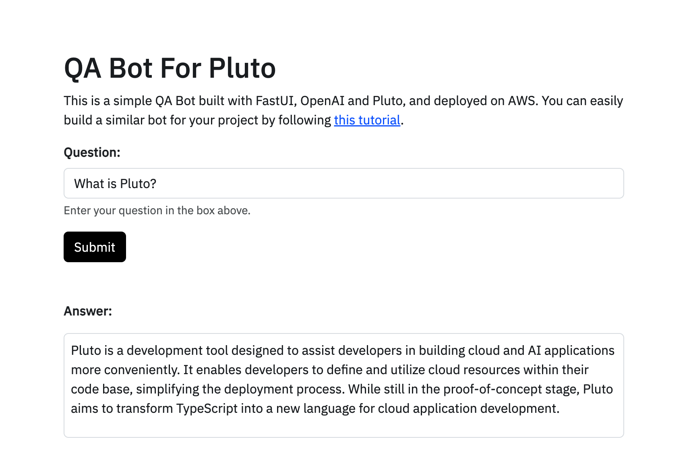
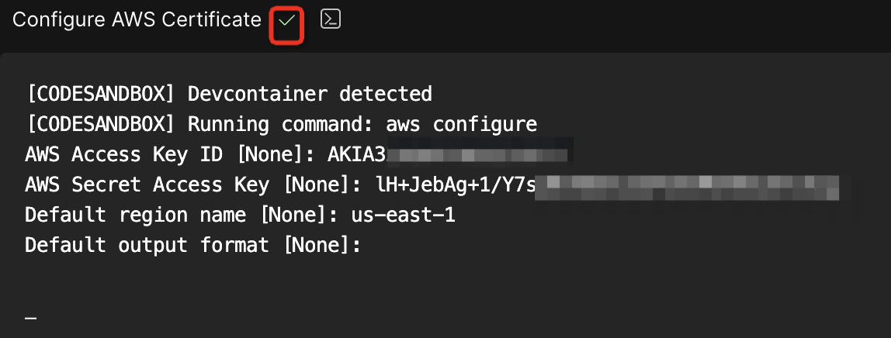
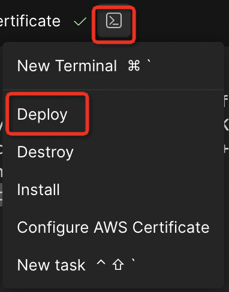
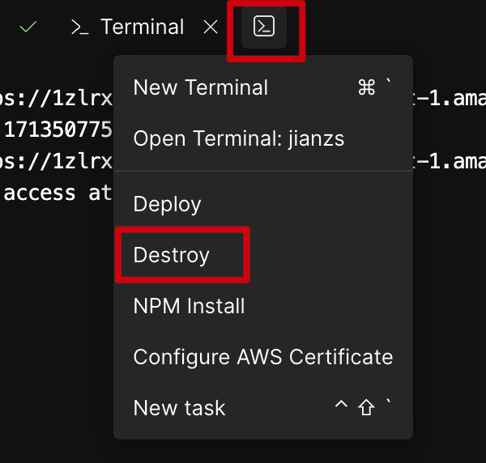

# Building a Document Q&A Bot With Web Interface

Let me introduce you to an incredibly simple way to build a document Q&A bot, which allows you to create a personalized Web Q&A bot based on your GitHub documentation repository in **just 5 minutes**.

First, let's take a look at the result. You can also experience it by opening [this link](https://xw3vdvjmyp7jig7tmrvrqbisiu0peosf.lambda-url.us-east-1.on.aws/).

<p align="center">
  
</p>

## Brief Introduction

First, let's quickly go over the working principle and implementation method of this document Q&A bot.

The main logic of this document bot is: upon initialization, it downloads documents from the GitHub repository where the documents are stored. Then, through LangChain, it calls OpenAI's Embeddings model to generate vectors for the documents and saves them to AWS S3 to avoid wasting Tokens by recreating document vectors. When a user inputs a question, LangChain is used again to generate vectors for the question. Then, the FAISS vector database retrieves related documents, and finally, GPT-3.5 is used to synthesize an answer. Additionally, this document Q&A bot automatically updates the document vectors at 0:00 UTC every day.

To construct this document Q&A bot, we utilized a series of frameworks and tools including LangChain, FastUI, and Pluto, and eventually deployed it on AWS. LangChain is used for the main Q&A functionality, invoking models such as OpenAI's Embedding and GPT-3.5; FastUI is used for the Web interface shown above; Pluto is in charge of creating and configuring cloud resources, as well as application deployment. With Pluto, you can create and configure resources such as AWS Lambda and S3 by just creating a few variables in the code.

## Getting Started

To make it easy for everyone to get started, I've made this document Q&A bot into a CodeSandbox template. Simply click the link below to open CodeSandbox's online IDE, then click Fork in the top right corner to copy the project to your account. After that, you are free to modify the code and deploy it to AWS with one click.
[](https://codesandbox.io/p/devbox/pluto-doc-qa-bot-forked-8njh42)

Next, I will introduce how to step by step build your own document Q&A bot.

### Prepare Tokens

Before you start, you need to prepare several key Tokens, including a GitHub Token for downloading document data from GitHub, an OpenAI API Key for invoking OpenAI models, and AWS credentials for application deployment, among others.

- GitHub Token: You can create a GitHub Token on this page [New personal access token (classic)](https://github.com/settings/tokens/new), with just the `public_repo` permission required.
- OpenAI API Key: You can obtain an API Key from the [OpenAI platform](https://platform.openai.com/account/api-keys). Of course, you can also use other APIs that are compatible with the OpenAI API, where there's a place to configure `base_url`.
- AWS Credentials: You need to get your AWS Access Key and Secret Key from [AWS's console](https://us-east-1.console.aws.amazon.com/iam/home?region=us-east-1#security_credential) for deploying the application to AWS later.

### Modify Basic Configuration

Once you enter the development environment, the console will automatically display the Configure AWS Certificate tab. Enter your AWS certificate information here to ensure the application can be successfully deployed to AWS. You can leave the `output format` field blank. After filling in the other necessary information, if everything is correct, you will see a green check mark ✔️ next to the tab name.

<p align="center">
  
</p>

Next, we need to modify the configuration of the bot. Open the `app/main.py` file, starting from line 25, the following lines contain the bot's basic configuration, including the GitHub repository where the documents are stored, the repository branch, the relative path of the documents in the repository, OpenAI's API Key, GitHub Token, etc. You will need to modify these configurations according to your actual situation.

```python
PROJECT_NAME = "Pluto" # Project name, related to the title of the Web page
REPO = "pluto-lang/website" # GitHub repository storing the documents
BRANCH = "main" # Branch of the repository
DOC_RELATIVE_PATH = "pages" # Relative path of the documents in the repository

OPENAI_BASE_URL = "https://api.openai.com/v1" # Base URL of the OpenAI API
OPENAI_API_KEY = "<replace_with_your_openai_api_key>" # OpenAI API Key
GITHUB_ACCESS_KEY = "<replace_with_your_github_access_key>" # GitHub Token
```

To customize your robot, such as changing the style of the robot's responses, you can achieve this by altering the `prompt` variable in the code.

### One-Click Deployment

After the configuration is complete, simply click the terminal icon and select `Deploy` from the menu to deploy the document Q&A bot to AWS, without any additional steps on your part. The deployment may take about a minute. Once it's done, the deployment URL will be displayed in the console, and you can access the document Q&A bot by clicking this URL!

<p align="center">
  
</p>

Note that due to AWS Lambda cold starts and the delay in building the vector database, the first visit may require a few seconds to a few tens of seconds of patience.

### Destruction

If you want to take the application offline, simply click `Destroy` from the menu, and the resources created in AWS will be completely deleted.

<p align="center">
  
</p>

## Summary

The implementation of this document Q&A bot is very simple; you only need to modify a few configurations to deploy it on AWS.

The reason it can be implemented so effortlessly is that you don't need to worry about the creation and configuration of cloud resources or the deployment of applications; this is mainly thanks to Pluto's capabilities. Pluto can automatically deduce the resources an application depends on from the code and automatically create and configure these resources, allowing developers to focus on the implementation of business logic.

If you want to learn more about Pluto's features, feel free to visit Pluto's [official documentation](https://pluto-lang.vercel.app) or the [GitHub repository](https://github.com/pluto-lang/pluto). If you could give a Star🌟, that would be even better! We also welcome everyone to submit issues and PRs.

## More Resources

- If you want to create based on Llama3, SageMaker, you can refer to this case: [Document-Q&A Bot based on Llama3](https://pluto-lang.vercel.app/cookbook/rag-qa-bot-llama3)
- If you want to support session functionality, you can refer to this case: [Building a Llama2 Conversational Chatbot with AWS and LangChain](https://pluto-lang.vercel.app/zh-CN/cookbook/langchain-llama2-chatbot-sagemaker-python)
- Pluto Official Documentation: [https://pluto-lang.vercel.app](https://pluto-lang.vercel.app)
- Pluto GitHub Repository: [https://github.com/pluto-lang/pluto](https://github.com/pluto-lang/pluto)
