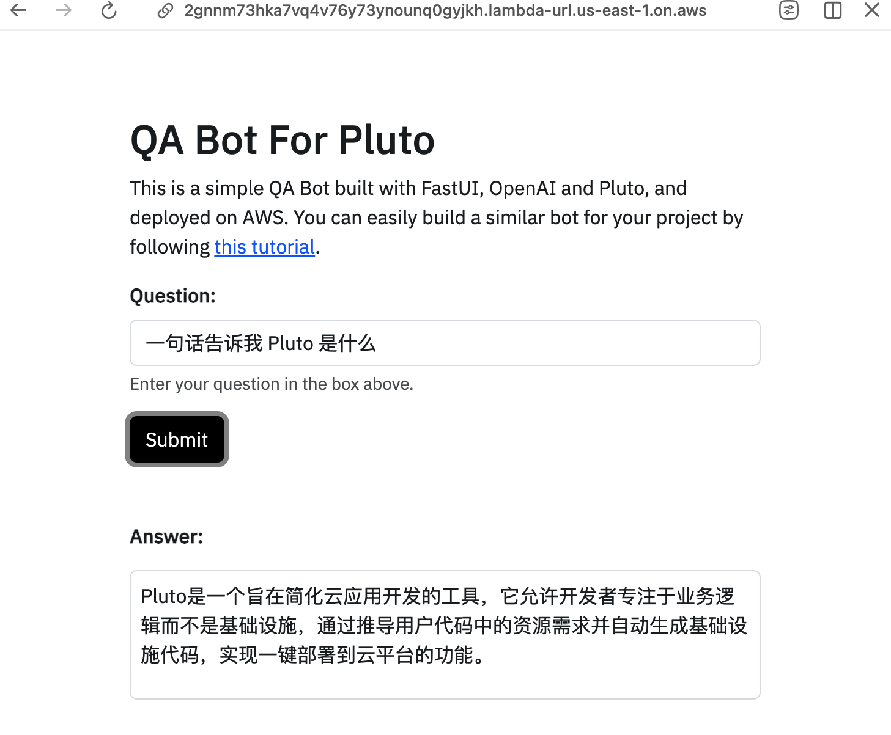

# 构建带有 Web 界面的文档问答机器人

这里给大家介绍一种非常简单的构建文档问答机器人的方式，**只需要 5 分钟**就可以基于你的 GitHub 文档仓库创建一个专属的问答机器人，并且将其部署到 AWS 上（免费），让你的用户可以通过 Web 界面来提问。

<p align="center">
  
</p>

## 简要介绍

首先，让我们快速了解一下这个文档问答机器人的工作原理和实现方式。

这个文档机器人的工作流程是：初始化时，先从存储文档的 GitHub 仓库上下载文档，然后通过 LangChain 调用 OpenAI 的 Embeddings 模型生成文档的向量，并保存到 AWS 的 S3 中，避免重复创建文档向量浪费 Token。当用户输入问题时，还是先通过 LangChain 生成问题的向量，然后通过 FAISS 向量数据库检索到相关的文档，最后通过 GPT-3.5 汇总生成答案。此外，这个文档问答机器人会在每天 UTC 0 点时自动更新文档向量。

构建这个文档问答机器人，我们采用了包括 LangChain、FastUI、Pluto 在内的一系列框架和工具，并最终在 AWS 上进行部署。其中，LangChian 用来实现主要的问答功能，通过它来调用 OpenAI 的 Embedding、GPT-3.5 等模型；FastUI 用来实现上图的 Web 界面；Pluto 则负责云资源的创建和配置，以及应用的发布，使用 Pluto，只需要在代码中创建几个变量就可以完成 AWS Lambda、S3 等资源的创建和配置。

## 开始上手

为方便大家快速上手，我已经将这个文档问答机器人制作成了 CodeSandbox 模板。只需点击下方链接就能打开 CodeSandbox 的在线 IDE，再点击右上角的 Fork，就可以将项目复制至你的账户下。然后，你就可以自由地修改代码，并且可以一键部署至 AWS。

[](https://codesandbox.io/p/devbox/pluto-doc-qa-bot-forked-8njh42)

接下来，我就来介绍如何一步步构建你的专属文档问答机器人。

### 准备 Token

开始之前，你需要准备几个关键的 Token，包括用于下载 GitHub 上的文档数据的 GitHub Token、调用 OpenAI 模型的 OpenAI API Key、以及用于应用部署的 AWS 凭证等。

- GitHub Token：你可以打开这个页面「[New personal access token (classic)](https://github.com/settings/tokens/new)」来创建一个 GitHub Token，只需要选择 `public_repo` 这一个权限即可。
- OpenAI API Key：你可以从 [OpenAI 平台](https://platform.openai.com/account/api-keys)上获取 API Key。当然，你也可以使用其他的和 OpenAI API 兼容的 API，后续有配置 `base_url` 的地方。
- AWS 凭证：你需要从 [AWS 的控制台](https://us-east-1.console.aws.amazon.com/iam/home?region=us-east-1#security_credential)上获取你的 AWS Access Key 和 Secret Key，用来后续将应用部署到 AWS 上。

### 修改基本配置

一旦进入开发环境，控制台会自动显示 Configure AWS Certificate 的标签页，在这里输入你的 AWS 证书信息，确保应用能够顺利部署至 AWS。你可以不填写 `output format` 字段，填写完其他必要信息后，如果一切正确，你可以在标签名旁边看到一个绿色的勾选标记 ✔️。

<p align="center">
  
</p>

接下来，我们就需要修改机器人的配置了，打开 `.env.local` 文件，该文件包含了这个文档机器人的基本配置，包括文档所在的 GitHub 仓库，仓库分支，文档在仓库中的相对路径，OpenAI 的 API Key，GitHub 的 Token 等，你需要根据你的实际情况修改这些配置。

```python
PROJECT_NAME = "Pluto" # 项目名称，会与 Web 页面的标题相关
REPO = "pluto-lang/website" # 存储文档的 GitHub 仓库
BRANCH = "main" # 仓库的分支
DOC_RELATIVE_PATH = "pages" # 文档在仓库中的相对路径

OPENAI_BASE_URL = "https://api.openai.com/v1" # OpenAI API 的基础 URL
OPENAI_API_KEY = "<replace_with_your_openai_api_key>" # OpenAI API Key
GITHUB_ACCESS_KEY = "<replace_with_your_github_access_key>" # GitHub Token
```

如果你想定制化你的机器人，比如修改机器人的回答风格，可以通过修改 `app/main.py` 代码文件中的 `prompt` 变量来实现。

### 一键部署

配置完成后，只需要点击终端图标，并从菜单中选择 `Deploy`，就可以将这个文档机器人部署到 AWS 上了，不需要你执行任何额外的步骤。部署可能需要 1 分钟左右，部署结束后，就会在控制台上显示部署的 URL，点击这个 URL 就可以访问这个文档机器人了！

<p align="center">
  
</p>

注意，由于 AWS Lambda 冷启动和向量数据库构建的延迟，首次访问可能需耐心等待几秒至几十秒。

### 销毁

如果你想将应用程序下线，只需从菜单中点击 `Destroy`，在 AWS 创建的资源就会被完全删除。

<p align="center">
  
</p>

## 总结

这个文档问答机器人的实现非常简单，只需要修改几个配置，就可以部署到 AWS 上。

之所以能够如此轻松的实现，主要是因为过程中不需要关心云上资源的创建和配置，以及应用的部署，而这主要得益于 Pluto 的能力。Pluto 可以从代码中自动推导出应用依赖的资源，并且自动地创建和配置这些资源，让开发者可以专注于业务逻辑的实现。

如果你想了解更多 Pluto 的功能，欢迎访问 Pluto 的[官方文档](https://pluto-lang.vercel.app)或者 [GitHub 仓库](https://github.com/pluto-lang/pluto)，如果你能点个 Star🌟 就更好了！也非常欢迎大家提 issue 和 PR。

## 更多资源

- 如果你想基于 Llama3、SageMaker 创建，可以参考这个案例：[基于 Llama3 的文档问答机器人](https://pluto-lang.vercel.app/cookbook/rag-qa-bot-llama3)
- 如果你想支持会话功能，可以参考这个案例：[基于 AWS 和 LangChain 的 Llama2 会话聊天机器人](https://pluto-lang.vercel.app/zh-CN/cookbook/langchain-llama2-chatbot-sagemaker-python)
- Pluto 官方文档：[https://pluto-lang.vercel.app](https://pluto-lang.vercel.app)
- Pluto GitHub 仓库：[https://github.com/pluto-lang/pluto](https://github.com/pluto-lang/pluto)
